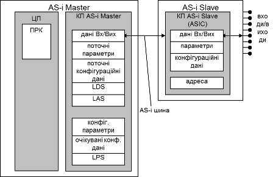

[Промислові мережі та інтеграційні технології в автоматизованих системах](README.md). 5.[ІНТЕРФЕЙС AS-i](5.md)

## 5.6. Швидкість відновлення даних

Знаючи бітову швидкість, формат кадру та паузи між кадрами можна вирахувати час, за який Ведучий AS-i опитає всіх Ведених на шині. Транзакцією в даному випадку будемо називати час між опитуванням Ведучим двох Ведених, які опитуються один за одним. На рисунку 5.7 показаний час однієї транзакції. Він складається з:

- часу передачі кадру Ведучого: 14 бітових інтервалів (б.і);

- паузи 1: від 3-х до 10-ти б.і;

- часу передачі кадру Веденого: 7 б.і;

- паузи 2: від 1-го до 2-х б.і.

Перша пауза триває 3 бітові інтервали під час фази нормальної роботи, 5 – під час інших фаз. Максимальною ця пауза може тривати 10 бітових інтервалів при використанні репітерів. Таким чином, в режимі нормальної роботи на шині AS-i без використання репітерів, час однієї транзакції буде 14+3+7+2=26 бітових інтервалів. Оскільки бітова швидкість=167 кБіт/с, то цей час:

`Ттранз= 26/167 000 ≈ 156 мкс`

Для того, щоб опитати всіх Ведених необхідно затратити n156 мкс, де n – кількість Ведених. Але окрім етапу обміну даними, стадія нормальної роботи складається також з етапів адміністрування та добавлення (див. рис.5.12), які проводять ще дві транзакції. Втім, якщо кількість Ведених=31, тобто максимум, етап добавлення (знаходження нового Веденого) не потрібен. Отже загальний час повного циклу шини AS-i буде:

`Тциклу=156мкс  (n+2) – якщо n<31`

`Тциклу=156мкс  (n+1) – якщо n=31, тобто 4,992 мс.`

Отже, при будь-якій кількості Ведених час одного циклу, тобто час обміну Ведучого з усіма Веденими не перевищує 5 мс.

 

<-- 5.5. [Формат кадру AS-i](5_5.md)

--> 5.7. [Профілювання Ведучих та Ведених](5_7.md)