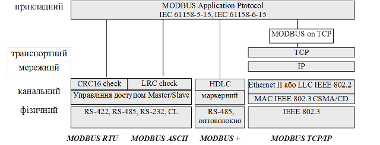

[Промислові мережі та інтеграційні технології в автоматизованих системах](README.md). 6. [МЕРЕЖІ MODBUS](6.md) 

## 6.1. Мережі Modbus в контексті моделі OSI

Згідно стандартів MODBUS-IDA – MODBUS являється протоколом прикладного рівня для зв’язку типу Клієнт-Сервер між прикладними Процесами пристроїв, які під’єднані до різноманітних типів шин або мереж. В контексті OSI-моделі, ці мережі мають архітектуру, наведену на рис.6.1.

 

Рис.6.1. MODBUS в контексті OSI-моделі

Як видно з рисунка, MODBUS на сьогоднішній день представлений 4-ма мережами: MODBUS RTU, MODBUS ASCII, MODBUS Plus і MODBUS TCP/IP. Перші реалізації MODBUS базувалися на послідовних інтерфейсах з двома режимами передачі RTU і ASCII, але з розвитком комп’ютерних мереж і їх інтеграції з промисловими мережами протокол MODBUS адаптували до використання в мережах, що базуються на основі TCP/IP. MODBUS Plus в основному використовується в пристроях Schneider Electric, тому розглядати його не будемо. 

<-- 6.[МЕРЕЖІ MODBUS](6.md)

--> 6.2. [Реалізація Modbus на прикладному рівні](6_2.md) 