[Промислові мережі та інтеграційні технології в автоматизованих системах](README.md). 6. [МЕРЕЖІ MODBUS](6.md) 

## 6.2. Реалізація Modbus на прикладному рівні

### 6.2.1. Формат MODBUS PDU

MODBUS Application Protocol (MBAP\ MODBUS протокол прикладного рівня) базується на моделі Клієнт-Серверного обміну повідомленнями і визначає формат повідомлень MODBUS PDU\ (Protocol Data Unit), які мають вигляд наведений на рис.6.2. 

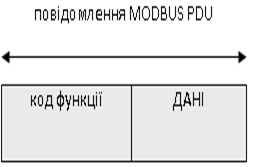

Рис.6.2. Формат повідомлення MODBUS PDU.

Клієнтський прикладний Процес робить повідомлення-запит до серверного Процесу, в якому в полі „код функції” вказує йому на дію, яку необхідно провести. Байти даних вміщують інформацію, яка необхідна для виконання даної функції. Серверний прикладний Процес у випадку вдалого виконання цієї функції повторює код функції у відповіді (якщо запит передбачає відповідь). При виникненні помилки, код функції у відповіді модифікується (старший біт виставляється в 1) а в байтах даних передається причина помилки. Тобто, якщо при передачі клієнтським прикладним Процесом повідомлення-запиту з функцією 0316 (000000112) виникла помилка у її виконанні Сервером, той відішле відповідь з полем функції рівним 8316(100000112). В доповненні до зміни коду функції, при помилці, Сервер розміщує в поле даних унікальний код, який вказує на тип і причину помилки.

Код функції являє собою поле з одного байту, яке може приймати значення від 1 до 255 (коди 128-255 зарезервовані під коди повідомлень-відповідей при помилкових діях). Всі коди функцій в MBAP діляться на (див рис.6.3):

-     Public Function Codes – це публічні коди, які описані в стандарті MODBUS-IDA, список яких включає в себе вже назначені та використовувані коди, а також коди для майбутнього використання;

-     User-Defined Function Codes (65-72, 100-110) – це коди, які можуть використовуватись компаніями для власних функцій і не описані в специфікації;

-     Reserved Function Codes (9, 10, 13, 14, 41, 42, 43, 90, 91, 125, 126 і 127) – це зарезервовані коди, які не доступні для загального використання. 

Нижче розписані тільки ті функції, які призначені для доступу до даних процесу. Ці дані, з точки зору MODBUS функцій діляться на:

- Discrete Inputs: дискретні входи, тільки для читання;

- Coils: котушки, внутрішні біти або дискретні виходи, читання/запис;  

- Input Registers: вхідні 16-бітні змінні, тільки читання;

- Holding Registers: внутрішні/вихідні 16-бітні змінні, читання/запис.

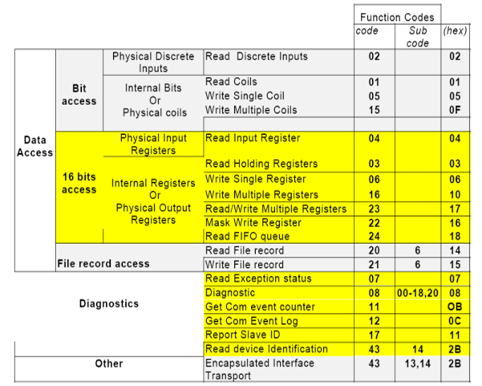

Рис.6.3. Функції MODBUS

У повідомленні-запиті за полем коду функції можуть слідувати дані, які уточнюють або доповнюють функцію допоміжними даними. Це можуть бути адреси змінних, їх кількість, лічильник байтів даних та самі дані для запису. Для певних функцій, поле даних може бути відсутнім взагалі. Максимальна довжина повідомлення прикладного рівня рівна 253. 

### 6.2.2. Формат основних функцій

Повний список кодів а також специфікацію протоколу можна знайти на офіційному Веб сайті MODBUS-IDA - [www.MODBUS.org](http://www.modbus.org/). В посібнику детально розглянемо тільки найбільш вживані функції MODBUS для обміну даними процесу. Номер функції дається в шістнадцятковому форматі. Скорочення в дужках Hi та Lo що  вказують відповідно на старший та молодший байти. Тобто, якщо для вказівки адреси початкової змінної необхідно двобайтове слово, то значення старшого байта буде передаватись в полі з позначенням Hi, а молодшого – відповідно Lo.

#### 6.2.2.1. Код функції 01h − читання статусу Coils (дискретних вихідних бітів). 

Повідомлення-запит вміщує адресу початкового біту і кількість бітів для читання. Біти нумеруються починаючи з 0. У повідомленні-відповіді кожне значення змінної передається одним бітом, тобто в одному байті пакується статус 8 бітових змінних. Якщо кількість їх не кратно восьми, інші біти в байті заповнюються нулями. Лічильник вміщує кількість байт в полі даних. 

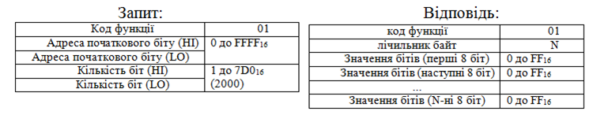

#### 6.2.2.2. Код функції 02h − читання статусу дискретних входів. 

Формат даного запиту такий же як попереднього, за винятком поля функції.

#### 6.2.2.3. Код функції 03h  − читання значення вихідних/внутрішніх регістрів. 

Повідомлення-запит вміщує адресу початкового вихідного/внутрішнього регістру (двохбайтове слово), і кількість регістрів для читання. Регістри нумеруються починаючи з 0.

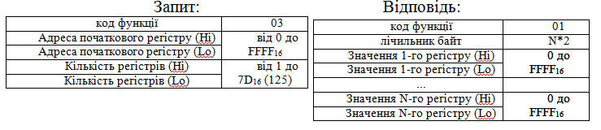

 У відповідному повідомленні в полі даних кожний регістр передається двома байтами.

#### 6.2.2.4. Код функції 04h − читання значення вхідних регістрів. 

Формат даного запиту такий же як попереднього, за винятком поля функції.

#### 6.2.2.5. Код функції 05h − запис вихідного/внутрішнього біту. 

В запиті вказується номер бітової змінної та значення: 0 – 0000, а 1 – FF00, всі інші значення не міняють стан змінних. В широкомовній передачі клієнтський запит виставляє значення даної змінної для всіх серверів.

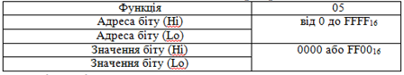

Нормальна відповідь серверу являється повторенням запиту до клієнта. 

#### 6.2.2.6. Код функції 06h − запис вихідного/внутрішнього регістру. 

Функція аналогічна попередній, але оперує з регістрами(словами). В запиті вказується номер вихідного/внутрішнього регістру та його значення. В широкомовній передачі запит виставляє значення даної змінної для всіх серверів.

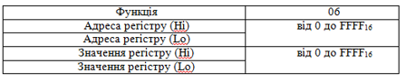

Нормальна відповідь сервера являється повторенням запиту клієнту. 

#### 6.2.2.7. Код функції 0Fh − запис декількох вихідних/внутрішніх бітів. 

В запиті вказується початкова адреса біту, кількість біт для запису, лічильник байтів і безпосередньо значення. В широкомовній передачі біти записуються всім серверам. Розглянемо приклад для встановлення наступних бітових вихідних/внутрішніх змінних:

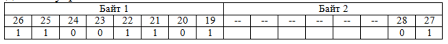

В таблиці показана відповідність адреси змінної, починаючи з 19-ї, і значення біту. Для зручності біти розміщені у тому порядку, що і передаються. В другому байті корисні тільки 2 перші біти, значення інших не буде прийнято до уваги, оскільки кількість бітів вказані у кадрі. Запит та відповідь будуть мати такий вигляд:

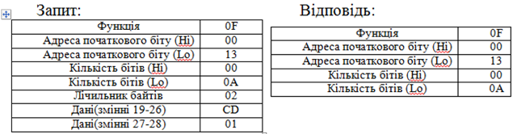

#### 6.2.2.8. Код функції 10h − запис декількох вихідних/внутрішніх регістрів. 

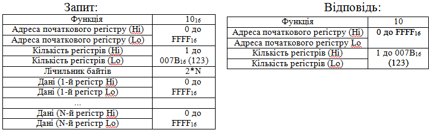

 

#### 6.2.2.9. Повідомлення про помилки. 

Ці повідомлення стосуються всіх типів MODBUS, але першопочатково були визначені для MODBUS Serial (RTU/ASCII). 

При запиті Клієнта до Серверу, можуть мати місце наступні ситуації:

-    якщо Сервер прийняв запит без комунікаційних помилок, і може нормально розпізнати запит, він повертає нормальну відповідь;

-    якщо Сервер не прийняв запит, відповідь не повертається. Клієнт очікує відповіді протягом певного тайм-ауту;

-    якщо Ведений (для MODBUS Serial) прийняв кадр, але знайшов комунікаційну помилку (паритет, помилка контрольної суми), то кадр-відповідь не повертається, а Ведучий чекає відповіді на запит протягом певного тайм-ауту;

-    якщо Сервер прийняв запит без комунікаційної помилки, але не може виконати замовлену функцію (наприклад, читання не існуючих виходів або регістрів), Сервер повертає повідомлення про помилку і її причини. 

Повідомлення про помилку має два поля які відрізняються від полів нормальної відповіді:

ПОЛЕ КОДУ ФУНКЦІЇ: при нормальній відповіді сервер повертає в цьому полі той номер функції, який потребував клієнт. У всіх кодах функції старший біт встановлений в 0. При поверненні повідомлень про помилку, Сервер встановлює цей біт в 1, по чому Клієнт може ідентифікувати наявність помилки.

ПОЛЕ ДАНИХ: В цьому полі при помилці повертається її код. 

Таблиця 6.1. Список кодів

| Код  | Назва                | Опис                                                         |
| ---- | -------------------- | ------------------------------------------------------------ |
| 01   | ILLEGAL FUNCTION     | Прийнятий код функції не  може бути оброблений на Сервері    |
| 02   | ILLEGAL DATA ADDRESS | Адреса даних вказана в  запиті не доступна даному Серверу .  |
| 03   | ILLEGAL DATA VALUE   | Величина, вміщена в полі даних  запиту являється не допустимою величиною для Серверу . |
| 04   | SLAVE DEVICE FAILURE | Невиправна помилка мала  місце поки Сервер намагався виконати дію запиту. |
| 05   | ACKNOWLEDGE          | Сервер прийняв запит і  обробляє його, але необхідний певний час. Ця відповідь захищає Клієнта від  генерації помилки тайм-ауту. |
| 06   | SLAVE DEVICE BUSY    | Сервер  зайнятий обробкою команди, Клієнт повинен повторити запит пізніше. |
| 07   | NEGATIVE ACKNOWLEDGE | Невдалий програмний запит  (для функцій 13 і 14).            |
| 08   | MEMORY PARITY ERROR  | Сервер хоче читати  розширену пам’ять, але знайшов помилку паритету. |

Приклад 6.1. MODBUS. Запит на читання статусу вихідних бітів. 

Завдання. Сформувати повідомлення-запит та повідомлення-відповідь на читання вихідних/внутрішніх бітів з 20 по 39 при: обробці без помилок; обробці з помилкою ILLEGAL DATA ADDRESS.

Рішення. Формат повідомлень показаний на рис.6.4. Слід зауважити, що 1-й біт в адресному просторі MODBUS опитується під номером 0. Тому 20-й біт зчитується під номером 19. Деталі читайте в 6.2.3.   

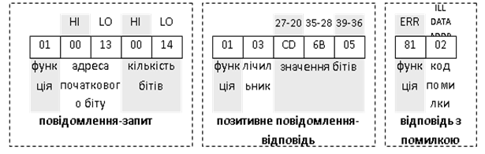

Рис.6.4. Формат повідомлень для запиту читання статусу вихідних бітів

Приклад 6.2. MODBUS. Запит на читання значення вихідних/внутрішніх регістрів. 

Завдання. Сформувати повідомлення-запит та повідомлення-відповідь на читання вихідних/внутрішніх регістрів починаючи з 108-го по 110-й при позитивній обробці запиту Сервером.

Рішення. Формат повідомлень показаний на рис.6.5. Як і в попередньому випадку 108-й регістр в запиті вказується під номером 107 (6В16).

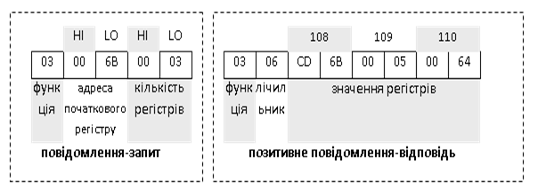

Рис.6.5. Формат повідомлень для запиту читання значень вихідних/внутрішніх регістрів

### 6.2.3. Адресна модель MODBUS та доступ до даних

Всі змінні до яких звертається клієнтський прикладний Процес являються частиною області пам’яті пристрою. Однак фізичні адреси цих змінних можуть не співпадати з тими, до яких він звертається згідно протоколу. Головне, щоб ці змінні були відображенням (mapping) дійсних даних в пристрої. На рис.6.6 показаний процес обробки запитів на стороні серверу MODBUS. Як видно з рисунку, при зверненні до певної змінної по її номеру, наприклад на читання,  по суті йде звернення до певної області даних в прикладній програмі пристрою. Зв’язок даних MODBUS моделі з фізичними даними називають відображенням\ (mapping\).   

  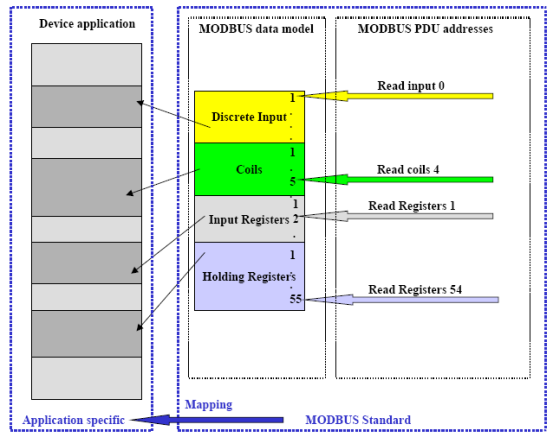

Рис.6.6. Адресна модель MODBUS

Слід відмітити, що мінімальна адреса елементу даних моделі MODBUS дорівнює 1 а не 0.

Таке розмежування між фізичною структурою даних і MODBUS моделі даних дає можливість адаптувати протокол під структуру різних пристроїв. Для прикладу, в стандарті наводяться два популярні способи реалізації MODBUS моделі даних: розділення даних по блокам (рис.6.7) та використання доступу до даних одного і того ж блоку (рис.6.8). Як видно з рисунків модель даних з єдиним блоком дає доступ до одних і тих же фізичних даних. Тобто області Input та Holding регістрів співпадають, а області Digital Inputs та Coils теж співпадають і знаходяться в області регістрів. 

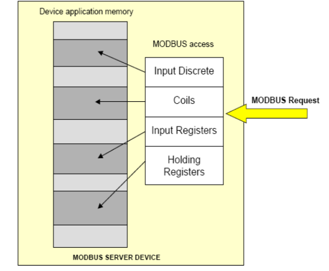

Рис.6.7. Модель даних MODBUS з розділеними блоками

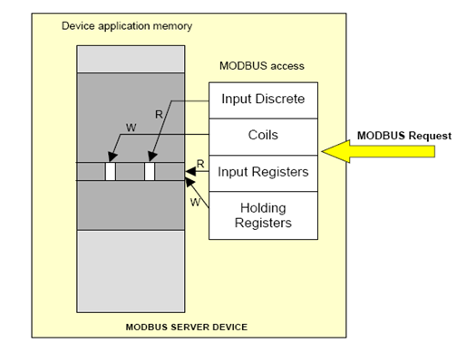

Рис.6.8. Модель даних MODBUS з єдиним блоком 

Приклад 6.3. MODBUS. Модель даних для різних типів пристроїв. 

Завдання. Показати відображення даних моделі MODBUS на адресний простір Momentum/Quantum (Schneider Electric), Micro/Premium/M340/Twido(Schneider Electric), Vipa CPU-21xSER1 (VIPA) Vipa IM-253NET(VIPA).

Рішення. Для контролерів Schneider Electric гілки Modicon тобто Momentum та Quantum, MODBUS – це рідний протокол, тому модель даних MODBUS абсолютно співпадає з моделлю їх адресного простору. Нумерація змінних починається з 1-ї (0-вий номер в запиті звертається до 1-ї змінної)

Для контролерів Micro/Premium, які влились в Schneider Electric під брендом Telemechanique, а також M340 та Twido доступ надається тільки до внутрішніх змінних (M - Memory), тому різниці між вхідними та вихідними бітами та регістрами немає, однак бітова область не співпадає з регістровою. Тобто Сервер MODBUS цих ПЛК будуть однаково реагувати скажімо на функції 01 та 02, або 03 та 04. Нумерація змінних починається з 0-ї (0-вий номер в запиті звертається до 0-ї змінної, тобто %M0-біт, або %MW0 – регістр). Таким чином загальна таблиця відображення даних для різних ПЛК від Schneider Electric має наступний вигляд:

|                   | Momentum/Quantum | Micro/Premium/M340/ Twido |
| ----------------- | ---------------- | ------------------------- |
| Input Discrete    | 1XXX             | %M                        |
| Coils             | 0XXX             | %M                        |
| Input Registers   | 3XXX             | %MW                       |
| Holding Registers | 4XXX             | %MW                       |

 Для Siemens-подібних контролерів VIPA мережі MODBUS не являються найбільш вживаними. Тим не менше VIPA випускає номенклатуру модулів з підтримкою даного протоколу. Зокрема в процесорних модулях типу Vipa CPU-21xSER1, є вбудований послідовний порт з підтримкою MODBUS Serial (RTU/ASCII) як в режимі Ведучого так і Веденого. Модуль представляє бік Серверу MODBUS- в режимі Веденого (пояснення дивись в MODBUS Serial), тому саме в цьому режимі розглядається відображення даних моделі MODBUS. При конфігурації послідовного порту CPU-21xSER1, задається його режим (MODBUS Master). Далі, весь обмін проходить через вхідні та вихідні буфери (рис.6.9), які прикладна програма повинна поновлювати самостійно. Однак буферів всього два, а отже бітові змінні знаходяться в пам’яті регістрових, вхідні в області вхідних регістрів, вихідні – вихідних (див.рис.6.10). 

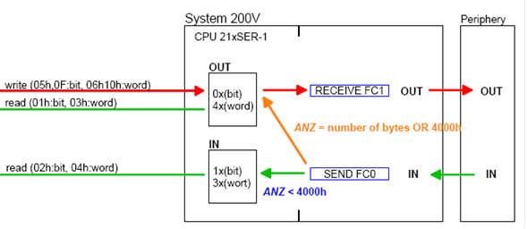

Рис.6.9. Обмін даними MODBUS в ПЛК VIPA CPU-21xSER1
 Слід зазначити, що буфери являються внутрішньою пам’яттю комунікаційного порту, а не самого ПЛК. Для відображення буферів на області пам’яті ПЛК, в комунікаційних функціях SEND та RECEIVE вказується необхідна область пам’яті, як правило це DB-область. Необхідно також пам’ятати, що адресація даних в буферах з боку мережі проходить по словам, а з боку програми до DB ПЛК – по байтам.

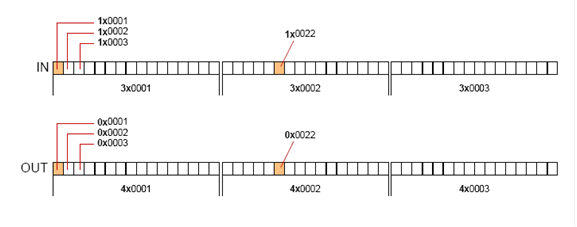

 Рис.6.10. Відображення змінних у вхідному та вихідному буферах для ПЛК VIPA

Інтерфейсний модуль Vipa IM-253NET(VIPA) для побудови розподілених систем вводу/виводу на базі Ethernet підтримує MODBUS TCP/IP тобто може бути Сервером MODBUS (Клієнтом бути не може). Доступ до входів та виходів системи на базі інтерфейсного модуля відбувається аналогічно, як показано на рис.6.10. Буфер IN поновлюється модулем автоматично, а виходи ПЛК автоматично відновлюються даними з буферу OUT.

<-- 6.1. [Мережі Modbus в контексті моделі OSI](6_1.md) 

--> 6.3. [Modbus Serial](6_3.md) 
