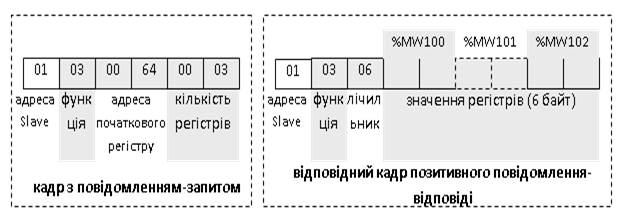

[Промислові мережі та інтеграційні технології в автоматизованих системах](README.md). 6. [МЕРЕЖІ MODBUS](6.md) 

## 6.3. Modbus Serial

Перші мережі MODBUS базувалися на асинхронних послідовних лініях зв’язку і отримали назву MODBUS RTU та MODBUS ASCII. На фізичному рівні вони використовують стандартні послідовні інтерфейси з символьним режимом передачі (див. рис.6.1). 

На сьогоднішній день в MODBUS-IDA ці мережі отримали назву MODBUS over Serial Line і описані у відповідному стандарті. У ньому вказуються правила та рекомендації використання на канальному та фізичному рівні. 

Оскільки мережа MODBUS RTU/ASCII може мати шинну топологію, то визначений метод доступу до шини − це модель Ведучий/Ведений. В мережах MODBUS RTU та MODBUS ASCII Процес Ведучого завжди являється Клієнтом, а Процеси Ведених – Серверами. Це значить, що Ведучий відсилає запити, а Ведені їх обробляють. Цей запит може бути адресований як індивідуальному вузлу так і всім Веденим на шині (broadcast). 

На канальному рівні MODBUS RTU/ASCII використовується адресація орієнтована на ідентифікатори вузлів. Кожний Ведений повинен мати свою унікальну адресу (1-247), Ведучий не адресується.. При індивідуальних запитах, Ведучий з клієнтським Процесом формує кадр із повідомленням-запитом і відправляє його за вказаною адресою. Ведений з серверним Процесом отримує цей кадр і обробляє повідомлення. Після його обробки Ведений формує кадр з повідомленням-відповіддю і відправляє його назад Ведучому. Кадр з повідомленням-відповіддю носить також функції кадру підтвердження, який Ведучий буде чекати від Веденого протягом часу, визначеного тайм-аутом.

При широкомовних запитах (broadcast) використовується 0-ва адреса. Широкомовні запити не потребують підтвердження, тому після відправки широкомовного кадру Ведучий не очікує кадр відповіді. 

### 6.3.1. Канальний рівень

На рис.6.11 показаний загальний вигляд кадру MODBUS Serial. Зверніть увагу, що розмежування між кадрами та тип контрольної суми тут не вказано, оскільки це залежить від режиму передачі ASCII або RTU. В полі адреси пристрою Ведучий при запиті вказує адресу отримувача, а Ведений при відповіді - свою адресу. Поля MODBUS PDU описані вище.


Рис.6.11. Формування кадру MODBUS 

На часовій діаграмі рис.6.12 показані три типові ситуації роботи моделі Ведучий/Ведений на MODBUS Serial. Перша ситуація – типовий обмін в одноадресному режимі, друга – в широкомовному, третя – реакція Веденого на комунікаційну помилку. 


### 6.3.2. MODBUS RTU

Даний режим передбачає використання 8 біт даних в 11-бітному символі, що дозволяє передавати по байту на символ. Формат символу в RTU режимі:   1 стартовий біт;  8 біт даних (молодший біт передається першим); 1 біт паритету + 1 стоповий біт або без паритету + 2 стопових біта. 

Формат кадру MODBUS RTU наведений на рисунку 6.13. Розмежування між кадрами проводиться за допомогою пауз між символами. Новий кадр не повинен з’являтися на шині раніше, ніж 3.5Тс від попереднього, де Тс – час передачі одного символу. Якщо час відсутності сигналу на лінії (інтервал тиші) буде більше ніж 3.5Тс приймач ідентифікує помилку. З іншого боку, появлення нового кадру раніше ніж 3.5Тс, теж приведе до помилки. 

<a href="media6/6_12.png" target="_blank"></a> 

Рис.6.12. Часова діаграма обміну на MODBUS Serial

Поле адреси і коду функції в RTU режимі займають по одному байту, оскільки байти передаються по символу на кожний. В якості контрольної суми використовується два байти, обраховані по алгоритму CRC16.

### 6.3.3. MODBUS ASCII

У даному режимі кожний байт повідомлення передається як два ASCII символи їх шістнадцяткового представлення, тобто значення байта 0316 буде передаватись як ASCII-код символів „0” і „3” (0110000 0110011) Отже байти даних, код функції і байт поля перевірки буде передаватись кодами символів 0-9, A-F. Формат символу в ASCII-режимі: 1 стартовий біт; 7 бітів даних, молодший біт передається першим; 1 біт паритету + 1 стоповий біт або без паритету + 2 стопових біта. 

 Формат кадру наведений на рис.6.14. Як бачимо, для розмежування між кадрами використовуються стартовий символ „:” та стопова послідовність „CR LF”. Приймачі на шині безперервно відслідковують символ „:” який однозначно вказує на початок кадру. Коли він прийнятий, приймачі відловлюють поле адреси і т.д. Це дуже простий спосіб синхронізації, який дозволяє некритично відноситись до пауз між символами (до 1 сек.). Адреса Веденого та код функції займають по два символи, відповідно до значення одного байта. Далі йдуть n2 символів даних, де n кількість байтів даних. В ASCII режимі MODBUS для підрахунку контрольної суми використовується алгоритм LRC. Причому контрольна сума проводиться над усіма байтами кадру, виключаючи стартову та стопову послідовність символів.

<a href="media6/6_13.png" target="_blank"></a> 

Рис.6.13. Формат кадру для RTU режиму обміну

Режим ASCII накладає менші вимоги на обладнання за рахунок використання стартової і стопової послідовності в розмежуванні кадрів і нечутливості до значних пауз між символами. Але переваги є і його недоліками. RTU-режим більш вимогливий до інтервалів між кадрами, але значно продуктивніший ніж попередній. 

Приклад 6.4. MODBUS. Розрахунок часу опитування Ведених на MODBUS-RTU.

 Завдання. Побудувати кадри форматів повідомлень запитів та відповідей для MODBUS RTU та розрахувати загальний час опитування 10-ти аналогових 16-бітних змінних для 4-х Ведених (рис.6.15). Швидкість передачі даних 19200 біт/с. Клієнтський Процес Ведучого (TSX Premium) та серверні Процеси Ведених (ПЛК TSX Micro ) приймають повідомлення на початку циклу, а відправляють - в кінці циклу. Час циклу Ведучого = 10 мс, Ведених - 5с. 

<a href="media6/6_14.png" target="_blank"></a> 

Рис.6.14. Формат кадру для ASCII режиму обміну

Виконання завдання. Доступ до внутрішніх аналогових змінних TSX Micro проводиться через 03 або 04 функцію, тому формат кадрів буде мати вигляд як на рис.6.16. 

<a href="media6/6_15.png" target="_blank"></a> 

Рис.6.15. Постановка задачі до прикладу 6.4 

Враховуючи, що структура інших кадрів – аналогічна, наводити їх формат немає сенсу. 

Аналогічно рис.6.12 побудуємо часову діаграму обміну (рис.6.17). З боку клієнтської програми повідомлення-запит формується за допомогою комунікаційної функції, відправка даних якої через комунікаційний порт проводиться в кінці циклу задачі, а отримування з порту – на початку циклу. Така поведінка клієнтської сторони цілком відповідає багатьом реалізаціям для різних ПЛК.

В TSX Micro MODBUS-Сервер реалізований на рівні операційної системи. Специфіка реалізації заключається в тому, що прийом MODBUS-запитів з комунікаційного порту системою проводиться на початку циклу, а відправка повідомлень-відповідей – вкінці. 

Слід зазначити, що реалізація MODBUS-Серверу може бути підтримана на рівні комунікаційного модуля, а обмін даними з пам’яттю самого пристрою проводитись через комунікаційні буфери. В цьому випадку реакція MODBUS-Сервера буде значно швидшою і не залежати від циклу програми. Для розрахунку часу транзакції для інших типів систем необхідно ознайомитися з деталями їх реалізації.  

На рис.6.17 показано, що надходження кадру приходить десь всередині циклу. Це значить, що їх обробка та генерація відповіді пройде приблизно через 1,5 циклу. Слід розуміти, що це усереднене значення, для найгіршої оцінки краще резервувати 2 часу циклу (тобто коли кадр прийшов відразу після опитування комунікаційного порту). Таким чином час транзакції для одного ПЛК, наприклад PLC1 (ТТ1),  буде дорівнювати:

`ТТ1=С5+T1.req+2*C1+T1.res+C5*2`                            (6.1)

<a href="media6/6_17.png" target="_blank"></a> 

Рис.6.17. Часова діаграма до прикладу 6.4.

ТТ1 розрахований з урахуванням 2 циклів затрачених Веденим на генерацію відповіді на повідомлення-запит. Якби транзакця проводилась не періодично, як по умові задачі, а по виникненню події, то в час транзакції необхідно б було включити також ще один цикл Ведучого. Нескладно вивести час опитування всіх Ведених:

`ТТall=C5*9+C1*2+C2*2+C3*2+C4*2+T1.req+T1.res+T2.req+T2.res+ T3.req+T3.res+ T4.req+T4.res`       (6.2)

Враховуючи, що цикли Ведених однакові, а кадри запитів і кадри відповідей для всіх Ведених мають однакову структуру, загальна формула буде мати наступний вигляд: 

`ТТall= C5*9 + C1*8 + (T1.req+T2.req)*4`                      (6.3)

Розрахуємо час T1.req та T2.req. Час передачі кадру (Тframe) можна орієнтовно розрахувати по кількості символів (Nsymb) в кадрі та часу передачі одного символу (Tsymb):

`Tframe=NsymbTsymb`                         (6.4)

Час передачі одного символу розраховується:

`час передачі одного символу = кількість біт в символі / бітова швидкість;`

Час передачі кадрів буде  дорівнювати (див.рис.6.16 та рис.6.17):

`T1.req=8*(11/19200)=4,58 мс`

`T1.res=25*(11/19200)=14,33 мс`

`TTall=90+40+ (4,58+14,33)*4= 206 мс.`

Таким чином, для опитування 10-ти змінних з 4-х Ведених зі швидкістю 19200 біт/с необхідно затратити приблизно 206 мс. Якщо необхідне періодичне опитування бажано зарезервувати певний час, наприклад ще додатково 100 мс.

У ряді випадків реалізація функцій MODBUS-Клієнта лягає на операційну систему, а доступ до них в програмі ПЛК відбувається через інтерфейсні комунікаційні функції. Зокрема це характерно для більшості ПЛК від Scneider Electric (Momentum, Quantum, TSX Micro, TSX Premium, M340). В ряді інших систем – клієнтську сторону на прикладному рівні необхідно повністю прописувати в програмі ПЛК, а інтерфейс надається тільки для обміну з комунікаційним портом. В цьому випадку система надає сервіси відправки та отримання повідомлення (яке формує і аналізує сама програма коритсувача), і генерації та перевірки контрольної суми. Розглянемо приклад.    


Рис.6.18. Постановка задачі до прикладу 6.5. 

Приклад 6.5. MODBUS. Реалізація MODBUS-клієнта на TSX Twido. 

Завдання. Записати фрагмент програми в TSX Twido для зчитування 3-х регістрів з Веденого з адресою 1 (рис.6.18). 

Рішення. У Twido клієнтську сторону MODBUS необхідно реалізовувати через універсальну функцію EXCHx, яка відправляє та/або отримує дані через комунікаційний порт з номером x. Параметрами функції є таблиця слів (%MW), в яких розміщуються дані управління функцією, дані для відправки та буфер для приймання. Якщо обмін буде проходити через комунікаційний порт 2, то виклик функції буде мати такий формат: 

```
EXCH2 %MWy:n 
```

де y – номер першої змінної виділеної таблиці, n – кількість слів в таблиці.

Формат таблиці, тобто даних, які необхідно заповнити, та область даних для приймання однаковий для всіх типів комунікацій. Для функцій 03/04 (читання N слів) на MODBUS-RTU ця таблиця буде мати вигляд наведений у табл.6.2).

Таблиця параметрів складається з 3-х частин-підтаблиць. В таблиці управління функцією задаються параметри для самої функції. Так в старшому байті 0-го слова вказується що ця функція працює в обидва боки, тобто після відправки даних, необхідно чекати відповіді. Молодший байт цього ж слова вказує на довжину таблиці передачі (в даному випадку 6 байт), для того щоб система знала які байти необхідно передати (з 2-го слова по 4-те) і звідки починається буфер прийому (з 5-го слова). Зміщення в передачі та прийомі необхідно для вирівнювання даних в буферах по словам. 

Таблиця передачі вміщує безпосередньо сам запит, тобто це кадр без коду CRC. Таблиця прийому – це буфер, який система заповнить кадром відповіді, при позитивному результаті. Таким чином, щоб скористатися цією функцією, перед цим необхідно побудувати кадр запиту та відповіді та виключити поля CRC(рис.6.19)  

<a href="media6/6_19.png" target="_blank"></a> 

Рис.6.19. Формат кадрів до запиту та відповіді без CRC для прикладу 6.5

Таблиця 6.2. Таблиця параметрів

<a href="media6/t6_2.png" target="_blank"></a> 

 Як бачимо, в запиті – 6 байт. Цю кількість необхідно вписати в молодший байт 0-го слова таблиці. У відповіді очікується 9-байт. Якщо байти кадру відповіді розмістити в послідовності слів (в ПЛК Schneider Electric пам’ять адресується словами), то старший байт першого прийнятого регістру (згідно умови %MW100) припаде на молодший байт 2-го слова в буфері, а молодший байт прийнятого регістру припаде на старший байт 3-го слова в буфері. Таким чином всі прийняті слова будуть зміщені, і прочитати їх буде проблематично. Для усунення цієї проблеми в таблиці параметрів функції є поле  зміщення прийому, в якому вказується номер байта в буфері прийому, який буде зсувати всю послідовність. 

Заповнивши всі поля, фрагмент програми буде мати вигляд як на рис.6.20. 

Верхній ланцюг LD призначений для заповнення таблиці управління функцією та таблиці передачі. 

У другому ланцюзі проводиться безпосередньо виклик функції. Змінна %MSG2.D повертає логічну 1, коли функція EXCH2 оброблена і результат отриманий. Її використання не дає „затопити” мережу надмірною кількістю кадрів, адже поки немає відповіді на попередній запит або не пройшов час тайм-ауту, новий запит відправляти не можна. 

Останній ланцюг призначений для запису результату читання в змінні %MW0:3 (таблиця з 3-х слів починаючи з %MW0). Змінна %MSG2.E буде рівною 1-ці тоді, коли є місце помилки у виклику функції. 

<a href="media6/6_20.png" target="_blank"></a> 

Рис.6.20. Фрагмент програми для реалізації задачі з прикладу 6.5

### 6.3.4. Реалізація фізичного рівня для MODBUS Serial

На відміну від початкової специфікації, яка обмежувалась описом кадру, в стандарті MODBUS-IDA описуються також правила для реалізації мережі на фізичному рівні. MODBUS over Serial Line базується на використанні послідовних інтерфейсів RS-485, RS-422 та RS-232. 

Для  RS-485 визначена топологія – це шина, до якої передбачено три способи підключення пристроїв (рис.6.21):

-     безпосередньо до магістрального (trunk) кабелю, так званим способом daisy-chain;

-     через пасивну коробку підключення та кабель відгалуження (Derivation);

-     через активну коробку та специфічний кабель відгалуження. 

<a href="media6/6_21.png" target="_blank"></a> 

Рис.6.21. Інфраструктура шини MODBUS для послідовного інтерфейсу RS-485

Інтерфейси між кабелями та лементами мережі мають наступні позначення (див. рис.6.21): ITr – інтерфейс до магістрального кабелю; IDv – інтерфейс між пристроєм та пасивною коробкою;  AUI  - інтерфейс між пристроєм та активною коробкою; LT – термінатори лінії.

Бітові швидкості визначені рівними 9600 біт/с та 19200 біт/с (по замовченню). Інші швидкості є опціональними. Використовується метод кодування NRZ. 

При використанні RS-485 стандарт визначає правила підключення пристроїв по 2-х провідній та 4-хпровідній схемі, а також правила сумісності 2-х провідних та 4-х провідних інтерфейсів на єдиній лінії. Нижче розглянуте тільки 2-х провідне підключення, яке є обов’язковим.

По суті, 2-х провідне підключення на самому ділі являється 3-х провідним, тому що крім ліній A-(D0) та B+(D1) використовується також загальна лінія C(Common), яка є обов’язковою (рис.6.22).

<a href="media6/6_22.png" target="_blank"></a> 

Рис.6.22. 2-провідне з’єднання пристроїв MODBUS по RS-485

Загальна кількість пристроїв обмежена: 32 пристрої на одному сегменті RS-485 без репітерів, використання яких дозволяється. Максимальна довжина кабелю залежить від швидкості, кабелю, кількості навантажень через daisy-chain і конфігурації мережі (2-х провідна або 4-х провідна). Для бітової швидкості 9600 і кабелю AWG26 максимальна довжина обмежена 1000м. Кабель відгалуження повинен бути коротше за 20 м. Якщо використовується мультипортова коробка з n портами, то кожен кабель відгалуження обмежений довжиною 40/n м. 

Загальний сигнальний провід (Common) обов’язково з’єднується з екраном в одній точці шини, яка як правило знаходиться на вузлі Ведучого, або його коробки відгалуження.

Для погашення відбиття хвиль на кінцях лінії між D1 та D0 виставляється термінатори лінії (LT). Термінатори дозволяється виставляти тільки на магістральному кабелі. В якості термінаторів можна використати:

-     резистор номіналом 150 Ом та потужністю 0.5 Вт;

-     послідовно з’єднані конденсатор (1 нФ, 10 В мінімум) та резистор номіналом 120 Ом (0.25 Вт) при використанні поляризації лінії

У стандарті MODBUS Serial визначені правила реалізації захисного зміщення (поляризації), які  передбачають  підключення  живлення  номіналом 5 В між D1 та D0 через PullUp та PullDown резистори для утримання логічної ”1” на лінії при відсутності передачі. Номінал резисторів вибирається від 450 Ом до 650 Ом в залежності від кількості пристроїв (650 Ом при великій кількості). Захисне зміщення проводиться тільки в одній точці лінії, як правило на стороні Ведучого. Максимальна кількість пристроїв з реалізованою поляризацією зменшується на 4 порівняно з системою без поляризації. Поляризація є необов’язковою. Однак ряд пристроїв критично налаштовані на відсутність логічного сигналу. Якщо це так, то поляризацію необхідно реалізовувати самостійно, або використовувати існуючі схеми, якщо такі передбачені пристроями. В іншому випадку пристрої, які потребують поляризації не будуть нормально працювати в мережі. 

Стандарт визначає також механічний інтерфейс, тобто типи роз’ємів, вилок та відповідність сигналів на контактах. В якості механічного терміналу можна використовувати клемну колодку, екранований RJ-45 (рис.6.23) або екранований SUB-D9 роз’єм (рис.6.24).

 

Рис.6.23. Використання RJ-45 типу з’єднувачів


Рис.6.24. Використання 9-пінового Sub-D типу з’днувачів

В таблиці 6.3 вказані призначення контактів для конекторів при 2-х провідному підключенню по RS-485, а в таблиці 6.4 по RS-232 . 

Таблиця 6.3. Призначення контактів конектора при підключенні по RS-485

<a href="media6/t6_3.png" target="_blank"></a> 

Таблиця 6.4 Призначення контактів конектора при підключенні по RS-232

<a href="media6/t6_4.png" target="_blank"></a> 

В якості кабелів для 2-х провідного типу з’єднання стандарт визначає подвійну екрановану виту пару категорій 4 (до 600м) або 5 (до 1000м), де в одній парі йдуть збалансовані сигнали D0 та D1, а в другій – сигнальна земля Common. Рекомендовані кольори кабелів: D1 жовтий; D0 коричновий;  Common сірий.

Приклад 6.6. MODBUS. Схема мережних з’єднань MODBUS RTU. 

Завдання. Нарисувати схему мережних з’єднань для 2-х провідної реалізації шини MODBUS RTU з наступними вузлами:

- PLC1: VIPA CPU 115SER 6BL32 (Ведучий) через вбудований послідовний порт процесорного модулю;
- PLC2: TSX Twido TWDLMDA40DTK (Ведений) через комунікаційний модуль TWD NOZ 485T 
- PLC3: TSX Twido TWDLMDA40DTK (Ведений) через комунікаційний модуль TWD NOZ 485T 

Рішення. На рис.6.25 показана схема мережних з’єднань до поставленої задачі. Специфікація мережних засобів дана в таб.6.5. 

Як видно з рис.6.25, PLC1 підключається до шини через пасивну коробку, а вірніше через клемну колодку, що в принципі рівнозначно. Це спричинено тим, що на ПЛК підключення йде з використанням 9-пінового SUB-D роз’єму, що потребує розробку власного кабелю, схема підключення (спаю) якого до коннектора та до клемної колодки показаний нижче основної схеми.  

Таким чином до вилки КК1 проводи кабелю КМ2 необхідно припаяти. Призначення пін розетки SER не співпадає зі стандартною. Піни 8 та 3, відповідно А(D0) та В(D1) йдуть в одну пару, яка потім підключаються до ХТ1:1 та ХТ1:2, а 5 та 6, відповідно  M5V(-5В) та P5V(+5В) йдуть в іншу виту пару кабелю КМ2. Живлення 5В необхідно для того, щоб реалізувати захисне зміщення (асиметрію) ввідповідно до стандарту, крім того -5В являється сигнальною землею (Common). 

Кабель КМ2 підключається до ХТ1 відповідно до схеми, показаної на рис.6.25. Екран кабелю з’єднується з сигнальною землею відповідно до вимог стандарту. Слід нагадати, що ПЛК VIPA в цій системі є Ведучим, отже і захисне зміщення і з’єднання екрана з землею необхідно реалізовувати саме в цьому місці. Захисне зміщення проводиться за допомогою живлення 5В, яке береться з порту SER та двох резисторів.

<a href="media6/6_25.png" target="_blank"></a> 

Рис.6.25. Схема мережних з’єднань до прикладу 6.6

Таблиця 6.5. Специфікація мережних засобів

| №    | Позна-чення | Найменування                                                 | Назва                 | Кіль-кість | Примітка                     |
| ---- | ----------- | ------------------------------------------------------------ | --------------------- | ---------- | ---------------------------- |
| 1    | PLC1        | ПЛК VIPA 100                                                 | VIPA CPU 115SER 6BL32 | 1 шт.      | VIPA                         |
| 2    | PLC2, PLC3  | ПЛК Twido                                                    | TWDLMDA40DTK          | 2 шт.      | Schneider Electric           |
| 3    | MK1, MK2    | комунікаційний модуль для реалізації інтерфейсу RS-485, підключення під  гвинт | TWD NOZ 485T          | 2 шт.      | Schneider Electric           |
| 4    | KK1         | 9-піновий SUB-D коннектор типу вилка                         |                       | 1 шт.      |                              |
| 5    | XT1         | клемна колодка на 4 клеми                                    |                       | 1 шт.      |                              |
| 6    | TL1,TL2     | термінатори лінії                                            |                       | 2 шт       | виготовляються з поз. 7 та 8 |
| 7    | Rt          | Резистор 120 Ом (0.25 Вт)                                    |                       | 2 шт.      | у складі поз.6               |
| 8    | Ct          | Конденсатор 1 нФ ( >10  В)                                   |                       | 2 шт.      | у складі поз.6               |
| 9    | Ru,Rd       | Резистор 500 Ом (0.25 Вт)                                    |                       | 2 шт       |                              |
| 10   | КМ1         | кабель подвійна екранована вита  пара 5-ї категорії AWG26    |                       | 300 м      |                              |
| 11   | КМ2         | кабель подвійна екранована вита  пара 5-ї категорії AWG26    |                       | 2 м        |                              |
| 12   | КМ3         | кабель подвійна екранована вита  пара 5-ї категорії AWG26    |                       | 300 м      |                              |

PLC2 та PLC3 з’єднуються з шиною за допомогою комунікаційного модулю з клемною колодкою. Це дозволяє реалізувати підключення типу daisy-chain. Однак на колодці не передбачене місце підключення екрану, тому кабель екранується окремо. Слід нагадати, що екранування дозволяє вирівняти потенціали на різних кінцях кабелю (див. [розділ 3](3.md)).  

Термінатори ліній реалізовані послідовним з’єднанням резистору та конденсатору, оскільки на шині задіяне захисне зміщення.

На сьогоднішній день MODBUS Serial використовується як на рівні контролерів так і на рівні датчиків (для розподіленої периферії). Його використання проблематичне при наявності на шині декількох диспетчерських пристроїв, які в Клієнт-Серверній архітектурі повинні бути Клієнтами, адже на MODBUS RTU/ASCII тільки Ведучий може бути Клієнтом. Але навіть в такій ситуації є можливість організувати доставку даних всім потребуючим вузлам, якщо вони підтримують такий режим. 

Виходячи з вказаного, на шині MODBUS Serial можна зупинити свій вибір у випадку, якщо:

-    всі пристрої-Сервери підтримують MODBUS RTU/ASCII в режимі Веденого;

-    необхідний тільки один пристрій-Клієнт, якому необхідно ініціювати обміни на шині, який підтримує MODBUS RTU/ASCII як Ведучий;

-    швидкість відновлення даних задовольняє умову задачі;

-    немає необхідності в приоритетних повідомленнях (телеграмах);

-    не ставляться особливі вимоги до надійності шини.

Альтернативою MODBUS RTU/ASCII є MODBUS TCP/IP, який дуже швидко став популярним і немає тих недоліків, які наведені вище.


<-- 6.2. [Реалізація Modbus на прикладному рівні](6_2.md) 

--> 6.4. [Modbus TCP/IP](6_4.md) 
