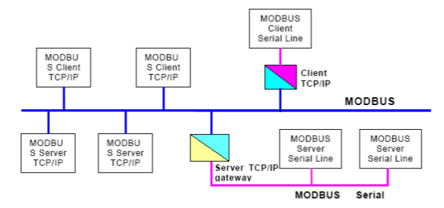
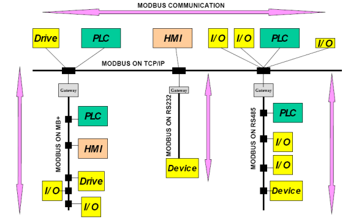
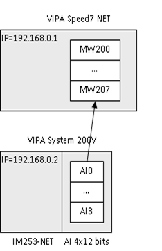
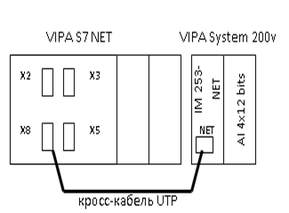
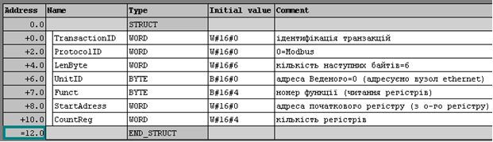
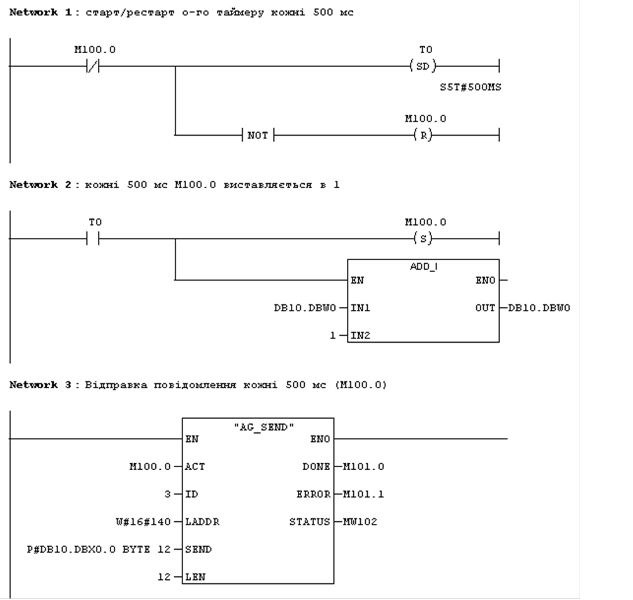
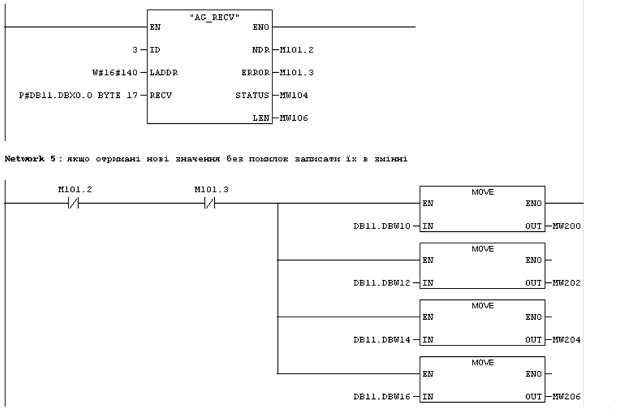

[Промислові мережі та інтеграційні технології в автоматизованих системах](README.md). 6. [МЕРЕЖІ MODBUS](6.md) 

## 6.4. Modbus TCP/IP

### 6.4.1. Комунікаційна архітектура MODBUS TCPIP

Мережа MODBUS TCP/IP базується на стеку протоколів TCP/IP і перш за все призначена для роботи на базі мереж Ethernet. MODBUS TCP/IP описаний в специфікаціях MODBUS-IDA, в яких комунікаційна система MODBUS TCP/IP може включати різні типи пристроїв (рис.6.26):

-    MODBUS TCP/IP Клієнти і Сервери підключені до TCP/IP мережі;

-    міжмережні пристрої типу мостів, маршрутизаторів або шлюзів для з’єднання TCP/IP мережі з послідовними лініями підмереж, що дозволяє обмінюватися даними MODBUS Serial Клієнтськими і Серверними пристроями. 



Рис.6.26. Комунікаційна архітектура MODBUS TCP/IP

Таким чином комунікаційна система MODBUS TCP/IP дозволяє обмінюватися пристроям не тільки на мережах зі стеком TCP/IP, а і з пристроями на послідовних лініях зв’язку (MODBUS RTU/ASCII або MODBUS+). Як приклад можна привести рис.6.27, взятий зі специфікації протоколу прикладного рівня.



 Рис.6.27.Приклад архітектури мережі MODBUS

### 6.4.2. Особливості реалізації протоколу

Аналогічно всім мережам MODBUS, дана мережа використовує MODBUS Application Protocol. Нагадаємо, що в MODBUS Serial на канальному рівні до PDU добавляється адреса веденого і контрольна сума, сам PDU не модифікується. Однак в MODBUS TCP/IP перед попаданням на транспортний рівень, до PDU (код функції та дані) додається додатковий MBAP-заголовок. (рис.6.28). Заголовок складається з полів, які описані в табл.6.6. Отриманий модуль передається рівню ТСР.


Рис.6.28. Формат модуля даних прикладного рівня (APDU) MODBUS TCP/IP

Зверніть увагу, що за допомогою поля UnitID можна вказати адресу вузла в MODBUS Serial, наприклад адресу Веденого в MODBUS RTU. Якщо потрібно адресувати вузол, безпосередньо підключений по TCP/IP то UnitID=0. 

Поле ProtocolID використовується для міжсистемного мультиплексування. Так ТСР порт для MODBUS серверу має номер 502, однак цей же порт, наприклад, використовує Schneider Electric для UNITE-Серверу. Таким чином замінивши поле ProtocolID Ethernet модулі ПЛК Schneider Electric одночасно підтримують два протоколи: MODBUS та UNI-TE. 

Таблиця 6.6. Поля MBAP заголовка

| Поле          | Дов-жина  (байт) | Пояснення                                     | Клієнт                      | Сервер                                     |
| ------------- | ---------------- | --------------------------------------------- | --------------------------- | ------------------------------------------ |
| TransactionID | 2                | ідентифікація транзакцій запитів/  відповідей | ініціалізує Клієнт в запиті | копіює з запиту у повідомлення  -відповідь |
| ProtocolID    | 2                | тип протоколу, 0=MODBUS протокол              | ініціалізує Клієнт в запиті | копіює з запиту у повідомлення  -відповідь |
| Length        | 2                | кількість наступних байтів                    | ініціалізує Клієнт в запиті | ініціалізує Сервер у відповіді             |
| UnitID        | 1                | адреса Веденого, який  підключений до вузла   | ініціалізує Клієнт в запиті | копіює з запиту у повідомлення  -відповідь |

Для ідентифікації пристрою, якому передається запит, вказується його IP-адреса. Для ідентифікації TPDU, які направляються MODBUS-Серверу, як прикладному об’єкту, виділений 502-гий TCP-порт. З деталями функціонування стеку TCP/IP а також Ethernet можна ознайомитись в літературі по комп’ютерним мережам а також в розділі 10. Крім того там наведені деякі пояснення з приводу обмежень використання рішень подібних MODBUS TCP/IP, зокрема в системах з жорсткими вимогами до реального часу.

Приклад 6.7. MODBUS. Реалізація MODBUS TCPIP Клієнтської програми для зв’язку VIPA Speed7 з віддаленими модулями вводу/виводу VIPA IM 253NET.

Завдання. Написати прикладну програму в середовищі Step7 для реалізації періодичного (1 раз в 500мс) зчитування значення 4-х аналогових входів в ПЛК Vipa Speed7NET з віддалених модулів вводу/виводу на базі VIPA IM 253NET (рис.6.29) . 



Рис.6.29. Постановка задачі до прикладу 6.7

Рішення. Даний приклад розглянутий з максимальними спрощеннями і без деталізації, яка не стосуються даної теми. Враховуючи, що для програмування VIPA можна скористатися іншим програмним продуктом (WinPLC7) деталі створення конфігурації для Step7 в прикладі упущені. Слід також відмітити, що Siemens пропонує свій комунікаційний функціональний блок, як для реалізації Клієнта так і Сервера MODBUS TCP/IP, однак в даному прикладі використовуються стандартні функції AG_SEND та AG_RECV. 

З рис.6.29 видно, що 4-ри 12-бітні входи будуть зчитуватися як 4 слова. Оскільки вони знаходяться на першому посадочному місці, змінна AI0 – буде адресуватись як 0-вий вхідний регістр, а AI3 – як 3-тій. Таким чином задачу можна сформувати так: написати прикладну програму в ПЛК Vipa Speed7NET (IP=192.168.0.1) для реалізації зчитування по MODBUS TCP/IP перших 4-х вхідних регістрів з Серверу з адресою IP=192.168.0.2. При такій постановці вже не важлива конкретика реалізації віддаленого пристрою.

Для повноти картини наведемо схему мережних з’єднань (рис. 6.30). Слід відмітити, що у VIPA S7 NET серед 2-х портів Ethernet X8 та X5 тільки один порт, а саме X8(TP), може використовуватись для різних типів з’єднань аналогічних CP343 від Siemens. Інший порт (X5) може використовуватись тільки для PG/OP з’єднань. Таким чином, для з’єднання даного ПЛК по MODBUS TCP/IP необхідно використати роз’єм Х8 (ТР).



Рис.6.30. Схема мережних з’єднань до прикладу 6.7 

Для реалізації обміну по протоколу TCP в S7-подібних контролерах конфігурують з’єднувальні канали (Connections). Для кожного каналу вказують:

-     локальний процесор, для якого конфігурується канал;

-     точку виходу в мережу, тобто комунікаційний модуль;

-     ідентифікатор з’єднання;

-     активність з’єднання, тобто чи ініціює даний вузол з’єднання;

-     адреса комунікаційного партнеру, з яким настроюється з’єднання (IP та TCP port);

-     локальний  TCP port для з’єднання.

В принципі, використовуючи з’єднувальні канали, можна обмінюватися поверх TCP по будь-якому відкритому протоколу. Тому MODBUS TCP/IP є один із багатьох варіантів використання даного типу комунікацій Siemens. Так, наприклад, Step5 сумісний зв’язок теж конфігурується подібним чином, однак порти TCP будуть інші і протокол прикладного рівня теж інший. 

Для поставленої задачі створюється з’єднувальний канал з наступними характеристиками:

-     канал створюється на стороні процесору VIPA S7 NET;

-     точка виходу в мережу (маршрутизатор) – вибираємо порт ТР (віртуальний модуль CP343), після чого в конфігураторі отримується адреса даного модуля відповідно до його розміщення в корзині (=14016) ;

-     тип каналу =TCP;

-     ідентифікатор з’єднувального каналу вибираємо довільний, наприклад  3 ;

-     з’єднання активне з цього боку, чим вказуємо, що даний вузол в з’єднанні представляє бік клієнта TCP;

-     вказуємо ІР-адресу комунікаційного партнеру, тобто IP=192.168.0.2;

-     вказуємо TCP port для партнеру, TCP=502 (MODBUS Серевер);

-     вказуємо локальний, тобто клієнтський TCP port, вибираємо довільний в дозволеному діапазоні, наприклад TCP=2001.

Після такої конфігурації, навіть без написання додаткової програми, між ПЛК та модулем віддаленого вводу/виводу створиться TCP з’єднання. Однак ніякими даними користувача вузли обмінюватися не будуть. 

Для передачі даних від ПЛК VIPA S7 NET, необхідно скористуватися комунікаційною функцією AG_SEND, яка поставляється з бібліотеками для VIPA. Ця функція відправляє блок даних по створеному з’єднувальному каналу. Одним із аргументів цієї функції є вказівник на блок даних, які необхідно відправити. В нашому випадку це, по суті, MODBUS TCP/IP ADU. Найбільш зручний спосіб описати в Step7 подібну структуру та виділити для неї пам’ять – це використати блоки даних типу DB. Таким чином формуємо DB10 для створення MODBUS TCP/IP ADU, відповідно до таблиці 6.5 та синтаксису функції читання вхідних регістрів (див. п. 6.2.2). Результат формування блоку DB10 в Step7 показаний на рис.6.31.

<a href="media6/6_31.png" target="_blank"></a> 

Рис.6.31. Блок DB10 для формування клієнтського запиту MODBUS до прикладу 6.7

Перші два поля при ініціалізації блока прирівнюються нулю. Поле TransactionID можна використати для відслідковування послідовності відповідей на запити (який TransactionID в запиті, такий і у відповіді), однак це не обов’язково. ProtocolID=0, бо використовується сервер MODBUS. 

Кількість наступних байт залежить від функції, в нашому випадку їх 6. Адреса Веденого=0, тому що адресат знаходиться безпосередньо на Ethernet. Функція=4, оскільки необхідно зчитати вхідні регістри, початкова адреса=0 а кількість =4 (див. рис.6.28).   

Вказівник на сформований блок даних вказується в аргументах функції AG_SEND. Частина програми, яка відповідає за відправку запитів буде мати вигляд як на рис. 6.32.

<a href="media6/6_32.png" target="_blank"></a> 

Рис.6.32. Частина програми (Network1-3), яка відповідає за відправку запитів, (до прикладу 6.7). 

Програма написана в організаційному блоці OB1 (циклічний виклик). В першому ланцюжку (Network1) кожні 500 мс, перезапускається таймер і генерується одиничний імпульс M100.0 тривалістю в один цикл. Цей імпульс використовується для відправки даних в мережу (параметр ACT) раз в 500 мс. З цією ж періодичністю в Network2 збільшується значення 0-го слова в блоці даних DB10 (DB10.DBW0), яке вказує на ідентифікатор транзакції. Крім безпосередньо вказівника на блок з даними для відправки довжиною 12 байт (параметр SEND), в функції вказується ідентифікатор з’єднувального каналу (параметр ID=3), адреса комунікаційного модуля (LADDR=140h), та кількість байт для відправки. Контроль відправки та виклику функцій проводиться за допомогою параметрів DONE (біт виконання операції), ERROR (біт наявності помилки) та STATUS (слово статусу операції), про використання яких можна можна прочитати в довідниковій літературі.

Після запуску програми на виконання, процесор ПЛК буде записувати вказані в DB10 дані в вихідний буфер комунікаційного модулю з адресою LADDR=140h, які відправляться цим модулем по з’єднувальному каналу TCP з ідентифікатором 3. Інтерфейсний модуль розподіленої системи вводу/виводу VIPA IM 253NET, отримавши по з’єднувальному каналу дані MODBUS TCP/IP ADU, сформує повідомлення-відповідь і відправить його по цьому ж каналу. Це повідомлення попадає у вхідний буфер комунікаційного модулю. Для того, щоб прочитати дані з вхідного буферу, використовується функція AG_RECV.

В якості одного з параметрів функції AG_RECV є вказівник на дані, куди необхідно помістити результат функції, тобто дані вхідного буферу. Аналогічно попередній частині програми, найкраще використати блок даних, наприклад DB11. Значення ініціалізації полів даного блоку не відіграє ніякої ролі, оскільки заповнюється значеннями буферу. Однак бажано задати структуру блоку, яка і показана на рис.6.33. 

<a href="media6/6_33.png" target="_blank"></a> 

Рис.6.33. Блок DB11 для отримання відповіді серверу MODBUS (до прикладу 6.7). 

Друга частина програми, в якій реалізоване отримання необхідних значень аналогових входів, показана на рис.6.34. 

<a href="media6/6_34.png" target="_blank"></a> 

Рис.6.34. Частина програми (Network4-5), яка відповідає за отримання відповіді з вхідного буферу комунікаційного модулю (до прикладу 6.7). 

У випадку позитивного результату виконання функції та отримання нових даних (NDR=0 та ERROR=0) записуємо значення в змінні MW200-MW206, відповідно до завдання. Слід зазначити, що даний приклад значно спрощений, зокрема в ньому не враховані випадки виникнення комунікаційних помилок. Однак він показує яким чином використовується клієнтський бік MODBUS TCP/IP в Siemens-сумісних ПЛК. Аналогічно можна прописати і серверний бік MODBUS TCP/IP, однак це набагато складніша задача.

Приклад 6.8. MODBUS. Реалізація MODBUS TCPIP Клієнтської програми для зв’язку прикладних програм з інтегрованим VBA та ПЛК.

Завдання. Написати прикладну програму в середовищі VBA (Excel) для реалізації зчитування значення 5-ти внутрішніх регістри з ПЛК по протоколу MODBUS TCP/IP. Зчитування проводити при нажиманні кнопки. 

Рішення. У VBA прописуємо наступний код, показаний на рис. 6.35.

Для реалізації даної задачі використаний ActiveX-елемент Winsock\ (має назву Winsock1), який як правило вже присутній на комп’ютерах з операційною системою Windows. Цей компонент являється інтерфейсом до однойменного сервісу в операційній системі Windows і функціонує приблизно так як модель сокетів (див.розділ 10). Він може працювати як в режимі TCP так і UDP. Для останнього - з’єднання проводити не потрібно. Достатньо розмістити Winsock елемент на контейнері (наприклад формі) і можна користуватися його методами, властивостями та подіями. 

```vb
Dim Reg(1 To 10) As Integer ' тут зберігаємо значення змінних
Private Sub CloseSocket()
    Winsock1.Close 		'закінчити з'єднання
End Sub

Private Sub ConnectSocket()  			'з'єднуємося з MODBUS сервером
    Winsock1.Protocol = sckTCPProtocol   'вибираємо протокол ТСР
    Winsock1.Connect "192.168.9.17", 502 'вказуємо ІР та 502 порт
End Sub

Private Sub CommandButton3_Click()
    ReadRegisters 0, 5                    ' читаємо 5 регістрів починаючи з 0
End Sub

Sub ReadRegisters(StartAddr As Integer, CountAddr As Integer)
    Dim a(1 To 12) As Byte 'посилка в байтах
    If Winsock1.State = sckConnected Then 'якщо під'єднанні
        a(6) = 6 					 'кількість байт
        a(8) = 3					 'функція
        a(9) = StartAddr \ 256             'початковий № - старший байт
        a(10) = StartAddr Mod 256          'початковий № - молодший байт
        a(11) = CountAddr \ 256           'кількість - старший молодший байт
        Winsock1.SendData a               'відправити масив байт
    End If
End Sub

Private Sub Winsock1_DataArrival(ByVal bytesTotal As Long) 'отримали дані
 Dim a As Variant, LoInd As Integer, i As Integer, j As Integer
 Winsock1.GetData a, , bytesTotal          'вийняти дані з буферу
 LoInd = LBound(a)                         'визначити початковий індекс масиву
 If a(7 + LoInd) = 3 Then 'якщо це функція читання і вона оброблена без помилок
    For i = 1 To a(8 + LoInd) \ 2         'перебираємо кожний регістр
        j = 9 + (i - 1) * 2               'номер байту в масиві для регістру і
        If (a(j) And &H80) > 0 Then      'якщо число від'ємне (старший біт в 1)
            a(j) = a(j) And &H7F          'обнулити старший біт
            Reg(i) = a(j) * 256 + a(j + 1) - 32768 
'рахувати з урахуванням знаку
        Else
            Reg(i) = a(j) * 256 + a(j + 1) ' рахуємо без знаку
        End If
    Next
 End If
End Sub

```

Рис.6.35 Фрагмент програми до прикладу 6.8                


<-- 6.3. [Modbus Serial](6_3.md)  

--> 6.5. [Рекомендації до проектування Modbus RTU/ASCII та Modbus TCP/IP](6_5.md)


 
