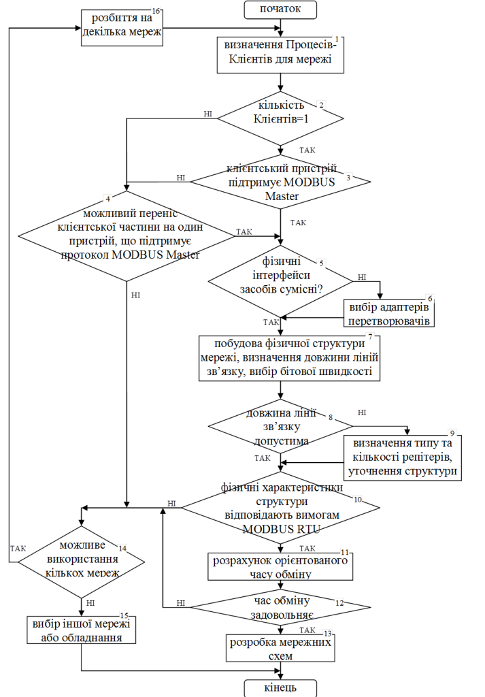
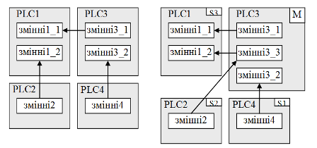
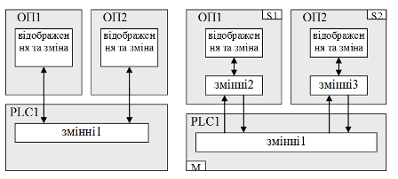

[Промислові мережі та інтеграційні технології в автоматизованих системах](README.md). 6. [МЕРЕЖІ MODBUS](6.md) 

## 6.5. Рекомендації до проектування Modbus RTU/ASCII та Modbus TCP/IP

Основними перевагами мереж MODBUS перед іншими мережами є їх простота та бюджетність рішення. Як було зазначено в 2-му розділі, нерідко вибір конкретної мережі диктується наявними обмеженнями з боку вибраної платформи. Якщо вибрані засоби мають інтегровані канали з підтримкою MODBUS, то при необхідності побудови мережних структур є сенс в їх використанні. Тільки якщо дане рішення принципово не підходить по ряду критеріїв, необхідно змінювати конфігурацію обладнання а інколи і самі програмно-технічні засоби. В даному підрозділі розглянемо загальні підходи до проектування мереж MODBUS в типових ситуаціях, загальна ж послідовність розробки інтегрованих автоматизованих систем наведена в розділі 15

### 6.5.1. Послідовність розробки мереж MODBUS RTU/ASCII

В загальному випадку проектування мереж MODBUS RTU можна проводити по алгоритму, наведеному на рис.6.36 (для MODBUS ASCII аналогічно). Враховуючи функціонування протоколу прикладного рівня по моделі Клієнт/Сервер обміну повідомленнями, в блоці 1 необхідно визначити вузли, які повинні ініціювати обмін. Серед типів програмно-технічних засобів, що наведені в розділі 1 даного посібника, типовими ініціаторами обміну можуть бути:

-     засоби людино машинного інтерфейсу (ЛМІ), до яких відносяться ОП та комп’ютери зі SCADA/HMI;

-     контролери, яким необхідно доступатись до інших контролерів або до периферійних засобів;

-     програматори або конфігуратори.

Нагадаємо, що засоби ЛМІ обмінюються даними з контролерами, периферійними засобами або іншими засобами ЛМІ. Для відображення плинних даних процесу, засоби ЛМІ опитують їх значення з певною періодичністю тільки тоді, коли сторінка відображення є активною. Така поведінка є логічною, оскільки економляться часові ресурси мережі. Однак деякі засоби ЛМІ дають можливість постійного опитування даних. Зокрема це характерно для операцій ведення архівів а також для задач тривог та аварій. Запис даних процесу з ЛМІ проводиться як правило тільки при їх зміні. Тому логічним є те, що засоби ЛМІ в мережі повинні бути Клієнтами. Виключенням можуть бути ситуації, коли в мережі повинно бути декілька засобів ЛМІ, або коли є необхідність в передачі термінових повідомлень на термінал. Ці ситуації розглянуті нижче.

При необхідності обміну даними контролера з іншим контролером, або з периферійними засобами, він повинен ініціювати обмін, тобто бути Клієнтом. 

Програматори та конфігуратори теж повинні бути Клієнтами. В зв’язку з тим, що підключення їх до мережі проводиться тільки при необхідності, та при умові відсутності вимог до одночасного функціонування мережі разом зі зміною конфігурації/програми мережних вузлів, можна вважати, що програматор не входить в структуру мережі. В іншому випадку, необхідно виділяти окремий канал, тобто виділяти окрему мережу для пристроїв, які необхідно програмувати, якщо таке можливе (блок 14).  

В будь якому випадку, кількість клієнтських вузлів не може бути більше одного, оскільки прикладний процес Клієнта в одній мережі MODBUS RTU може знаходитись тільки на Ведучому. Якщо кількість Клієнтів (блок 1) все ж таки більше одного можна спробувати перенести клієнтські запити вузлів на один вузол з правами Ведучого (блок 4). Нижче розглянуті декілька прикладів такого переносу. Якщо перенос не вдається по певним причинам необхідно на вузлах виділити окремі канали, тобто замість одної мережі створити декілька мереж, якщо таке можливо (блоки 14 та 16), або змінити забезпечення вузлів (блок 15).       

Рис.6.36.Алгоритм проектування мереж MODBUS RTU 

Якщо Клієнт тільки один, його прикладний Процес буде виконуватися на вузлі з правами Ведучого шини (блок 3). Після всіх проведених вище перевірок, необхідно узгодити фізичні інтерфейси (блок 5) та при необхідності використати адаптери перетворювачі. При великих довжинах ліній необхідно підібрати репітер, після чого визначитися з кінцевою структурою, бітовим швидкостям та перевірити відповідність фізичних характеристик вимогам MODBUS RTU. 

При наявності часових комунікаційних характеристик для портів всіх засобів, які приймають участь в обміні, бажано розрахувати орієнтований час обміну, розрахунок якого показаний в прикладі 6.4. Якщо час обміну задовольняє, то мережа підходить для вирішення поставлених задач і можна переходити до розробки документів робочого проекту.       

### 6.5.2. Перенесення клієнтських запитів в мережах MODBUS RTU/ASCII

Якщо при проектуванні мережі MODBUS RTU виявилось декілька прикладних Процесів Клієнтів, можна спробувати їх перенести на один вузол.

На рис.6.37 показаний приклад вирішення задачі, в якій необхідно поєднати в мережу чотири ПЛК (PLC1-PLC4) , для обміну даними з певною періодичністю. Розглянемо, який з PLC повинен бути Клієнтом, а отже і Ведучим MODBUS RTU.

Враховуючи, що обмін даними повинен бути періодичним, то кожен з ПЛК для інформаційних потоків може бути як ініціатором обміну, тобто Клієнтом, так і Сервером. Чи можна виділити єдиний Клієнтський вузол? PLC1  – не може бути єдиним клієнтським вузлом, бо присутній інформаційний зв’язок між PLC3 та PLC4. PLC2 теж не може, із-за зв’язків PLC3-PLC1 та PLC3-PLC4. Для PLC3 так як і для PLC4 залишається недосяжними зв’язок PLC1-PLC2. Для PLC4 крім того не може бути Клієнтом із-за зв’язку PLC3-PLC1. Таким чином явно виділяються як мінімум два Клієнти: PLC1 та PLC3.      

Рис.6.37. Перенесення клієнтських запитів на один ПЛК: зліва – постановка задачі, зправа – варіант вирішення задачі  

Рішення даної задачі може бути перенесення клієнтських запитів на один із вузлів, наприклад PLC3. Прямі клієнтські запити залишаються: PLC3 записує значення змінні3_1 в змінні1_1, зчитує значення зі змінні4 в змінні3_2. Для реалізації зв’язку між змінні2 та змінні1_2, необхідно щоб PLC3 зчитував ці значення з PLC2, після чого записував їх в PLC1. Як правило для цього виділяється додатковий буфер, в прикладі це змінні3_3.    

Вибір вузла з клієнтським прикладним Процесом, а отже Ведучого, може проводитись по різними критеріями: здатність комунікаційних каналів працювати в режимі MODBUS RTU Ведучого або Веденого, потужність комунікаційних каналів (продуктивність запитів що може обробити ПЛК), потужність процесору, зручність програмування або конфігурування, кількість прямих клієнтських запитів, зручність налагоджування, тощо. В нашому випадку ми зупинилися на PLC3, що обумовлено зменшенням кількості непрямих клієнтських запитів.  

Розглянемо наступний випадок. При необхідності підключення до єдиної мережі MODBUS RTU декількох засобів людино-машинного інтерфейсу, які, як ми зазначили, повинні формувати клієнтські запити, виникає необхідність в декількох Ведучих. На рис.6.38 продемонстрований приклад, в якому необхідно підключити дві операторські панелі до одного ПЛК як для відображення так і для управління. Жодна з операторських панелей не може взяти на себе ексклюзивні права Клієнта, оскільки інша операторська панель не зможе отримувати дані. Якщо операторські панелі підтримують MODBUS RTU в режимі Веденого, а ПЛК в режимі Ведучого, то рішення цієї задачі може бути як на рис.6.38 (зправа). Для цього в операторських панелях повинна бути виділена область пам’яті (на рис.6.38 змінні2 та змінні3), з якою буде обмінюватись ПЛК, генеруючи запити на читання та запис регістрів/бітів. Відображення та зміна значень змінні1 з операторських панелей буде проходити через ці виділені області. 

  

Рис.6.38. Перенесення клієнтських запитів з декількох ОП на один ПЛК: зліва – постановка задачі, зправа – варіант вирішення задачі 

Хоч в розглянутому прикладі використовуються операторські панелі, аналогічно вирішується ситуація, коли в якості засобів людино-машинного інтерфейсу виступають ПК зі SCADA, або комбінація ОП та SCADA. Для SCADA в цьому випадку необхідна наявність драйверів MODBUS RTU в режимі Веденого. 

В даній задачі можливе перенесення клієнтських запитів на один із засобів людино-машинного інтерфейсу. Однак це далеко не завжди можливо, оскільки в цьому випадку необхідно реалізувати переприсвоєння змінних з різними джерелами даних. Крім того, засоби ЛМІ в більшості випадків не можуть забезпечити детермінований час доставки даних.

### 6.5.3. Послідовність розробки мереж MODBUS TCP/IP

На відміну від MODBUS RTU/ASCII в MODBUS TCP/IP, що як правило базується на Ethernet, немає проблем з наявністю клієнтських запитів тільки на одному вузлі. Прикладний Процес на вузлі може одночасно бути як Клієнтом так і Сервером. При розробці мережі враховують фізичні особливості засобів Ethernet (див. розділ 10). Таким чином в загальній послідовності проекту мережі можна виділити такі кроки:

1. Визначення клієнтських вузлів.

2. Визначення підтримки потенційними клієнтськими вузлами режиму MODBUS Клієнта, а серверних – режиму MODBUS Серверу.

3. Перенесення клієнтських або серверних запитів на інші вузли при необхідності.

4. Розрахунок орієнтовного часу транзакції між вузлами Клієнта та Сервера.

5. Розробка мережних схем на базі Ethernet.

Розрахунок орієнтованого часу транзакції для MODBUS TCP/IP базується на тих саме принципах що і MODBUS RTU/ASCII. Однак замість часу, який витрачається на передачу кадру, необхідно врахувати час реакції комунікаційних засобів Etherent (концентраторів, комутаторів, мостів, шлюзів і т.д.).

## Контрольні запитання до розділу 6

1. Якими мережами на сьогоднішній день представлений MODBUS? Охарактеризуйте їх в контексті моделі OSI.

2. Розкажіть про основи функціонування MODBUS Application Protocol. Який формат повідомлення MODBUS PDU? Як поділяються коди функцій з точки зору MODBUS-IDA?

3. Як MODBUS-серверний Процес дізнається про помилковий результат обробки повідомлення-запиту?

4. Які функції використовуються для доступу до даних процесу?

5. Як формуються повідомлення-запити та повідомлення відповіді для читання та запису діапазону вхідних та вихідних регістрів?

6. Які ситуації можливі при обробці запиту MODBUS Клієнта? Наведіть приклади відповідей про помилку.

7. Що таке MODBUS відображення даних? Які моделі відображення даних MODBUS використовуються в сучасних засобах автоматизації?

8. Прокоментуйте основи функціонування MODBUS RTU/ASCII в контексті моделі OSI. Як пов’язана модель функціонування обміну на прикладному рівні з функціонуванням на канальному?

9. Яка модель адресації та який метод доступу до шини використовується в MODBUS RTU/ASCII на канальному рівні? Як на цьому рівні проводиться контроль за правильністю доставки бітової послідовності?

10. В чому відмінність роботи MODBUS RTU та MODBUS ASCII на канальному та фізичному рівні?

11. Розкажіть про принципи розрахунку часу обміну між вузлами з використанням часової діаграми.

12. Розкажіть про принципи побудови кадрів для MODBUS RTU та MODBUS ASCII.

13. Які інтерфейси, бітова швидкість та топологія використовується для MODBUS RTU/ASCII на фізичному рівні? Яким чином вузли можуть підключатися до загальної шини?

14. Як реалізовується двохпроводне з’єднання вузлів по MODBUS RTU/ASCII? В якому місті і як реалізовується захисне зміщення? 

15. Які типи роз’ємів визначені в стандартах MODBUS-IDA для підключення пристроїв до шини по RS-485? 

16. Які основні недоліки ви можете назвати в принципах функціонування мереж MODBUS RTU/ASCII?

17. Прокоментуйте основи функціонування MODBUS TCP/IP в контексті моделі OSI. Які типи пристроїв передбачає комунікаційна архітектура MODBUS TCP/IP? 

18. Які поля включає формат модуля даних прикладного рівня MODBUS TCP/IP? Поясніть призначення полів заголовка MBAP? 

19. Яка адреса порту ТСР використовується для MODBUS Сервера?

20. Яким чином забезпечується доступ до необхідного вузла MODBUS RTU/ASCII, підключених через шлюз до MODBUS TCP/IP в заголовку MBAP?

21. Які вузли як правило являються ініціаторами обміну в MODBUS RTU/ASCII? Поясніть чому?

22. Навіщо необхідно визначати вузли з клієнтськими запитами? Чому вузол з клієнтським Процесом в MODBUS RTU/ASCII може бути тільки один?

23. Наведіть приклади переносу клієнтських запитів на один вузол. Які обмеження при цьому є?

24. В чому відмінність проектування MODBUS TCP/IP порівняно з MODBUS RTU/ASCII? 

 

<-- 6.4. [Modbus TCP/IP](6_4.md) 

--> 7. [МЕРЕЖА PROFIBUS](7.md)

 

 
