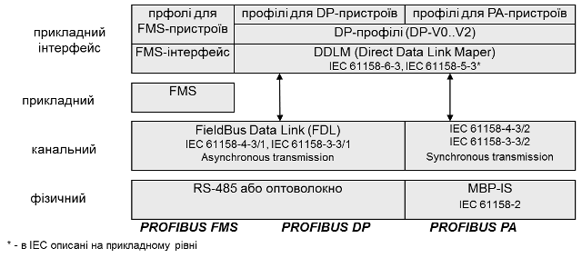
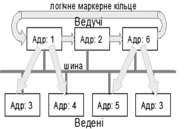

[Промислові мережі та інтеграційні технології в автоматизованих системах](README.md). 7.[МЕРЕЖА PROFIBUS](7.md)

## 7.1. Мережі PROFIBUS в контексті моделі ISO та МЕК

На сьогоднішній день PROFIBUS це система, яка включає в себе різноманітні технології (рис.7.1.):

-     PROFIBUS DP (Decentralized Periphery);

-     PROFIBUS FMS (Fieldbus Message Specification);

-     PROFIBUS PA (for Process Automation)

 

Рис.7.1. PROFIBUS в контексті OSI-моделі

Мережа PROFIBUS DP використовується в системах автоматизації процесу для зв’язку контролерів з розподіленою периферією, а PROFIBUS PA для зв’язку контролерів з датчиками в промисловій зоні. 

PROFIBUS DP - це сивмольно-орієнтований асинхронний тип мережі, який на фізичному рівні базується на інтерфейсі RS-485 або на різних типах оптоволоконних з’єднань.  Відсутність протоколу прикладного рівня (згідно опису EN) дозволяє безпосередньо обмінюватися ідентифікованими даними між вузлами, що значно прискорює процес обміну. Кількість та призначення даних визначається профілем та конфігурацією мережі. Слід зазначити, що в трьохрівневій моделі МЕК, PROFIBUS DP на прикладному рівні описаний: протоколом - IEC 61158-5-3 та інтерфейсом рівня - IEC 61158-6-3. У розділі 7.7 наведена інша модель PROFIBUS DP, яка викладена в специфікації від PNO. 

PROFIBUS PA – перша із PROFIBUS комунікацій, яка з’явилася в стандарті IEC 61158. Мережа реалізовує синхронний тип обміну, що більш характерний для обміну даними вводу/виводу в жорсткому реальному часі. На фізичному рівні використовується інтерфейс MBP, який дозволяє живити по інформаційній парі проводів підключені датчики та виконавчі механізми. Це спеціальна пропозиція для вибухонебезпечних зон виробництва. Сегмент PROFIBUS PA може підключатися до сегменту PROFIBUS DP і таким чином включаючись у загальну PROFIBUS систему.

PROFIBUS FMS – це по суті сервіс прикладного рівня, який забезпечує ацикліччний обмін повідомленнями, що дозволяє передавати дані великого обсягу. Враховуючи, що він базується на тих же сервісах канального рівня що і PROFIBUS DP, вони можуть працювати у одній і тій же мережі. 

В мережах PROFIBUS, незалежно від їх типу, використовується гібридний метод доступу до шини (рис.7.2), що дозволяє обмінюватися даними між рівноправними вузлами (активні учасники ─ Ведучі), а також забезпечувати їх обмін з розподіленими периферійними засобами на шині (пасивні учасники - Ведені). 

 

Рис.7.2. Метод доступу в мережах Profibus

<-- 7.[МЕРЕЖА PROFIBUS](7.md)

--> 7.2. [Реалізація фізичного рівня PROFIBUS DP](7_2.md)