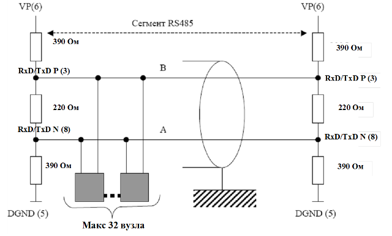
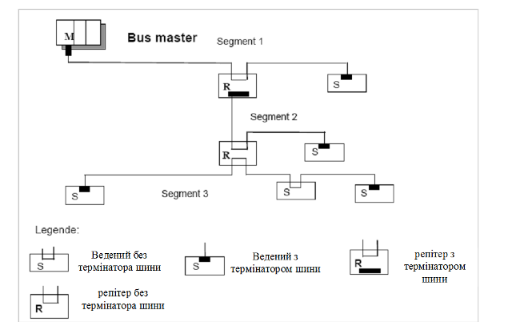
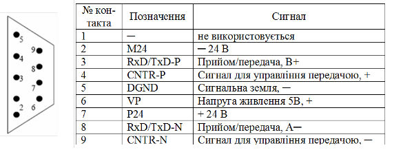
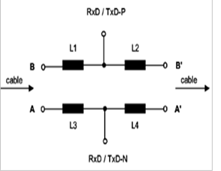
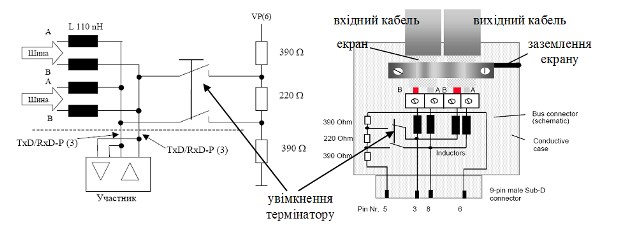
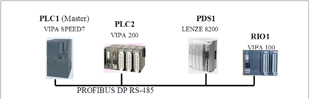
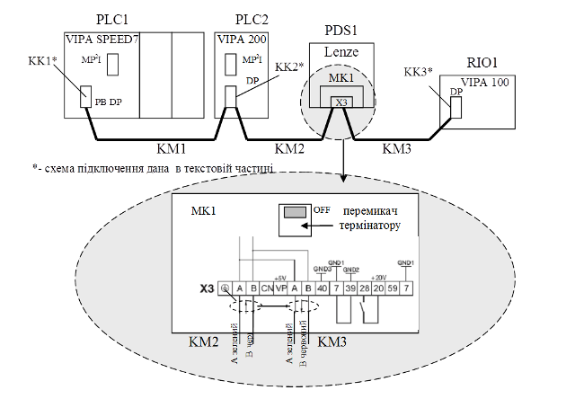
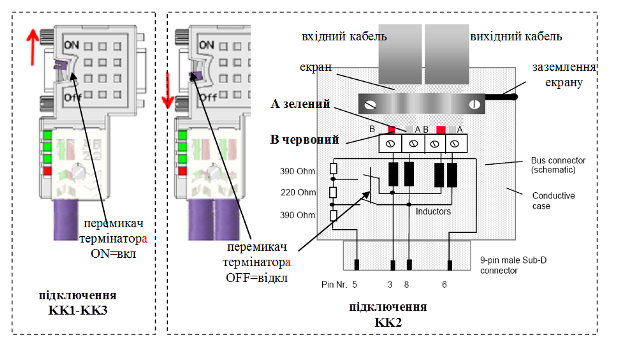

[Промислові мережі та інтеграційні технології в автоматизованих системах](README.md). 7.[МЕРЕЖА PROFIBUS](7.md)

## 7.2. Реалізація фізичного рівня PROFIBUS DP

PROFIBUS DP на фізичному рівні базується на інтерфейсі RS-485 або на різних типах оптоволоконних з’єднань з бітовою швидкістю до 12 МБіт/с. Дані передаються 11-бітними символами (1 старт, 8 даних, 1 паритет, 1 стоп) методом NRZ. Максимальна кількість вузлів на сегмент – 32, максимальна довжина лінії залежить від бітової швидкості:

- від 9600біт/с до 187500біт/с – до 1000 м;
- 500 кбіт/с – до 500 м;
- 1500 кбіт/с – до 200 м;
- 12 Мбіт/с – до 100 м.

Використовується шинна топологія (рис.7.3). З’єднання вузлів проводиться по 2-провідній схемі (сигнал А та В) без сигнальної землі. На кінцях кожного сегменту виставляються термінатори лінії опором 220 Ом.  

В стані покою, коли всі передавачі мовчать, на лінії обов’язково повинна бути логічна „1”. Тобто в мережі необхідно реалізовувати поляризацію лінії (захисне зміщення). Для цього на кінцях лінії, крім термінаторів лінії, до шини підключається живлення 5 В через PullUp та PullDown резистори номіналом 390 Ом. Захисне зміщення з обох кінців забезпечується як правило безпосередньо кінцевими вузлами. Використання зміщення з двох кінців більш надійне порівняно з централізованою схемою, як наприклад у Modbus RTU, оскільки при відключенні одного з кінцевих вузлів мережа залишається робочою.  

Підключення пристроїв до загальної шини проводиться способом daisy-chain, тобто без відгалужень. Ці вимоги пов’язані з ефектом відбиття хвиль на коротких ділянках відгалуження. На рис.7.4 видно, що кабель шини повинен „зайти” до кожного і „вийти” з кожного пристрою. На цьому ж рисунку показаний спосіб розділення загальної шини на сегменти, які об’єднуються за допомогою репітерів. Таким чином можна досягнути іншої топології і збільшити кількість пристроїв та загальну довжину мережі. Треба пам’ятати, що наявність репітерів треба враховувати при виборі швидкості передачі даних.

Рис.7.3. Структура шинного сегменту RS-485 

 

 Рис.7.4. Сегментація та підключення пристроїв до PROFIBUS шини 

Деякі пристрої необхідно підключати тільки в певні періоди часу, наприклад програматори. В цьому випадку дозволяється підключення до шини через активні відгалужувачі (наприклад шинні термінали, репітери, активні кабельні з’єднувачі).

 В якості з’єднувача в стандартах IEC 61158-2 і EN 50170-2 рекомендується використовувати 9-піновий SUB-D конектор, призначення контактів якого наведене на рис.7.5. Наявність наведених функцій для контактів 3,5,6 та 8 є обов’язковою. Стандарти дозволяють використовувати інший тип з’єднувачів, або клемну колодку з аналогічними контактами. 

Рис. 7.5 Призначення контактів 9-пінового SUB-D конектора

Стандарт IEC 61158-2 визначає два типи кабелів рекомендованих для підключення PROFIBUS шини: виті пари типу А та В. Характеристики цих кабелів і припустимі швидкості передачі даних для них, в залежності від довжини лінії зв’язку, наведені у табл. 7.1 і табл.7.2.

Для шинної топології на базі RS-485 інтерфейсу, для достатнього погашення відбиття сигналів рекомендують мінімізувати довжину відгалужень від магістральної шини. Загальна ємність всіх відгалужень на шині не повинна перевищувати: 0,05 nF для 3 Мбіт/с, 6 Мбіт/с та 12 Мбіт/с; 0,2 nF для 1,5 Мбіт/с; 0,6 nF для 500 кбіт/с; 1,5 nF для 187,5 кбіт/с; 3,0 nF для 93,75 кбіт/с; 15 nF для 9,6 та 19,2 кбіт/с.

Таблиця 7.1 Характеристики кабелів

| Параметр кабелю                       | Тип А                                       | Тип В                                      |
| ------------------------------------- | ------------------------------------------- | ------------------------------------------ |
| Характеристичний імпеданс             | 135-165 Ом   (при частотах від 3 до 20 МГц) | 100-130 Ом   (при частотах більше 100 кГц) |
| Ємність                               | <30 пФ.м                                    | <60 пФ.м                                   |
| Погонний опір                         | <110 Ом/км                                  | не визначено                               |
| Переріз проводу                       | >= 0.34 мм2                                 | >= 0.22 мм2                                |
| Колір ізоляції для не IS застосування | фіолетовий                                  | не визначено                               |
| Колір ізоляції для IS застосування    | синій                                       | не визначено                               |
| Колір проводу A (RxD/TxD-N)           | зелений                                     | не визначено                               |
| Колір проводу B (RxD/TxD-P)           | червоний                                    | не визначено                               |

Таблиця 7.2  Залежність швидкості передачі даних від довжини лінії зв’язку

| Бітова швидкість (кбіт/с)         | 9.6  | 19.2 | 93.75 | 187.5 | 500  | 1500 | 3000         | 6000         | 12000        |
| --------------------------------- | ---- | ---- | ----- | ----- | ---- | ---- | ------------ | ------------ | ------------ |
| Макс. довжина кабелю   типу А (м) | 1200 | 1200 | 1200  | 1000  | 400  | 200  | 100          | 100          | 100          |
| Макс. довжина кабелю типу В (м)   | 1200 | 1200 | 1200  | 600   | 200  | 70   | не допустима | не допустима | не допустима |

Таким чином, для бітової швидкості порядку 1500 Кбіт/с сумарна довжина всіх відгалужень на кабелі типу А не повинна перевищувати 6,6 м, а для швидкості 3/6/12 Мбіт/с – 1,6 м. При високих швидкостях (3-12 Мбіт/с) необхідно включити додатковий імпеданс на лінії зв’язку відгалужувачів або в шинні з’єднувачі. Стандарт рекомендує використати для цього додаткові індуктивності (рис.7.6) 

Рис.7.6. Використання індуктивностей  в якості додаткових імпедансів 

Для кабелю типу А, індук-тивності L1-L4 мають мати значення від 110±22 нГн. Значення індуктив-ностей розраховуються відповідно до імпедансу між B та B’, А та А’, ємнісних характеристик з’єднувача, трансиверу та інших деталей. Тобто при відключенні пристрою від шини (з’єднувача від пристрою), в даній точці може відбутись відбиття сигналу, що спотворює корисний сигнал на загальній шині. На рис. 7.7 показана конструкція мережного з’єднувача, при підключенні по типу daisy-chain. 

Слід зазначити, що у випадку використання кабеля типу В, термінатор лінії повинен мати опір 150 Ом замість 220 Ом (для кабеля типу А).  

У випадку прокладки лінії передачі у місцях з потужними електромагнітними завадами, необхідно використати екранований кабель та правильно виконати заземлення екрану. Екран кабелю повинен бути з’єднаний з корпусом штекера (рис.7.7).  

 

Рис.7.7. Схема мережного з’єднувача для мереж з бітовою швидкостю >1500 біт/с  

Згідно стандартів PROFIBUS заземлення екрану необхідно проводити в усіх точках підключення кабелю через відповідне виконання роз’ємів (рис.7.8) або по загальним правилам заземлення кабелів з високочастотним сигналом (див. розділ 3).   

Приклад 7.1. PROFIBUS. Побудова схеми мережних з’єднань для PROFIBUS DP на базі RS-485. 

Завдання. Підібрати необхідні технічні засоби та розробити схему мережних з’єднань для PROFIBUS DP відповідно до наведеної структури рис.7.8.

 

Рис.7.8. Структурна схема системи до прикладу 7.

Рішення. PLC1 – Speed7 має вбудований PROFIBUS DP інтерфейс, який можна використати в якості Ведучого. PLC2 вибираємо з таким розрахунком, щоб в процесорному модулі теж був інтегрований інтерфейс ROFIBUS-DP (VIPA 215-2BP02), що значно дешевше ніж купувати окремий модуль. Модулі розподіленого вводу виводу RIO1 повинні бути PROFIBUS DP Веденими (VIPA 153-4PH00). Для підключення до мережі частотного перетворювача Lenze необхідний відповідний комунікаційний модуль E82ZAFPC001. Таким чином схема мережних з’єднань буде мати вигляд показаний на рис.7.9. Специфікація мережних засобів та вузлів дана в таблиці 7.3. На рис. 7.10 приводиться схема підключень кабелів КМ1-КМ3 до мережних з’єднувачів КК1-КК3. 

 

 Рис.7.9. Схема мережних з’єднань до прикладу 7.1.

 

Рис.7.10. Схема підключення кабелів до мережних з’єднувачів (до прикладу 7.1).

Таблиця 7.3. Специфікація мережних засобів та вузлів

| №    | Позна-чення | Назва                                                        | Тип            | Кіль-кість | Фірма |
| ---- | ----------- | ------------------------------------------------------------ | -------------- | ---------- | ----- |
| 1    | PLC1        | ПЛК VIPA Speed7                                              | VIPA 314-6CF02 | 1 шт.      | VIPA  |
| 2    | PLC2        | ПЛК VIPA 200                                                 | VIPA 215-2BP02 | 1 шт.      | VIPA  |
| 3    | RIO1        | Модуль  віддаленого вводу/виводу VIPA 100                    | VIPA 153-4PH00 | 1 шт.      | VIPA  |
| 4    | PDS1        | Частотний перетворювач Lenze 8200 Vector для управління асинхронним  двигуном 0,37 кВт | E82EV371K2C    | 1 шт.      | LENZE |
| 5    | MK1         | комунікаційний модуль для роботи в мережі PROFIBUS DP частотних перетворювачів Lenze 8200, з вбудованим  термінатором | E82ZAFPC001    | 1 шт.      | LENZE |
| 6    | KK1-KK3     | мережний з’єднувач Easy Conn PB 90° для мережі  PROFIBUS DP з вбудованим термінатором | VIPA 972-0DP10 | 3 шт.      | VIPA  |
| 7    | KM1         | Кабель екранована вита пара для PROFIBUS DP (тип „Стандарт”) | VIPA 830-0LE00 | 30 м       | VIPA  |
| 8    | KM2         | Кабель екранована вита пара для PROFIBUS DP (тип „Стандарт”) | VIPA 830-0LE00 | 40 м       | VIPA  |
| 9    | KM3         | Кабель екранована вита пара для PROFIBUS DP (тип „Стандарт”) | VIPA 830-0LE00 | 15 м       | VIPA  |

<-- 7.1. [Мережі PROFIBUS в контексті моделі ISO та МЕК](7_1.md) 

--> 7.3. [Реалізація фізичного рівня PROFIBUS PA (MBP)](7_3.md) 