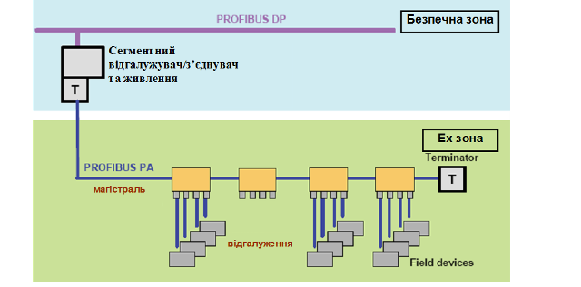
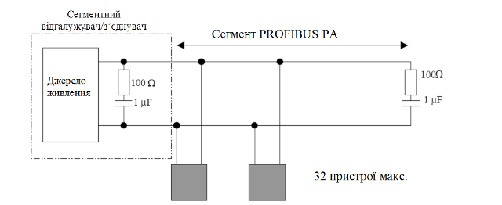
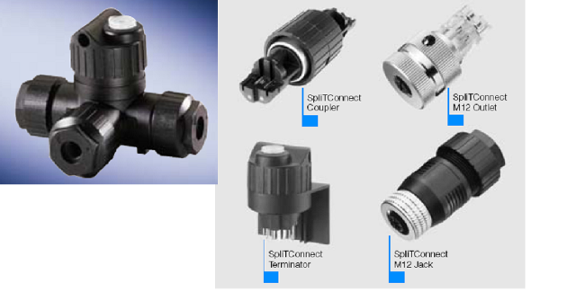

[Промислові мережі та інтеграційні технології в автоматизованих системах](README.md). 7.[МЕРЕЖА PROFIBUS](7.md)

## 7.3. Реалізація фізичного рівня PROFIBUS PA (MBP)

PROFIBUS PA на фізичному та канальному рівні базується на технології передачі MBP\ (Manchester Coding (M) and Bus Powered(BP)), яка застосовується в функціонально небезпечних областях автоматизації, що дозволяє використовувати цю шину в потенційно вибухонебезпечних процесах. Як видно по самій назві, для передачі використовується манчестерське кодування з можливістю живлення пристроїв по одній 2-х провідній шині. В стандарті IEC 61158-2 PROFIBUS PA визначена як Тип 3 в синхронному режимі з бітовою швидкістю 31,25 Кбіт/с.

Безпечна технологія передачі MBP як правило обмежується певними сегментами заводу (польові пристрої в небезпечних Ex-зонах), які з’єднуються з сегментами RS-485 (безпечна зона, система управління та інженерні пристрої в пункті управління) за допомогою сегментних відгалужувачів (segment coupler) та сегментних з’єднувачів (segment link). З’єднання сегментів PROFIBUS DP та PROFIBUS PA показані на рис.7.11. 

Сегментні відгалужувачі\ (segment coupler) – це перетворювачі сигналів, які модулюють сигнал з RS-485 в MBP та навпаки. Пристрої на шині PROFIBUS PA прозорі з точки зору загальної шини, тобто Ведучі обмінюються з ними як з окремими Веденими. Швидкість на сегменті PROFIBUS DP в цьому випадку повинна бути 45.45 Кбіт/с. 

Сегментні з’єднувачі\ (segment link) – це інтелектуальні пристрої, які являються Ведучими пристроями на сегменті PROFIBUS PA і обмінюються даними з Веденими сегменту. З боку PROFIBUS DP сегментні з’єднувачі являються Веденим, який має одну адресу, а вузли на PROFIBUS PA видимі як модулі вводу/виводу. При використанні сегментних з’єднувачів обмеження на швидкість з боку PROFIBUS DP відсутня.

Рис.7.11 З’єднання сегментів PROFIBUS DP та PROFIBUS PA

PROFIBUS PA підтримує шинну та деревовидну топологію. В якості магістральних кабелів та відгалужень рекомендується використовувати кабелі типу А, В, C та D(див. таб.7.4).

Таблиця 7.4. Характеристика кабелів

|                                                              | Тип А (основний)               | Тип В                                   | Тип С                            | Тип D                              |
| ------------------------------------------------------------ | ------------------------------ | --------------------------------------- | -------------------------------- | ---------------------------------- |
| Структура кабелю                                             | Витий, двожильний, екранований | Одна або декілька витих пар, екрановані | Декілька витих пар, неекрановані | Декілька невитих пар, неекрановані |
| Площа перерізу (номінальна)                                  | 0,8 мм2  (AWG18)               | 0,32 мм2  (AWG22)                       | 0,13 мм2  (AWG26)                | 1,26 мм2  (AWG16)                  |
| Погонний опір (пост. струм)                                  | 44 W/км                        | 112 W/км                                | 264 W/км                         | 40 W/км                            |
| Хвильовий опір при 31,25 кГц                                 | 100 W±20%                      | 100 W±30%                               |                                  |                                    |
| Затухання при 39 кГц                                         | 3 dB/km                        | 5 dB/km                                 | 8 dB/km                          | 8 dB/km                            |
| Ємнісна неузгодженість                                       | 2 nF/km                        | 2 nF/km                                 |                                  |                                    |
| Груповий час запізнювання  (7,9...39 кГц)                    | 1,7 ms/km                      |                                         |                                  |                                    |
| Ступінь екранування                                          | 90 %                           |                                         | -                                | -                                  |
| Рекомендована довжина мережі включно з  ¼-хвильові узгоджуючі шлейфи | 1900 m                         | 1200 m                                  | 400 m                            | 200 m                              |

 Максимальна кількість пристроїв у сегменті обмежена 32-ма вузлами. Загальна довжина лінії залежить від топології, довжини відгалужень, кабелю. Наприклад, при кабелі типу А – не більше 1900м. Довжина відгалужень не повинна перевищувати 30 м. Сегмент з обох кінців обмежений термінатором, один з яких вбудований у сегментний відгалужувач/з’єднувач, а інший підключається у кінці сегменту (рис.7.12).

Рис.7.12. Принципова схема сегменту PROFIBUS PA

Фізичне підключення кабелів відгалуження проводиться з використанням спеціальних з’єднувачів, які мають високий рівень захисту по IP (рис.7.13). 

Рис.7.13. Відгалужувачі, з’єднувачі, термінатори SpliTConnect (Siemens) для PROFIBUS PA

В PROFIBUS PA для передачі даних використовується біт-синхронізований з манчестерським кодом протокол передачі (позначається також H1). Дані передаються за допомогою модуляції ±9мА несучого струму шини Іb (рис.7.14).

<-- 7.2. [Реалізація фізичного рівня PROFIBUS DP](7_2.md)

--> 7.4. [Реалізація канального рівня](7_4.md) 