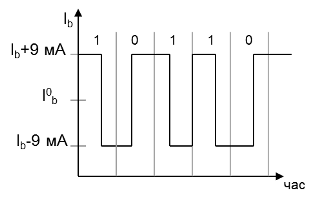
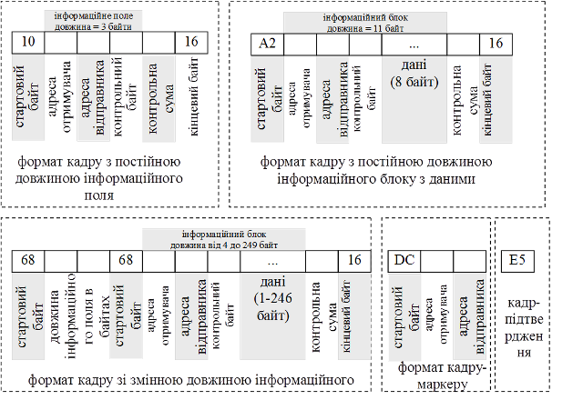

[Промислові мережі та інтеграційні технології в автоматизованих системах](README.md). 7.[МЕРЕЖА PROFIBUS](7.md)

## 7.4. Реалізація канального рівня

В мережах PROFIBUS використовується гібридний метод доступу (див.рис.7.2). Кожний вузол (Ведучий або Ведений) має унікальну адресу від 0 до 126. Вузол може передати кадри одному вузлу (точка-точка), використовуючи його адресу, або всім вузлам (широкомовний режим) використовуючи широкомовну адресу=127.  

Кадри PROFIBUS DP передаються 11-бітними символами, а в PROFIBUS PA – побітово синхронним способом. Однак структура кадрів має однаковий формат для обох типів мережі. На канальному рівні відомі такі типи сервісів: SRD – дані відправляються і приймаються з підтвердженням; SDN – дані відправляються без підтвердження; SDA (тільки для FMS) – відправка даних з підтвердженням; CSRD (тільки для FMS) – циклічна посилка та прийом з підтвердженням. Ці сервіси використовують різні формати кадрів як з постійною так зі змінною довжиною (рис.7.15). 

Рис.7.14. Передача даних в PROFIBUS PA за допомогою модуляції струму

Всі кадри, окрім кадру короткого підтвердження, починаються з стартового байту, який вказує на тип формату кадру. Далі вказується адреса отримувача/чів (0-247) та адреса відправника (0-246). Контрольний байт в кадрі уточнює призначення кадру. Контрольна сума вираховується логічним об’єднанням значення всіх байт по AND без переповнення. Закінчуються кадри кінцевим байтом (1616). 

За допомогою кадру-маркеру, активний вузол (Ведучий) передає маркер наступному Ведучому вузлу (рис.7.2). Отримавши маркер Ведучий обмінюється даними з Веденими, після чого передає маркер далі. Так відбувається до тих пір, поки маркер не надходить до активного вузла з найбільшою адресою (HSA− Highest Station Address). Цей вузол передає маркер активному вузлу з найменшою адресою, тим самим замикаючи маркерне кільце. 

Рис.7.15. Формат кадрів для PROFIBUS

Управління доступом до шини активних вузлів відбувається як на фазі ініціалізації так і на фазі функціонування маркерного кільця. При цьому встановлюється адреса всіх активних вузлів, які присутні на шині і заносяться в список активних станцій LAS (List of Active Station). Для управління маркером при цьому, особливо важливі адреси попередньої станції – від якої маркер отримується, і наступної станції – якій маркер передається. Крім того LAS потрібен для виключення з кільця дефектних активних вузлів та включення в кільце вузлів, які знову з´явилися, без переривання функціонування мережі.

<-- 7.3. [Реалізація фізичного рівня PROFIBUS PA (MBP)](7_3.md) 

--> 7.5. [Базові функції обміну даними між вузлами в PROFIBUS DP (DP-V0)](7_5.md) 