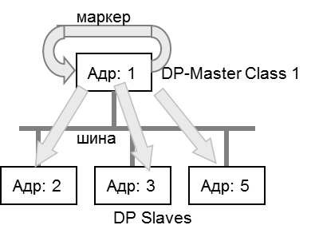
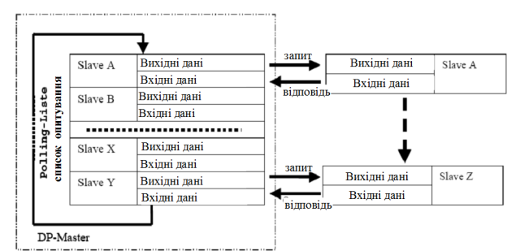
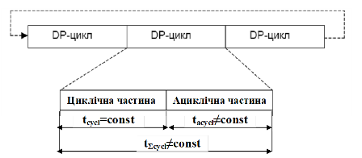
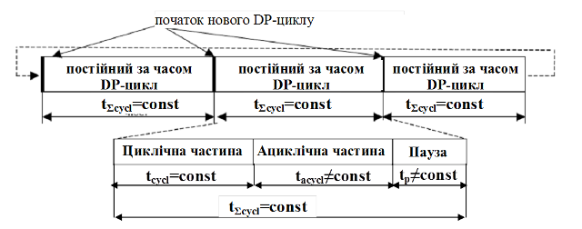
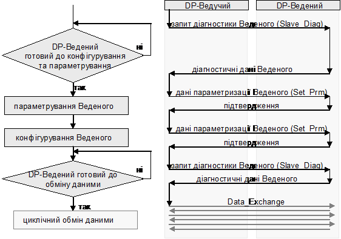
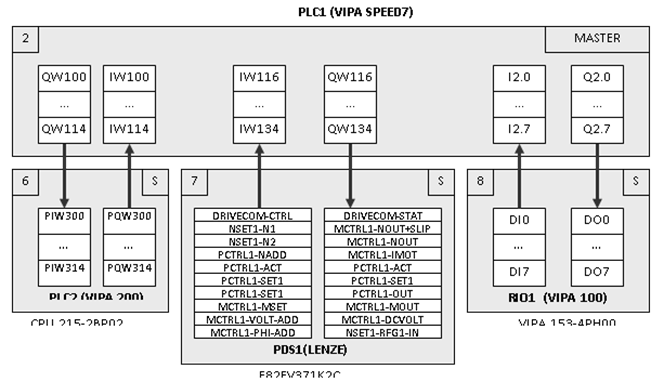
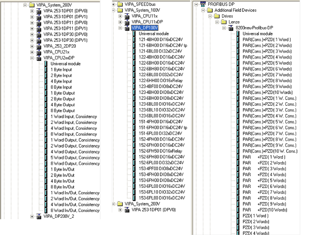
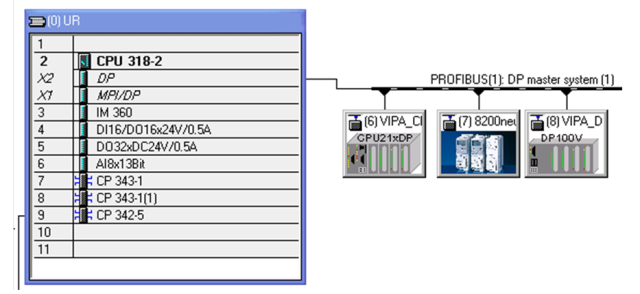
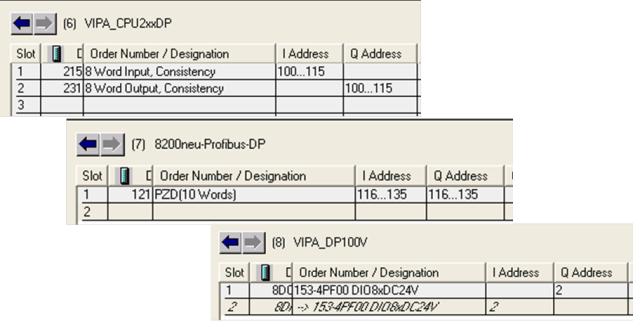

[Промислові мережі та інтеграційні технології в автоматизованих системах](README.md). 7.[МЕРЕЖА PROFIBUS](7.md)

## 7.5. Базові функції обміну даними між вузлами в PROFIBUS DP (DP-V0)

В PROFIBUS DP доступні різні типи сервісів: цикліччний/ациклічний обмін даними процесу, ациклічний обмін параметричними даними, функції діагностування та управління вузлом. 

Для швидкого циклічного обміну даними процесу в PROFIBUS DP використовується постійне опитування центральним вузлом (контролером) розподіленої периферії. Цей механізм може бути описана клієнт-серверною моделлю ідентифікованого обміну (модель Polling), а в PROFIBUS DP він називається циклічним обміном (Cyclic Data Exchange), тому що обмін Ведучого з Веденими проходить по циклу. Функції циклічного обміну забезпечується сервісами Data_Exchange (див.7.5.2). Вони з’явилися першими і входять до складу базових функцій PROFIBUS DP. До базових функцій також відносяться всі інші функції перераховані вище, крім ациклічного обміну даними процесу, яка та ряд інших з’явилися в старших версіях протоколу PROFIBUS. На сьогоднішній день існує три версії PROFIBUS DP:

-     PROFIBUS DP-V0 з базовими функціями;

-     PROFIBUS DP-V1 та PROFIBUS DP-V2 з додатковими функціями.

Оскільки функції молодших версій реалізовані в протоколах старшої версії також, зберігається їх сумісність. В даному розділі розглянуті базові функції PROFIBUS DP, тобто функції PROFIBUS DP-V0, а в наступному – додаткові функції PROFIBUS DP-V1 та PROFIBUS DP-V2.

### 7.5.1. Функція циклічного обміну даними процесу

#### 7.5.1.1. Циклічний обмін даними процесу. 

Циклічний обмін даними процесу продемонструємо на типовій конфігурації мережі PROFIBUS DP, тобто структурі з одним Ведучим (рис.7.16). 

Рис.7.16. Структура з одним Ведучим.

Кожний Ведений може зайняти шину для передачі кадру тільки з дозволу Ведучого. Перелік адрес Ведених зберігається в списку опитування Ведучого(Polling-Liste). DP-циклом називається процес опитування Ведучим всіх своїх Ведених в період часу від отримання маркеру до передачі його наступному Ведучому. Структура DP-циклу складається з циклічної частини, в період якої Ведучий обмінюється з веденими даними процесу, та ациклічної, в період якої Ведучий може обмінюватися параметричними даними (див. 7.2.3). 

Обмін даними процесу між Ведучим і Веденим проходить без аналізу змісту цих даних з використанням сервісу SRD. Ведучий відправляє запит типу Data_Exchange в якому передає Веденому значення вихідних даних процесу і отримує від нього кадр-відповідь (підтвердження) з вхідними даними процесу (рис.7.17). Це ідентифікований тип обміну, тому кількість і призначення цих даних визначається в момент конфігурації мережі, завдяки чому забезпечується максимальна швидкодія. 

 Рис.7.17. Опитування Ведених по списку опитування 

При циклічному обміні даними процесу, Ведений реагує тільки на ті запити Data_Exchange, які приходять від Ведучого, який його конфігурував та параметризував (див 7.5.3).  

Повідомлення, які надсилає Ведучий мають "високий" пріоритет, а які видає Ведений – "низький". Однак Ведений може під час відповіді змінити клас пріоритету повідомлення на "високий", якщо необхідно повідомити про наявність діагностичної події. Після отримання такої відповіді, Ведучий додатково опитує веденого на предмет уточнення діагностичної інформації, повідомленням типу SlaveDiag. Процес обміну діагностичною інформацією проходить ациклічним способом, в період ациклічної частини ROFIBUS DP циклу. 

#### 7.5.1.2. Команди SYNC та FREEZE. 

Крім циклічного обміну даними процесу з Веденим, Ведучий може також відправляти команди в широкомовному режимі. Насамперед це команди SYNC та FREEZE, які дозволяють синхронізувати процес зчитування та запису даних.  

Так, при циклічному опитуванні, різниця в часі опитування впливає на "свіжість" оновлення вхідних даних процесу. Тобто при опитуванні Веденого 5, його дані будуть новіше ніж Веденого 2, оскільки за час, який пройшов від останнього опитування Веденого 2, той отримав нові вхідні дані. Якщо необхідно, щоб вхідні дані Ведених були з однаковою часовою міткою, необхідно спочатку їх заморозити, а потім зчитати. Таким чином на початку циклу Ведучий в широкомовному режимі відправляє команду "freeze", після якої Ведені заморожують плинне значення входів до наступної команди "freeze", а Ведучий зчитує ці значення. Якщо режим FREEZE необхідно відмінити, то Ведучий відправляє команду "unfreeze", після якої Ведені відновлюють вхідні дані процесу в довільний час.  

Подібним чином працює режим SYNC. Ведучий відправляє команду "sync", тим самим зберігаючи виходи Ведених в попередньому значенні. Потім кожному з Ведених він записує значення вихідних змінних, однак Ведені не оновлюють виходи новими значеннями, поки не прийде наступна команда "sync". Таким чином виходи Ведених одночасно оновлюються в момент отримання широкомовної синхронізуючої команди.   

### 7.5.2. Функції (сервіси)  базових типів вузлів

В ROFIBUS DP визначено два класи Ведучих, набір сервісів яких відрізняється: Ведучий класу 1 (DPM1) та Ведучий класу 2 (DPM2). 

DP Master Class 1 (DPM1) – це центральний контролер, який циклічно обмінюється даними користувача з Веденими. Типовим прикладом такого вузла є ПЛК. Йому доступні такі базові функції протоколу:

1. Data_Exchange – циклічний обмін даними процесу з призначеними йому Веденими; 

2. Set_Prm и Chk_Cfg – відправка параметричних (конфігураційних) даних Веденому в момент його конфігурації та перевірка цих даних; 

3. Slave_Diag – читання у Веденого діагностичної інформації; 

4. Global_Control – управління станом Ведених.

DP Master Class 2 (DPM2) – це Ведучі, призначені для конфігурування та діагностики мережі (програматори). Пристрої DPM2 не повинні постійно функціонувати в мережі. DPM1 Ведучим цього класу доступні всі описані вище функції та ряд додаткових:

-     RD_Inp и RD_Outp – читання входів та виходів з потрібного Веденого;

-     Get_Cfg – зчитування дійсних даних конфігурації Веденого;

-     Set_Slave_Add – призначення нової адреси Веденому.

Ведені, тобто DP-Slave, обмінюються даними тільки з Ведучим DPM1, який попередньо його сконфігурував або з Ведучим DPM2. 

Таким чином в ROFIBUS DP можливі три випадки з’єднання:

- між DPM1 (ініціатор обміну) та DP-Slave;

- між DPM2 (ініціатор обміну) та DP-Slave;

- між DPM1 та DPM2 (ініціатор обміну) .

Обмін між Ведучими одного класу не підтримується базовими функціями ROFIBUS DP. Однак можлива комбінація функцій в одному засобі: DPM1 та DPM2, чи DPM1 та DP-Slave.

### 7.5.3. Структура DP-циклу

На рис.7.16 та рис.7.17 показана структура циклічного обміну даними прикладного Процесу Ведучого зі своїми Веденими по шині. Крім циклічного обміну даними процесу (Data_Exchange), необхідне виділення часу для інших сервісів, які не потребують постійного використання ресурсів мережі, однак час від часу повинні функціонувати (обмін параметричними даними). Це такі функції як параметризація, конфігурування та діагностика Ведених. Для функціонування таких сервісів в DP-V0 в DP-циклі виділена ациклічна частина (рис.7.18). 

Рис.7.18 Структура циклу ROFIBUS DP в системі з одним Ведучим

В циклічній частині DP-циклу проходить процес циклічного обміну даними процесу (Data_Exchange), які розглянуті вище. До змінної по часу ациклічної частини відносяться такі функції:

-  обмін даними під час фази ініціалізації Веденого;

-  діагностичні функції для Веденого;

-  комунікації з Ведучим DPM2;

-  повторення спотворених кадрів;

В протоколі DP-V0 обмін даними процесу з Веденим в ациклічній частині не підтримується. Однак в циклічний частині, при передачі повідомлення-відповіді, Ведений може повідомити Ведучому про наявність діагностичного переривання (Diagnostic Interrupt) шляхом зміни пріоритету повідомлення на високий. Ведучий, отримавши таке повідомлення, в ациклічній частині дає повідомлення-запит типу SlaveDiag, на який Ведений передає відповідь з діагностичними даними.    

Ациклічні функції мають низький пріоритет і можуть виконуватись протягом декількох циклів. В залежності від кількості цих дій час виконання конкретного DP-циклу може змінюватись. 

В деяких системах необхідно, щоб час шинного циклу DP був постійним, тобто обмін даними процесу проходив строго періодично. Це, наприклад, актуально для систем управління електроприводами (PDS) для самосинхронізації декількох приводів. На відміну від нормального циклу DP, Ведучим передбачається (резервується) певна частина часу для ациклічного обміну (рис.7.19). Ведучий слідкує, щоб зарезервована змінна частина не перевищила виділений час, обмежуючи кількість ациклічних повідомлень в DP-циклі. З іншого боку, якщо зарезервований час не використовується, Ведучий витримує необхідну паузу. Завдяки цьому гарантується, що заданий постійний час буде витриманий з точністю до мікросекунди

Рис.7.19. Структура постійного за часом циклу ROFIBUS DP в системі з одним Ведучим

### 7.5.4. Конфігурування та ініціалізація мережі

#### 7.5.4.1. Ініціалізація Веденого.

Слід ще раз зазначити, що циклічний обмін у PROFIBUS DP – це ідентифікований обмін. Тобто Ведучий віддає Веденому вихідні дані та забирає вхідні, а кількість та призначення цих даних визначається при ініціалізації Веденого. По суті, процес налаштування такого зв’язку – це домовленість між комунікаційними партнерами перед операційним функціонуванням циклічного обміну. Ця домовленість проходить з використанням службових сервісів управління мережею. Процес налаштування Веденого перед циклічним опитуванням називається ініціалізацією. Процес ініціалізації конкретного Веденого проходить в ациклічній частині DP-циклу. 

У PROFIBUS DP ініціалізує (конфігурує та параметризує) Веденого той Ведучий, з яким буде налаштований ідентифікований обмін. На рис.7.20 показані стадії процесу ініціалізації. Спочатку за допомогою діагностичних даних перевіряється готовність Веденого. Якщо  DP-Slave готовий для параметризації, Ведучий відсилає параметричні та конфігураційні дані. Саме ця інформація потрібна Веденому, щоб визначити якими саме даними процесу він буде обмінюватись з Ведучим в циклічному обміні. Позитивний результат перевірки готовності Веденого до роботи (діагностична інформація) завершує процес його ініціалізації. Коли Ведений проініціалізований, він переходить в операційний режим, тобто в режим циклічного обміну даними. 

#### 7.5.4.2. Режими роботи мережі. 

Поведінка Ведених на шині PROFIBUS DP залежить від режиму функціонування Ведучого DPM1, який його ініціалізував. Ці режими стандартизовані і можуть приймати значення:

- Offline – відсутній зв’язок Ведучого з Веденим;
- Stop – циклічний обмін даними з Веденими відсутній;
- Clear – Ведучий зчитує вхідну інформацію з Ведених, однак виходи виставляє в аварійному значені (fail-safe state);
- Operate – нормальний операційний режим, в якому доступні операції циклічного обміну.

 Рис.7.20. Стадії ініціалізації Веденого

DPM1 циклічно відправляє стан режиму всім назначеним веденим через визначені інтервали в широкомовному режимі. Крім того контролюється працездатність кожного Веденого, для чого Ведучий DPM1 виділяє для них окремі діагностичні таймери (Data_Control_Timer). Якщо протягом дозволеного часу Ведений не зреагував на запити Ведучого, той сигналізує про це програмі користувача. Крім того, якщо конфігураційний параметр Auto_Clear виставлений у стан 1, система переходить в стан Clear, про що повідомляється всім Веденим.

Ведені в свою чергу використовують сторожовий таймер (WatchDog), який відслідковує активність звернення до нього Ведучого. Якщо таймер спрацював – вихідні дані, які оновлює даний Ведучий, виставляються в аварійне значення.

Слід зазначити, що в мультимастерній структурі тільки один Ведучий DPM1 може ініціалізувати конкретного Веденого а також обновити його виходи. Інші Ведучі можуть тільки зчитувати з цього Веденого вхідні дані.  

Прокоментуємо функції, які використовуються в процесі ініціалізації.

#### 7.5.4.3. Дані параметризації (Set_Prm). 

За допомогою даних параметризації Веденому повідомляються необхідні локальні та глобальні параметри, властивості та функції. Зміст даних параметризації встановлюється при проектуванні Ведучого. 

Проектування Ведучого включає конфігурацію мережі та настройки Ведених. Враховуючи велику різноманітність типів засобів, які можуть функціонувати на PROFIBUS DP в якості Веденого, необхідний універсальний механізм переліку та опису параметрів для конкретного засобу. В PROFIBUS DP для цього використовуються  GSD-файли (Geräte Stamm Daten (нім.) – дані про походження приладу), які описані в 7.7.4. Підключивши до інструменту конфігурації мережі GSD-файл для конкретного засобу, можна добавити в конфігурацію цей засіб в якості Веденого та налаштувати для нього необхідні параметри. 

Таким чином, для кожного Веденого в пам’яті Ведучого знаходяться значення всіх параметрів, які необхідно змінити. Саме вони передаються на стадії параметризації. Зокрема це так параметри: 

-     Station-Status – специфічні настройки для поведінки Веденого;

-     Watchdog – контроль часу спрацювання; 

-     Ident-Number – ідентифікаційний номер типу засобу, який видається PNO; цей ID зберігається в GSD-файлі і при параметризації відправляється Веденому; Ведений приймає дані параметризації тільки якщо отриманий ідентифікаційний номер в запиті співпадає з його власним, завдяки чому запобігається помилкова параметризація. 

-     Group-Ident – груповий ідентифікатор, за допомогою якого Ведені можна об’єднувати в групи для групових операцій типу "Sync" та "Freeze".

-     User-Prm-Data – специфічні, характерні даному засобу дані для Веденого. 

#### 7.5.4.4. Дані конфігурування (Chk_Cfg). 

За допомогою конфігураційного кадру Ведучий повідомляє Веденому формат розпізнавання, об’єм та структуру вхідних/вихідних даних процесу, які приймають участь в обміні. Ця область, яка називається також модулем, узгоджується по формі між Ведучим та Веденим (формат розпізнавання): буде це байтова структура чи структура зі слів. Через формат розпізнавання на модуль можна встановлювати вхідні/вихідні області розміром максимум в 16 байт/слів.

Області вхідних/вихідних даних процесу, які вміщують зв’язну інформацію і тому мають передаватися тільки разом (одним масивом), повинні оброблятися як консистентні дані. До них відносяться, наприклад, області параметрів для регуляторів чи набори параметрів для приводу. За допомогою спеціальних форматів розпізнавання (які залежать від Веденого та виробника) можна встановлювати консистентність для області входів та виходів (модулів) з максимальною довжиною 64 байти або слова. Формат області входів/виходів процесу для Веденого зберігаються в GSD-файлах і при проектуванні пропонуються відповідним інструментом проектування. 

#### 7.5.4.5. Діагностичні дані (Slave_Diag). 

За допомогою запиту діагностичних даних Ведучий перевіряє на фазі запуску, чи присутній Ведений і чи готовий він для параметризації. Діагностичні дані від Веденого складаються із діагностичної частини і необов’язкової, специфічної для Веденого, діагностичної інформації. Через діагностичні дані Ведений повідомляє Ведучому свій робочий стан і у випадку діагностики – причину діагностичного переривання. 

Приклад 7.2. Розробка проекту для мережі PROFIBUS DP. 

Завдання. Сконфігурувати всі вузли мережі PROFIBUS DP для реалізації поставленої на рис.7.21 задачі, схема мережних з’єднань якої дана в прикладі 7.1. 

 

Рис.7.21. Постановка задачі до прикладу 7.2

Рішення. Для ясності поставленої задачі зробимо деякі пояснення. PLC1 (VIPA SPEED7) являється центральним вузлом мережі, який повинен обмінюватися даними процесу з частотним перетворювачем (PDS1) та віддаленим модулем вводу виводу (RIO1). Це значить, що він повинен бути активним вузлом, тобто Ведучим на шині PROFIBUS DP. Частотний перетворювач повинен обмінюватися даними з PLC1 статусною інформацію та значеннями різних плинних та заданих параметрів, призначення яких не принципово для рішення даної задачі. Дискретні входи та виходи модуля віддаленого вводу/виводу повинні відображатися в змінних PLC1. По суті, для програми користувача в PLC1 значення входів та параметрів на периферійних засобах – це лише вхідні/вихідні змінні, які у ПЛК VIPA та SIMENS позначаються як I (входи) Q (виходи).

 Однак PLC1 повинен координувати роботу PLC2 (VIPA 200), обмінюючись в обох напрямках 8-мима 16-бітними змінними. Для цього PLC2 на цій шині виступає в якості Веденого вузла, оскільки інтерфейс DP, який інтегрований в CPU 215-2BP02, може використовуватись як в режимі Ведучого так і Веденого. Такий обмін можливий з використанням периферійних вхідних та вихідних змінних PLC2, які повинні бути виділені для цього. Слід зазначити, що з точки зору PLC2, змінні PIW (периферійні вхідні слова) являються входами, однак в адресному просторі Ведучого, тобто PLC1, вони будуть відображатися як виходи. Аналогічна ситуація і для PQW.

Для функціонування такої системи необхідно налаштувати та сконфігурувати кожний вузол. Прокоментуємо, яким чином необхідно налаштувати кожного з Ведених.

PLC2 – це інтелектуальний Ведений. Ведучий не ініціалізує його, оскільки для нього проект створюється за допомогою спеціальних інструментів. В даному випадку можна використати Step7. Для роботи в мережі відповідно до задачі необхідно налаштувати DP-канал, тобто:

-     вказати режим роботи = Slave;

-     вказати адресу = 6 (див рис.7.20);

-     вказати бітову швидкість = 12 Мбіт/с;

-     при необхідності налаштувати додаткові параметри.

Необхідно вказати діапазон периферійної пам’яті, виділеної для Ведучого: (input bytes 300-315, output bytes 300-315).

Частотний перетворювач PDS1 (LENZE) можна налаштувати за допомогою панелі або спеціального ПЗ. Необхідно вказати адресу (С1509=7), вказати джерелом завдання – функціональний модуль (С0005=200). Бітова швидкість визначається автоматично.

Модуль віддаленого вводу/виводу RIO1(VIPA 100) має перемикач адреси, яким необхідно виставити адресу 8. Всі інші настройки визначаються Ведучим в процесі ініціалізації.

Налаштування Ведучого шини PROFIBUS DP, тобто PLC1, проводиться в проекті для даного контролера. В якості інструмента проектування будемо використовувати Step7, який дасть можливість більш наглядно продемонструвати шляхи створення конфігурації мережі.

Конфігурацію мережі можна створити в розділі HWConfig (Hardware Configuration), де створюється апаратна конфігурація для ПЛК. Мережа конфігурується в настройках комунікаційного модуля, де вказуються:

-     режим роботи = Master;

-     адреса = 2 (див рис.7.20);

-     бітова швидкість = 12 Мбіт/с;

-     при необхідності додаткові параметри.

Після конфігурації самої мережі, необхідно вказати Ведені, які "належать" даному ПЛК (адже при мультимастерній архітектурі на мережі можуть бути Ведені для інших Ведучих). Для включення та на лаштування Ведених, відповідно до їх профілю, в Step7 необхідно підключити всі необхідні GSD-файли: 

- для VIPA CPU2xxDP;

- для VIPA DP100V;

- для модуля Lenze E82ZAFPC001. 

Після підключення цих файлів профілів, в каталозі профілів з’являться нові розділи та комунікаційні об’єкти. На рис.7.22 показані три частини каталогу, які відносяться до Ведених в даній задачі. Прокоментуємо можливі комунікаційні об’єкти, які доступні для обміну з цими пристроями. 

Для VIPA CPU2xxDP можна сконфігурувати обмін даними різної довжини (до 8 слів) з можливістю консистентної передачі. В поставленій задачі необхідно передавати і отримувати 8 слів. 

Для VIPA DP100V вибирається конкретна модель модуля, в нашому випадку це 153-4PH00 (DIO8), що передбачає обмін одним байтом в обидва боки. 

Об’єкти Lenze теж можна вибрати відповідно до задачі. При цьому виділяються два типи об’єктів: PZD (змінні процесу) та PAR (параметри). За допомогою об’єкту PAR, який займає 4 вхідні + 4 вихідні слова, можна доступитись по індексу до будь якого параметру частотного перетворювача як для читання так і для запису. Об’єкти PZD – передають значення змінних процесу та задані значення. Відповідно до поставленої задачі об’єкти PAR не використовуються, а використовуються 10 вхідних та вихідних об’єктів PZD. 

 

 Рис.7.22. Доступні об’єкти в каталозі профілів (до прикладу 7.2) 

Використовуючи каталог профілів вибирається профіль засобу, наприклад VIPA CPU2xxDP, для якого налаштовуються адреса та загальні параметри. Загальний вигляд конфігурації для поставленої задачі показаний на рис.7.23. 

Рис.7.23. Конфігурація PROFIBUS DP в проекті Ведучого в Step7 (до прикладу 7.2) 

Для кожного Веденого необхідно вказати комунікаційні об’єкти, які вибираються в каталозі профілів. Автоматично для кожного з цих об’єктів в області вводу/виводу процесу Ведучого виділяється пам’ять (налаштовується їх відображення на образ процесу Ведучого). Розподіл пам’яті можна змінити відповідно до задачі рис.7.24. 

Якщо немає необхідності в додаткових настройках, процес конфігурування можна вважати завершеним.

Рис.7.24. Налаштування комунікаційних об’єктів Ведених та їх відображення в адресному просторі Ведучого (до прикладу 7.2) 

<-- 7.4. [Реалізація канального рівня](7_4.md) 

--> 7.6. [Розширені функції обміну даними між вузлами в PROFIBUS DP (DP-V1, DP-V2)](7_6.md) 