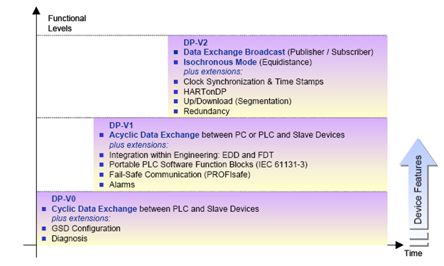
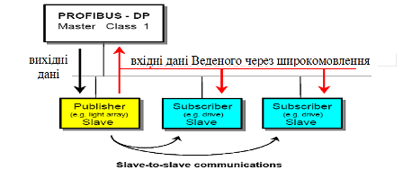
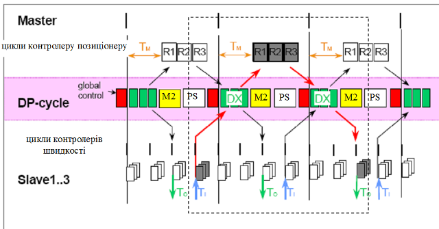

[Промислові мережі та інтеграційні технології в автоматизованих системах](README.md). 7.[МЕРЕЖА PROFIBUS](7.md)

## 7.6. Розширені функції обміну даними між вузлами в PROFIBUS DP (DP-V1, DP-V2)

### 7.6.1. Версії DP-V1 та DP-V2. 

З розвитком систем автоматизації та підвищенням вимог до комунікаційного зв’язку, PROFIBUS DP вдосконалювався та доповнювався новими функціями. Так з’явилися нові версії протоколів PROFIBUS DP-V1 та PROFIBUS DP-V2, що доповнилися розширеними функціями, які є необов’язковими для використання. На рис.7.25 показане добавлення нових функції при переході до нових версій. 

Основні функції DP-V0 перераховані в попередньому підрозділі. Структура GSD-файлів, які підтримувалися ще в базовій версії разом з доповненнями приводиться в наступному підрозділі. Ведучі та Ведені, які підтримують розширення називаються відповідно Master DP-V1/Master DP-V2 та Slave DP-V1/Slave DP-V2. 

Основною відмінністю DP-V1 від попередньої версії є поява функції ациклічного обміну даними процесу (Acyclic Data Exchange) паралельно з функціонуванням циклічного. Такий зв’язок характерний для генерування подій (Events), тривог (Alarm), обміну з ЛМІ, які не потребують постійного трафіку. Пізніше PROFIBUS  DP був вдосконалений до DP-V2, в основному за рахунок додаткових функцій для роботи з приводами (PDS): ізохронним способом обміну даними (Isochronous Mode) та широкомовним обміном даними між Процесами вузлів по типу Видавець/Підписувач (Data Exchange Broadcast-DXB). 

### 7.6.2. Ациклічний обмін даними процесу. 

Для функціонування ациклічного (ациклічного) обміну даними процесу використовується механізм переривань (Interrupt), аналогічний функціонуванню діагностичного переривання, яке ми розглянули в попередньому підрозділі. Тобто при циклічному обміні даними процесу, Ведений передає повідомлення-відповідь з високим пріоритетом, яке вимагає від Ведучого додаткового обміну в ациклічному трафіку. А в ациклічній частині DP-циклу, Ведений вже передає ациклічні дані процесу.    

 Рис.7.25. Функціональність PROFIBUS DP від версії до версії

### 7.6.3. Широкомовний обмін даними процесу.  

Data Exchange Broadcast забезпечує прямим зв’язком між Веденими по принципу pull моделі Видавець/Підписувач (рис.7.26). При запиті від Ведучого, прикладний процес Веденого в широкомовному режимі відправляє кадр з вхідними даними, на які можуть підписатись прикладні Процеси інших Ведених. Це розширення дає можливість значно зменшити навантаження на шину, оскільки в задачах де приходиться організовувати обмін між Веденими, в DP-V0/V1 цим займається Ведучий. 

Рис.7.26 Широкомовний обмін даними процесу

### 7.6.4. Ізохронний режим. 

Режим Isochronous Mode дозволяє реалізувати часово-синхронну передачу даних незалежно від навантаження шини. Функція дозволяє реалізувати високоточні процеси позиціонування з часовим відхиленням менш ніж одна мікросекунда. Для цього всі цикли пристроїв синхронізовані до циклу Ведучого через широкомовне повідомлення "global control". Спеціальний сигнал (послідовний номер циклу) дозволяє контролювати цикли синхронізації. На рис.7.27 показані: доступний час для обміну даними процесу (DX), час доступу Ведучих DPM2 (MSG) та час паузи (Reserve). Синхронізація годинників вузлів дозволяє чітко визначити інтервали опитування входів, обробки процесу та запису виходів. Для зменшення часу реакції системи (оптимізації), можна вказати значення часових зсувів: опитування входів Ведених відносно кінця DP-циклу (Ті), запису виходів відносно початку DP-циклу(То), запуску задачі відносно початку DP-циклу (Тм).       

Рис.7.27 Обмін в ізохронному режимі

<-- 7.5. [Базові функції обміну даними між вузлами в PROFIBUS DP (DP-V0)](7_5.md) 

--> 7.7. [Профілі в PROFIBUS DP](7_7.md)