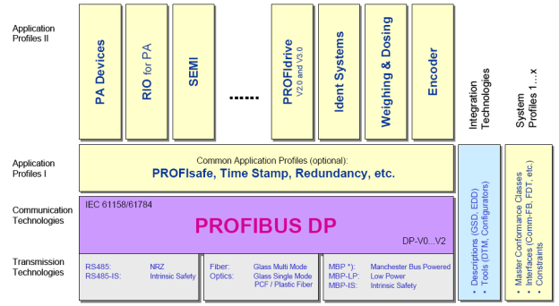
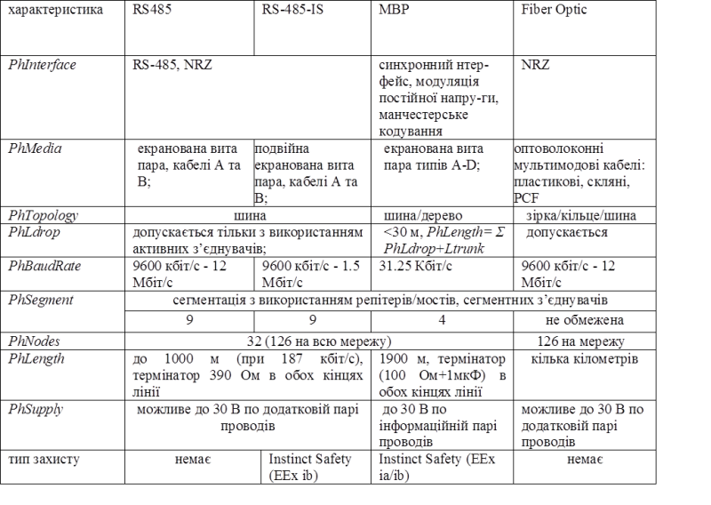
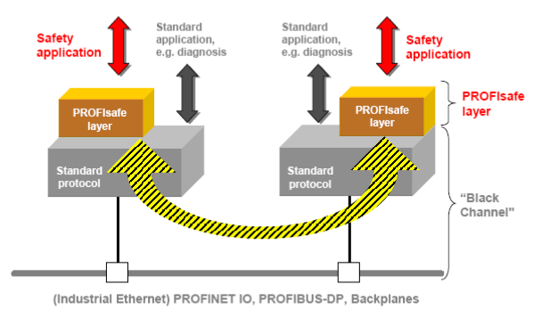
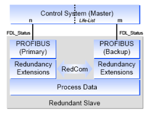

[Промислові мережі та інтеграційні технології в автоматизованих системах](README.md). 7.[МЕРЕЖА PROFIBUS](7.md)

## 7.7. Профілі в PROFIBUS DP

### 7.7.1. Технічна структура PROFIBUS

На рис.7.1 показана структура PROFIBUS в контексті моделі OSI. Однак в специфікаціях PROFIBUS стандартів DIN та EN для  PROFIBUS DP прикладний рівень не описаний, а в IEC 61158 до цього рівня увійшли функції інтерфейсу DDLM та профілі. А у загальнодоступному документі від PNO наводиться наступна модель (технічна структура системи) PROFIBUS (рис.7.28). 

 

Рис.7.28. Технічна структура системи PROFIBUS

На фізичному рівні описані різні типи реалізації фізичних інтерфейсів, тобто різні технології передачі (Transmission Technologies), загальний опис яких наведений в таб.7.4. На рівні комунікаційних технологій (Communication Technologies), який також називається протокольним рівнем, визначені два типи протоколів FMS та DP (DP-V0, DP-V1, DP-V2). Прикладний рівень визначається системою прикладних профілів та технологій: Application Profiles I (загальні прикладні профілі); Application Profiles II (специфічні прикладні профілі для пристроїв); Integration Technologies – інтеграційні технології (методи та інструменти), які забезпечують опис та швидке впровадження різнорідних пристроїв в системі PROFIBUS; System Profiles – системні профілі, тобто діапазон стандартів (профілі Ведучих, інтерфейси), які забезпечують реалізацію однорідних, стандартизованих систем. 

Таблиця 7.4. Характеристики мереж PROFIBUS на фізичному рівні з різними варіантами реалізації.

 

Профілі PROFIBUS – це специфікації, визначені виробником і користувачами відносно специфічних властивостей, особливостей виконання та поведінки пристроїв та систем. Специфікації профілю визначають параметри та поведінку пристроїв та систем, які належать сімейству профілю. Сімейства профілів розроблені для полегшення здатності до взаємодії з пристроєм, а в деяких випадках для полегшення взаємозаміни пристроїв одного сімейства на шині. У профілях враховуються особливості застосування і визначені типом спеціальні особливості польових пристроїв, управління і методів інтеграції (інжинірингу). Розрізняють:

-  general application profiles (загальні прикладні профілі, Application Profiles I) – це профілі які описують специфіку пристроїв для різних варіантів виконання; наприклад профілі PROFIsafe для систем функціональної безпеки, Redundancy – для систем з резервуванням);

-  specific application profiles (специфічні прикладні профілі, Application Profiles II) – це профілі, які розвинуті для пристроїв певного класу задач; наприклад PROFIdrive – для електроприводів PDS, PanelDevices – для засобів людино-машинних інтерфейсів;

-  system and master profiles (системні профілі) – це профілі, які описують функціональні можливості систем, доступних пристроям: DPM1, DPM2, DP Slave, DP-V0/V1/V2. 

### 7.7.2. Загальні прикладні профілі

 Загальні прикладні профілі (Application Profiles I) описують функції та характеристики, які стосуються області застосування. Вони можуть також використовуватися в поєднанні зі специфічними прикладними профілями. 

#### 7.7.2.1. PROFIsafe. 

До недавнього часу для функціонально-небезпечних процесів та виробництв використання промислових мереж було проблематичним. З появою профілю PROFIsafe, PROFIBUS створив всебічне, відкрите рішення для функціонально-безпечного (safety-base) застосування, яке задовольняє найбільш безпечним критеріям. PROFIsafe визначає яким чином запобіжні засоби (кнопка аварійної зупинки, лампи) можуть зв’язатися по PROFIBUS з запобіжними контролерами (контролери ПАЗ) настільки безпечно, щоб можна було їх використовувати для зв’язаних з функціональною безпекою задач до категорій KAT4, сумісною з EN954, AK6 або SIL3 (Safety Integrity Level). Це реалізовує безпечні з’єднання по профілю, тобто по спеціальному формату даних користувача та спеціального протоколу. Специфікація була сумісно складена виробниками, користувачами, комітетами стандартизації та інспектування (TÜV, BIA). Вона базується на сумісних стандартах, перш за все  IEC 61508, які в тому числі стосуються розробників програмного забезпечення (рис.7.29). 

Рис.7.29. Реалізація PROFIsafe

PROFIsafe приймає до уваги кількість можливих помилок, які можуть відбутися в шинах, типу затримки, втрати або повторення даних, неправильних послідовностей, спотворення даних. Є декілька способів корекції, частина з яких були відібрані для PROFIsafe, а саме: послідовна нумерація телеграм;  таймаут для вхідних кадрів-повідомлень та їх підтвердження; ідентифікатор між відправником та отримувачем ("пароль"); додатковий захист даних (CRC).

Комбінуючи ці міри корекції разом з запатентованим "SIL monitor" (контроль частоти помилкових повідомлень) PROFIsafe досягає класів безпеки до SIL3 та вище. 

PROFIsafe – це програмне рішення, яке впроваджене в пристроях як додатковий рівень над прикладним рівнем, при цьому стандартні компоненти типу ліній зв’язку, ASICs або протоколи залишаються незмінними (див. рис.7.30). Пристрої з профілем PROFIsafe можуть використовуватись в сумісності з стандартними пристроями на тому самому кабелі без якихось обмежень. PROFIsafe використовує ациклічний обмін даними процесу і може використовуватись на технологіях передачі RS485, оптоволоконні або MBP. 

#### 7.7.2.2. Time Stamp. 

При реєстрації часових подій в мережах, особливо для діагностики і визначення помилки, корисно забезпечити точний час виникнення події. Для цього, PROFIBUS пропонує профіль Time Stamp (часовий відбиток). При виникненні повідомлення шляхом ациклічного обміну даними Ведучий зчитує не тільки саме повідомлення а і його часовий відбиток.

#### 7.7.2.3. Slave Redundancy. 

В багатьох випадках необхідна реалізація системи з дублюванням зв’язку. По цій причині для PROFIBUS створили специфікацію механізму дублювання ведених Slave Redundancy (резервування Веденого), який описує наступні характеристики пристрою (рис.7.31):

-     ведені пристрої повинні мати два різні інтерфейси PROFIBUS, які називаються первинним (primary) та резервним (backup); вони можуть бути на одному пристрої (резервування шляхів), або розподілені між декількома пристроями (резервування пристроїв);

-     пристрої обладнані двома незалежними стеками протоколів з спеціальним розширенням для резервування;

-     резервний зв’язок redundancy communication (RedCom) відбувається між стеками протоколів, тобто в межах пристрою (при резервуванні шляхів) або між двома пристроями (при резервуванні пристроїв). 

У нормальному режимі, з’єднання відбувається виключно з первинним Веденим, і тільки він  конфігурується. По резервному зв’язку Ведучий відсилає діагностичні дані та дані процесу резервному Веденому. Коли первинний Ведений виходить з ладу, резервний Ведений приймає на себе його функції, або в результаті безпосереднього виявлення відмови, або по просьбі Ведучого. Резервний Ведений пристрій може використовуватись на одній PROFIBUS лінії, або, у випадку додаткового резервування лінії, – на двох лініях зв’язку. 

 

Рис.7.31. Резервування Ведених

### 7.7.3. Специфічні прикладні профілі

PROFIBUS виділяється серед інших промислових мереж великою гамою підтримуваних пристроїв для різних прикладних задач. Для цього розроблено ряд специфічних прикладних профілів (Application Profiles II) для конкретних типів пристроїв, які наведені в таб.7.5. 

Таблиця 7.5. Специфічних прикладних профілів

| Профіль                   | Застосування профілю                                         |
| ------------------------- | ------------------------------------------------------------ |
| PROFIdrive                | визначає поведінку пристроїв та процедури доступу до даних для електроприводів (PDS) |
| PA devices                | визначає характеристики PA пристроїв                         |
| Robots/NC                 | описує яким чином управляються роботи, які призначені для обробки та збирання |
| Panel devices             | описує інтерфейс для простих засобів людино-машинного інтерфейсу до високорівневих компонентів автоматизації |
| Encoders                  | описує інтерфейс до поворотних, кутових та лінійних енкодерів |
| Fluid power               | описує яким чином управляються гідравлічні приводи           |
| SEMI                      | описує характеристики пристроїв для виробництва напівпровідників по стандарту SEMI |
| Low-voltage switchgear    | описує обмін даними для різних пристроїв вимикання/перемикання (вимикачі,магнітні пускачі) |
| Dosign/weighing           | описує використання систем зважування та дозування           |
| Ident systems             | описує комунікації між пристроями ідентифікації (сканери штрих кодів, транспондери) |
| Liquid pumps              | визначає використання рідинних насосів                       |
| Remote I/O for PA devices | для пристроїв вводу/виводу для PROFIBUS РА                   |

Використання прикладних профілів дає можливість спростити процедуру розробки системи з однотипних пристроїв від різних виробників, оскільки їх поведінка та структура даних визначаються однаковими специфікаціями профілю. Крім того, така уніфікація зменшує кількість помилок, оскільки профілі розробляються з урахуванням багатолітнього досвіду експлуатації подібних пристроїв. В даному посібнику не приводиться опис наведених вище профілів, за винятком PROFIdrive, який наведений в розділі 11.  

### 7.7.4. Використання GSD для інтеграції пристроїв в мережу

Сучасні польові засоби забезпечують широкий діапазон інформації та виконуваних функцій, які перед цим виконувались в контролерах та в системах управління. Для виконання цих задач необхідні інструменти для вводу в дію, обслуговування, розробки та параметризації цих пристроїв, які потребують точного та повного опису даних для пристрою та його функцій, таких як: тип прикладної функції; конфігураційні параметри; діапазон значень; одиниці вимірювання; значення по замовченню; значення граничних меж; ідентифікація і таке інше.

Те ж саме стосується контролера/системи управління, специфічні параметри яких та формат даних повинні також бути повідомлені (інтегровані) для гарантії безпомилкового обміну даними з польовими пристроями. 

В PROFIBUS розвилося багато методів та інструментів ("інтеграційних технологій") для опису пристроїв. В автоматизованих системах управління процесом переважно використовується технологією GSD-опису, в якому описуються особливості зв’язку між пристроями PROFIBUS. GSD зручний для простих застосувань і розробляється та поставляється виробником обладнання. GSD-опис оформлений у вигляді текстового GSD-файлу формату ASCII, який вмішує основну та специфічну інформацію для зв’язку з конкретним типом пристрою. Для конфігурації цього пристрою за допомогою ключових слів інструмент конфігурації зчитує з GSD ідентифікатор пристрою, настроювальні параметри, відповідний тип даних та межі їх значень і т.д. Деякі із ключових слів обов’язкові, наприклад Vendor_Name, і інші є опціональними, наприклад Sync_Mode_supported. GSD-файли поділені на три секції. 

1) General Specifications. Ця секція включає інформацію про виробника та назву пристрою, апаратну та програмну версію, підтримувані швидкості, часові інтервали для контролю та призначення сигналів на з’єднувачах.  

2) Master Specifications. Ця секція включає параметри Ведучого, такі як максимальна кількість можливих Ведених, завантажувані/вивантажувані опції. Для пристроїв, які можуть бути тільки Веденими – ця секція відсутня.

3) Slave Specifications. Секція включає всю інформацію, специфічну для даного пристрою, як Веденого. Це може бути кількість та тип вхідних/вихідних каналів, специфікація тексту діагностичного повідомлення та інформація про доступні модулі, у випадку модульного пристрою. 

GSD-формат розроблений для максимальної зручності у використанні (наявні списки, опції і т.д.) та підтримує інтеграцією растрових малюнків для символічного зображення пристроїв.  

Кожний Ведений та Ведучий DPM1 повинні мати ідентифікатор виробника (Manufacturer ID). Це потрібно для того, щоб Ведучий міг ідентифікувати тип підключених Ведених без додаткових протокольних затрат. Ведучий порівнює ідентифікатор підключеного Веденого, з вказаним ідентифікатором в даних конфігурації. Тільки при їх рівності почнеться обмін даними в операційному режимі. Це гарантує помилку від невірної конфігурації.

Спеціальні ідентифікатори зарезервовані для профілів пристроїв (Profile ID):

- 9700h - 977Fh – РА пристрої;

- 3A00h - 3AFFh – пристрої профілю PROFIdrive.   

<-- 7.6. [Розширені функції обміну даними між вузлами в PROFIBUS DP (DP-V1, DP-V2)](7_6.md) 

--> 8.[CAN ПРОТОКОЛ](8.md).

## Контрольні запитання до розділу 7

1. Перерахуйте мережі PROFIBUS, які використовуються на сьогоднішній день? Яке призначення кожної з них? Охарактеризуйте їх в контексті моделі OSI.

2. На якому інтерфейсі, яке середовище передачі, яка бітова швидкість, топологія та який метод кодування використовується для електричного з’єднання для PROFIBUS DP?

3. Як забезпечується термінування, захисне зміщення, сегментація в PROFIBUS DP, побудованого на базі RS-485?

4. Які правила підключення вузлів до загальної шини PROFIBUS DP, побудованого на базі RS-485?

5. Який тип з’єднувача рекомендується використовувати для PROFIBUS DP, побудованого на базі RS-485? Прокоментуйте призначення кожного піну.

6. Які типи кабелів використовуються для PROFIBUS DP, побудованого на базі RS-485? Які вимоги до бітової швидкості, загальної довжини лінії зв’язку та довжини відгалужень при використанні різних кабелів?

7. Які додаткові засоби необхідно використати при підключенні пристроїв до шини, на  бітових швидкостях вище 3Мбіт/с? Поясніть конструкцію з’єднувача, який використовується при таких швидкостях.

8. Як правильно виконується заземлення екранів кабелів?

9. На якій технології передачі на фізичному рівні базується мережа PROFIBUS PA? Розкажіть про принципи її функціонування.

10. Яке призначення в сегментних відгалужувачах та сегментних з’єднувачах? Чим вони відрізняються?

11. Яка топологія, бітова швидкість та кабелі використовуються в PROFIBUS PA? Прокоментуйте принципову схему сегменту PROFIBUS PA.

12. Який метод доступу використовується в мережах PROFIBUS? Як адресуються вузли в мережі?

13. Які способи обміну використовуються в PROFIBUS DP? Які функції відносяться до базових PROFIBUS DP-V0?

14. Що таке циклічний обмін даними процесу? Які він функціонує? 

15. Розкажіть про призначення та принципи функціонування команд SYNC/FREEZE?

16. Які Ви знаєте класи Ведучих вузлів PROFIBUS DP-V0? Які функції цим вузлам доступні?

17. З яких складових складається цикл ROFIBUS DP в системі з одним Ведучим? Які функції виконуються в ациклічній частині? Навіщо потрібні DP-цикли з постійним часом, та з яких складових вони складаються?

18. Як функціонують діагностичні переривання Веденого в контексті функціонування DP-циклу?

19. Розкажіть про процедуру ініціалізації Ведучим свого Веденого.

20. Що таке консистентність даних процесу в PROFIBUS DP? Навіщо її визначати? Які обмеження на об’єм консистентних даних?

21. Які розширені функції обміну доступні в PROFIBUS DP-V1 та DP-V2? 

22. Як функціонують сервіси ациклічного обміну даними процесу? 

23. Як функціонують сервіси широкомовного обміну даними процесу?

24. Як функціонують сервіси ізохронного режиму обміну?

25. Прокоментуйте технічну структуру системи PROFIBUS. Що таке загальні прикладні профілі, специфічні прикладні профілі та системні профілі і як вони пов’язані?

26. Охарактеризуйте мережі PROFIBUS на фізичному рівні з різними варіантами реалізації.

27. Яке призначення і принципи функціонування профілю PROFIsafe?

28. Як функціонують системи на базі профілю  Slave Redundancy?

29. Наведіть приклади специфічних профілів PROFIBUS.

30. Розкажіть про призначення та принципи побудови GSD-файлу. 