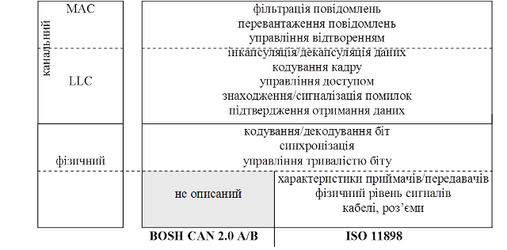

[Промислові мережі та інтеграційні технології в автоматизованих системах](README.md). 8.[CAN ПРОТОКОЛ](8.md)

## 8.1. CAN стандарти та їх опис в контексті моделі OSI

Протокол CAN набув визнання вже після випуску першої специфікації. Однак, у зв’язку з все більшим ростом потреб, виникла необхідність в розширені одного з полів кадру (11-бітного Ідентифікатору повідомлення). Для сумісності версій, нова CAN Специфікація 2.0 дозволяє використовувати як старий формат кадру з 11-бітним Ідентифікатором, який отримав назву "стандартний формат", так і новий – "розширений формат" з 29-бітним Ідентифікатором повідомлення. Нова специфікація складається з 2-х частин:

-  Частина "А", яка описує CAN формат повідомлення такий самий, як в CAN Специфікації 1.2;

-  Частина "В", яка описує як стандартний, так і розширений формат.

Для сумісності реалізації CAN з новою специфікацією, достатньо щоб вона була сумісною з Частиною "А", або Частиною "В". Крім того, вузли реалізовані на основі специфікації CAN 1.2 або CAN 2.0 Частини "А", можуть зв’язуватись з вузлами, реалізованими на основі CAN 2.0 Частини "В", використовуючи стандартний формат повідомлення. Можливе одночасне функціонування обох форматів повідомлення на одній мережі, за рахунок наявності резервного біту в стандартному форматі кадру (розглянуто нижче).

CAN Специфікацію 2.0 також називають BOSH CAN 2.0 A/B. В контексті моделі OSI вона описує повністю канальний рівень та частину фізичного (рис.8.1). На фізичному рівні CAN 2.0 описує тільки загальні правила синхронізації, кодування бітів та вимоги до швидкодії. Однак фізичний спосіб передачі бітів, середовище передачі, роз’єми та характеристики трансиверів залишаються поза уваги специфікації. Таким чином CAN визначений повністю на підрівні МАС, частково на LLC та фізичному рівні, а також він накладає певні вимоги на реалізацію інших рівнів (фізичного та прикладного). 

Рис.8.1. Стандарти BOSH CAN та ISO 11898 в контексті OSI-моделі

В 1993 році CAN закріпився у міжнародному стандарті ISO 11898 (CAN High Speed Transceiver and Data Link Layer). Цей стандарт, на відміну від BOSH CAN 2.0 A/B, додатково описує вимоги до високошвидкісних трансиверів та середовища передачі даних (рис.8.1.). Саме ISO 11898 використовується у багатьох мережах, які базуються на CAN (наприклад CANOpen, DeviceNet). Як правило під поняттям "CAN-шина" мають на увазі мережне рішення на базі ISO 11898. 

<-- 8.[CAN ПРОТОКОЛ](8.md)

--> 8.2. [Організація канального рівня](8_2.md)  