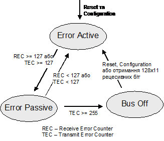

[Промислові мережі та інтеграційні технології в автоматизованих системах](README.md). 8.[CAN ПРОТОКОЛ](8.md)

## 8.2. Організація канального рівня

### 8.2.1. Комунікаційні сервіси

Протокол CAN забезпечує два комунікаційні сервіси: це сервіс Запису Об’єкту (Write Object) та сервіс Читання Об’єкту (Read Object). Для обміну даними визначені два типу кадрів - Кадр Даних (DATA FRAME) та Дистанційний Кадр (REMOTE FRAME), які можуть вміщувати до 8 байт даних повідомлення.

При записі об’єкту від одного вузла (Виробника) передається Кадр Даних до одного або більше приймаючих вузлів (Споживачів) (рис.8.2).

Рис.8.2. Обмін даними між вузлами мережі CAN

Сервіс Читання Об’єкту ініціюється одним або декількома Споживачами. Для цього один з цих вузлів передає Дистанційний Кадр, по якому вузол Виробник відповідає Кадром Даних. В цьому випадку потрібний Кадр Даних та Дистанційний Кадр будуть мати ідентичні Ідентифікатори. 

Широкомовність і фільтрація дає змогу прийняти Кадр Даних на всіх необхідних вузлах. У випадку одночасної передачі по шині Кадру Даних та Дистанційного Кадру з тим же Ідентифікатором, - пріоритет має (виграє арбітраж) Кадр Даних. 

### 8.2.2.Формати кадрів обміну даними

#### 8.2.2.1. Типи кадрів. 

Повідомлення виявляються і управляються чотирма різними типів кадрів:

-  Кадр Даних (DATA FRAME) – несе дані від передавача до приймача;

-  Дистанційний Кадр (REMOTE FRAME) – проводить запит на передачу Кадру Даних з тим же Ідентифікатором;

-  Кадр Помилки (ERROR FRAME) – передається будь яким пристроєм при виявленні помилки;

-  Кадр Перевантаження (OVERLOAD FRAME) – використовується для попередження про необхідність затримки до передачі наступного кадру.

Ми вже зазначали, що перші два типи кадрів служать для обміну даними і можуть бути використані як в стандартному так і в розширеному форматі. Другі два – призначені для управління роботою шини в нештатних ситуаціях. Мінімальна пауза між кадрами називається Міжкадровим Простором (INTERFRAME SPACE).

Кожний кадр складається з бітових полів. Розглянемо формати кадрів для обміну даним, починаючи з Кадру Даних (рис.8.3).

#### 8.2.2.2. Формат Кадру Даних. 

 

Рис.8.3. Формат Кадру Даних

Початок кадру (SOF-Start Of Frame) – складається з одного домінантного біту, який призначений для синхронізації приймачів з передавачем. Будь якій станції дозволяється займати шину для передачі, якщо вона в стані очікування, тобто в період Міжкадрового Простору. Всі вузли синхронізуються по передньому фронту сигналу біту SOF. Функція даного біту аналогічна стартовому біту при символьній передачі. 

Поле Арбітражу (ARBITRATION FIELD) – призначене для визначення пріоритету повідомлення/кадру. Склад даного поля різний для стандартного та розширеного форматів (рис.8.4). В стандартному форматі поле має 11-бітний Ідентифікатор та RTR-біт. В розширеному форматі поле має 29-бітний Ідентифікатор, SRR-біт, IDE-біт  і RTR-біт. Біти Ідентифікатору позначаються ID-28…ID-0. У попередніх специфікаціях (1.0-1.2) біт IDE стандартного формату позначався як r1.

Рис.8.4. Стандартний (11 біт) та розширений (29 біт) формат Кадру Даних.

Для стандартного формату біти Ідентифікатору нумеруються по порядку від ID-28(найбільш значимий) до ID-18(найменш значимий), з яких 7 перших (ID-28...ID-22) – не можуть бути рецесивними. В розширеному форматі Ідентифікатор включає в себе дві секції: 11-бітну BaseID та 18-бітну ExtendedID. BaseID (Базовий ID) – це еквівалент Ідентифікатору в стандартному форматі і визначає базовий пріоритет в розширеному форматі. ExtendedID (Розширений ID) складається з 18 бітів, які позначаються, починаючи з ID-17, закінчуючи ID-0.

Біт RTR (Remote Transmission Request BIT) – вказує на тип кадру. Для Кадру Даних даний біт буде домінантним, для Дистанційного Кадру – рецесивним. Таким чином досягається вищий пріоритет кадру з даними над кадром з запитом на передачу цих даних при тому самому Ідентифікаторі. Однак слід відмітити, що RTR в стандартному форматі йде раніше ніж при передачі розширеного формату кадру, хоч в обох випадках – після бітів Ідентифікатору.

Біт SRR (Substitute Remote Request BIT) – існує тільки в розширеному форматі, і завжди передається в рецесивному стані. Оскільки його позиція співпадає з позицією біту RTR в стандартному форматі, то у випадку одночасної передачі кадрів стандартного та розширеного форматів, з Ідентифікатором стандартного кадру рівним BaseID розширеного, - стандартний кадр буде вигравати арбітраж. 

Біт IDE (Identifier Extension Bit) – для стандартного формату передається домінуючим, для розширеного – рецесивним.

Поле Управління (CONTROL FIELD) - складається з 6 біт (рис.8.5). Чотири з них (DLC3-DLC0) називаються Кодом Довжини Даних (DATA LENGTH CODE) і вказують на кількість байтів в Полі Даних. Інші 2 біти r1 і r0 – зарезервовані і відправляються домінантними. Однак для стандартного формату кадру на місці біту r1 стоїть біт IDE, призначення якого описано вище.

Рис.8.5. Формат ПОЛЯ УПРАВЛІННЯ

Рис.8.6. Формат ПОЛЯ CRC

Поле Даних (DATA FIELD) – складається з байтів від 0 до 8, які передаються в Кадрі Даних.

Поле CRC – використовується для перевірки контрольної суми. Воно складається з 15-бітової CRC послідовності, після якої йде рецесивний біт під назвою Розмежувач CRC (CRC DELIMITER), який служить для розмежування між послідовністю CRC та полем ACK.

Рис.8.7. Формат Поля ACK

Поле ACK – складається з двох бітів: Слоту ACK (ACK SLOT) та Розмежувача ACK (ACK DELIMITER). Обидва біти передаються рецесивними, а отримувачі, які отримали повідомлення вірно (перевіривши CRC), замінюють Слот ACK на домінантний біт. Таким чином відправник контролює вірну доставку повідомлення.

Кінець кадру (EOF – End Of Frame) – це послідовність із семи рецесивних бітів, які вказують на кінець Кадру Даних або Дистанційного Кадру.

#### 8.2.2.3. Формат Дистанційного Кадру.  

Дистанційний Кадр сформований із шести полів: Початку Кадру, Поля Арбітражу, Поля Управління, Поля CRC, Поля ACK, Кінця Кадру (рис.8.8). 

Рис.8.8. Формат Дистанційного Кадру

На відміну від Кадру Даних біт RTR Дистанційного Кадру є рецесивним, а отже при одночасній передачі Кадру Даних та Дистанційного з тим самим Ідентифікатором, арбітраж виграє Кадр Даних. 

Слід зазначити, що в Дистанційному Кадрі немає Поля Даних, оскільки цей тип кадру є тільки ініціатором передачі даних. Для полів Початок Кадру, Поля Арбітражу, Поля Управління, Поля Даних, Послідовності CRC справедливе правило бітового начинення. Всякий раз, коли передавач виявляє в бітовому потоці п’ять послідовних бітів однакової величини, які повинні бути передані, він автоматично включає допоміжний біт в фактичний переданий бітовий потік, який обернений до них по рівню сигналу. Для інших полів а також для Кадрів Помилки та Кадрів Перевантаження це правило не діє. 

### 8.2.3. Обробка помилок та боротьба з дефектами

#### 8.2.3.1. Типи помилок. 

В CAN виділяються 5 різних типів помилок, які не виключають одна одну:

- бітова помилка;

- помилка начинення;

- помилка CRC;

- помилка форми;

- помилка підтвердження.

Бітова помилка (bit error) виникає, коли вузол-відправник, прослуховуючи шину при передачі, виявить інший рівень біту, ніж він передавав. Винятком являються Поле Арбітражу, Поле ACK та Пасивний Прапор Помилки, в яких вияв домінуючого біту замість рецесивного не являється помилкою.

Помилка начинення (stuff error) є результатом вияву послідовності з 6 бітів однакового логічного рівня в тих полях, де діє правило бітової начинки.

Помилка CRC (CRC error), як і в інших протоколах з перевіркою контрольної суми, виникає при відмінності розрахованої CRC з отриманим значенням в CRC Послідовності.

Помилка форми (form error) виникає, коли фіксовані бітові поля мають один або декілька незаконних бітів (домінантний біт в областях Розмежувач CRC , Розмежувач ACK або EOF).

Помилка підтвердження(acknowledgment error) завжди виникає, коли передавач не виявляє в Слоті ACK домінантного біту, що говорить про відсутність підтвердження з боку отримувача(-ів).      

#### 8.2.3.2. Механізм глобалізації помилки. 

У випадку виявлення одним з вузлів помилки, передача повинна припинитися, навіть якщо всі інші вузли помилок не виявили. Це досягається за рахунок глобалізації помилки, тобто штучного спотворення бітів, які передаються, задля виявлення помилок усіма вузлами. Тобто, якщо помилку виявив один із вузлів (локальна помилка), він повинен заставити всі інші вузли виявити цю помилку. Для цього, він передає послідовність із 6 домінантних бітів (Прапор Помилки), що приводить до вияву усіма іншими вузлами помилки начинення. Ті, в свою чергу, виявивши локальну помилку теж починають передавати послідовність із 6 біт (рис.8.9). 

Рис.8.9. Механізм глобалізації локальної помилки

Таким чином, при виникненні помилки на шині з’явиться від 6 до 12 домінантних бітів. Ця послідовність разом з допоміжними бітовими полями формує Кадр Помилки (рис.8.10).  

Рис.8.10. Формат Кадру Помилки

Після того, як вузол передає останній біт Прапора Помилки, він посилає рецесивний біт, з контролем його стану на шині. Як тільки цей стан з’явиться на шині (тобто всі вузли передали свій Прапор Помилки), кожний з них передає ще 7 рецесивних бітів. Ця послідовність із 8-ми рецесивних біт називається Розмежувачем Помилки (ERROR DELIMITER). Після Кадру Помилки, дочекавшись паузи із 3-х біт (Міжкадрового Простору) передавач перерваного кадру повторює його передачу знову.

#### 8.2.3.3. Механізми самодіагностики 

Глобалізація помилки могла би привести до абсолютно зворотного ефекту, у випадку виходу з ладу або збоїв в роботі одного з вузлів. Наприклад, якщо вузол починає кожен раз посилати Прапор Помилки, у зв’язку з певними дефектами приймача, шина зациклиться на передачі одного й того самого інформаційного кадру. Однак в CAN визначені механізми для локалізації дефектних вузлів, які не допускають "зависання" мережі. Кожен контролер CAN оснащений засобами самоконтролю, які переводять його в один із 3-х станів:

-  активним до помилок (Active Error);

-  пасивним до помилок(Passive Error);

-  неактивний на шині (Bus Off). 

У нормальному стані вузол знаходиться в активному до помилок стані і у випадку виникнення помилки, веде себе так, як описано вище.  

Якщо вузол по певним причинам (описано нижче) перейшов в пасивний до помилок стан, то при передачі Прапора Помилки (див. рис.8.11) замість домінантних бітів він посилає рецесивні. Це значить, що у випадку виникнення локальної помилки при прийомі кадру на даному вузлі, він не зможе провести її глобалізацію, а отже всі інші вузли на шині помилку не виявлять. 

Тим не менше, при передачі кадру, пасивний до помилок вузол при виявленні помилки сам перериває свій власний кадр послідовністю із 6 рецесивних бітів. Це викличе помилку бітового начинення в інших вузлах, що приведе до глобалізації помилки. По цій причині даний вузол знову повторить передачу кадру. Щоб не зациклити шину даним кадром (адже дефектний вузол може сам спотворювати власну передачу) введена допоміжна пауза (Призупинка Передачі), під час якої інші вузли зможуть почати передачу свого кадру. Неактивний на шині вузол взагалі не приймає участь в передачі.  

Рис.8.11. Управління станом вузла CAN

Для управління своїм станом, кожен вузол має лічильники для підрахунку помилок приймання REC (Receive Error Counter) та відправки TEC(Transmit Error Counter). На діаграмі на рис.8.11 видно, як вузол переходить з стану в стан, в залежності від значення цих лічильників. В специфікаціях CAN визначені правила збільшення/зменшення значень REC і TEC.

<-- 8.1. [CAN стандарти та їх опис в контексті моделі OSI](8_1.md) 

--> 8.3. [Реалізація фізичного рівня](8_3.md) 