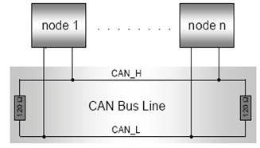
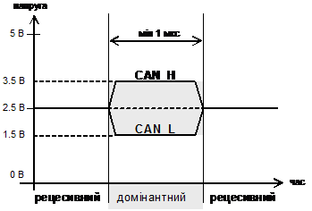
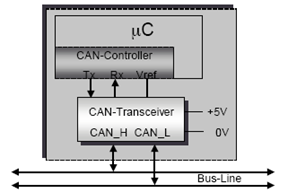
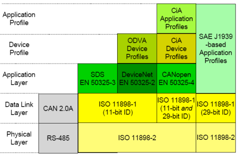

[Промислові мережі та інтеграційні технології в автоматизованих системах](README.md). 8.[CAN ПРОТОКОЛ](8.md)

## 8.4. CAN-сумісні стандарти

CAN Специфікація 2.0 є основою для багатьох популярних мереж, тому не описує рівні, які знаходяться вище канального, та частину фізичного. Так, наприклад, є декілька офіційних і промислових стандартів, які визначають підрівень MDA:

- CAN High-Speed (ISO 11898-2) – високошвидкісний;

- CAN Low-Speed (ISO 11519-1) – низькошвидкісний; 

- Fault-Tolerant Transceivers (ISO 11898-3) – стійкий до помилок,  використовуються в автомобільній бортовій електроніці; 

- Truck/Trailer Transceiver (ISO 11992) –  використовується німецьким стандартом LBS(DIN 9684)для машин сільського господарства;

- Single-Wire (SAE 2411) –  однопроводний зв’язок;

- Fiber Optical Transmission – волоконно-оптична передача; 

- Wire-Less Transmission – безпровідна передача;

-  Power-Supply Transmission – живлення пристроїв по шині.

Протоколи верхніх рівнів описані в стандартах мереж CANopen, CAN Kingdom, DeviceNet , SDS (Smart Distributed System) та інших. Багато з них базуються на стандарті ISO 11898, тому його розглянемо детальніше. 

### 8.4.1. Стандарт ISO 11898

#### 8.4.1.1. Загальний огляд ISO 11898. 

Стандарт ISO/IS 11898 (Road vehicles. Interchange of digital information. Controller area network (CAN)) складається з п’ятьох частин:

-  ISO 11898-1: описує канальний рівень та частину фізичного аналогічно як в CAN 2.0 частини А;

-  ISO 11898-2: стандарт високошвидкісного доступу до шини, описує трансивери, параметри передачі даних та фізичне середовище для реалізації на фізичному рівні;

-  ISO 11898-3: стандарт низькошвидкісного, стійкого до помилок доступу до шини, описує трансивери, параметри передачі даних та фізичне середовище для реалізації на фізичному рівні;

-  ISO 11898-4: описує обмін даними по часовому тригеру

На відміну від CAN 2.0 частини А, в ISO 11898-1 значення поля DLC може бути більш ніж 8 (до 15). Однак в специфікації від BOSH не визначена жодна з помилок в такій ситуації, що значить про сумісність в реалізації обох стандартів. Додатково визначений новий необов’язковий режим, в якому може перебувати вузол: моніторинг шини (Bus monitoring mode). В цьому режимі вузол може тільки слідкувати за передачею, однак не передавати дані самому.

Для систем з регламентованим часом відновлення даних, може знадобитися допоміжна функція, яка описана в ISO 11898-4 (TTC – Time Triggered Communication). Ця функція визначає умови для генерації повідомлення кожним вузлом через певні інтервали часу, що виключає одночасний доступ до шини декількох пристроїв і дозволяє проводити так зване "планування кадрів". Для реалізації такого функціонування необхідне однакове "проходження часу" на кожному пристрої, що досягається за рахунок синхронізації внутрішніх лічильників по біту SOF або по точці синхронізації останнього біту поля EOF. На основі TTC полегшується створення глобальної системи часу на реалізації верхніх рівнів OSI для мереж, основаних на CAN. Однак використання режиму TTC заперечує використання Кадрів Перевантаження та Кадрів Помилки та повторення передачі кадру у випадку помилки. Реалізовується функція TTC як підрівень між LLC та MAC.

#### 8.4.1.2. ISO 11898-2. 

Стандарт ISO 11898-2 описує високошвидкісні трансивери CAN, та вимоги до фізичного середовища. Кожен вузол підключається до шини, яка складається з двох ліній, які називаються CAN_H і CAN_L. Для забезпечення мінімізації ефекту відбиття сигналу в кінцях ліній використовуються узгоджувальні резистори номіналом 120 Ом (рис.8.12).

Рис.8.12. Підключення вузлів до CAN мережі по ISO 11898

Використовується диференційний спосіб передачі по напрузі: вузлами ідентифікується рецесивний біт, якщо різниця потенціалів між CAN_H і CAN_L не перевищує 0.5 В, домінантний – якщо більше ніж 0.9 В. Номінальна напруга в домінантному стані – 3.5 В для лінії CAN_H і 1.5 В для CAN_L (рис.8.13). 

Рис.8.13. Домінантний та рецесивний біти в ISO 11898-2 ПЕРЕВАНТАЖЕННЯ

ISO 11898-2 сумісні вузли являють собою мікроконтролер (mC) та CAN-контролер, які підключені до трансивера, що живиться 5 В (рис.8.14). 

Рис.8.14.  Конструкція CAN-вузлів ISO 11898

Максимально припустима довжина лінії зв’язку визначається різними фізичними обмеженнями, пов’язаними з характеристиками вузлів та кабелю. Використовуючи трансивер згідно ISO 11898-2 і високошвидкісну опторозв’язку можна досягнути максимальної довжини 9 метрів при бітовій швидкості 1 Мбіт/с. При менших швидкостях ця довжина може істотно бути збільшена. В таблиці 8.1 показана довжина лінії, яка може бути досягнута при використанні ISO 11898 сумісного трансивера зі стандартним шинним кабелем, без урахування опторозв’язки. 

Таблиця 8.1. Припустима довжина лінії зв´язку

| БІТОВА ШИВДКІСТЬ | Довжина лінії  зв’язку |
| ---------------- | ---------------------- |
| 1  Мбіт/с        | 30 м                   |
| 800 кбіт/с       | 50 м                   |
| 500 кбіт/с       | 100 м                  |
| 250 кбіт/с       | 250 м                  |
| 125 кбіт/с       | 500 м                  |
| 62,5 кбіт/с      | 1000 м                 |
| 20 кбіт/с        | 2500 м                 |
| 10 кбіт/с        | 5000 м                 |

 Враховуючи велику популярність ISO 11898-2 серед CAN-сумісних промислових мереж, визначимо його загальні характеристики.

-     сумісний з BOSH CAN 2.0 А;

-     використовується симетрична передача по напрузі між CAN_H та CAN_L;

-     середовище передачі – вита пара з характеристичним хвильовим імпедансом 120 Ом;

-     бітова швидкість вибирається з ряду від 10 кБіт/с до 1 Мбіт/с (таб.8.1); підтримка 20 Кбіт/с – обов’язкова;

-     топологія – шина, з короткими відгалуженнями (до 0,3 м при 1Мбіт/с);

-     максимальна довжина лінії зв’язку до 1000 м;

-     два обов’язкових термінальних резистори 120 Ом (108 Ом - 132 Ом) на кінцях лінії;

-     максимум 64 пристрої на один сегмент.

### 8.4.2. Протоколи прикладного рівня для мереж CAN

 Необхідність у використанні функцій прикладного рівня для мереж CAN породила ряд мережних рішень, деякі з яких дуже схожі між собою. Серед найбільш популярних протоколів прикладного рівня, які базуються на CAN є  CANopen, DeviceNet, CAN Kingdom, SDS (Smart Distributed System). На сьогоднішній день вони стандартизовані в міжнародних стандартах. Зокрема, в EN 50325 описані наступні промислові мережі:

- EN 50325-1 2002 Industrial communications subsystems based on ISO 11898 (CAN) for controller device interfaces - part 1: general requirements;

- EN 50325-2 2000 Part 2: DeviceNet;

- EN 50325-3 2000 Part 3: Smart Distributed System;

- EN 50325-4 2002 Part 4: CANopen.

Крім того в серії стандартів МЕК Industrial Communication Networks (IEC 61158, IEC 61784, IEC 61918) теж стандартизовані деякі рішення, зокрема DeviceNet (у складі сімейства СІР). Загальна картина прикладних рішень на базі CAN показана на рис.8.15. Більшість з них базується на  ISO 11898. 

Рис.8.15. Мережі на базі технології CAN

<-- 8.3. [Реалізація фізичного рівня](8_3.md) 

--> 8.5. [Реалізація CAN](8_5.md)