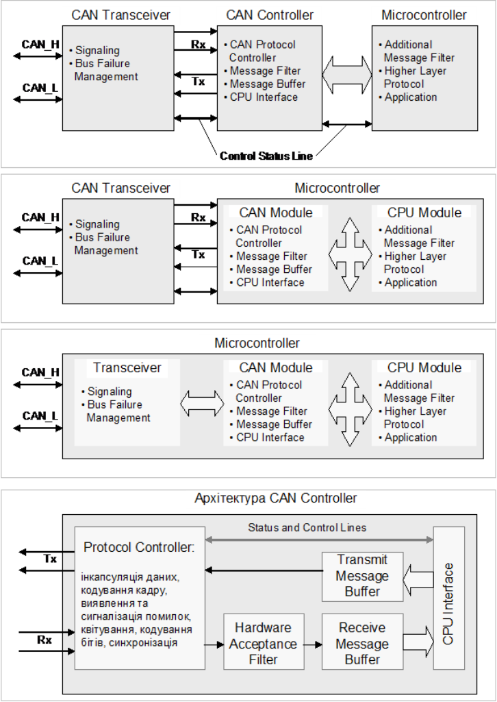

[Промислові мережі та інтеграційні технології в автоматизованих системах](README.md). 8.[CAN ПРОТОКОЛ](8.md)

## 8.5. Реалізація CAN

Декілька компаній реалізують протоколи CAN у вигляді готових мікросхем, задача яких полягає у забезпеченні основних послуг зв’язку: передача даних, запит на дані, слідкування за помилками та їх ідентифікація. Всі існуючі реалізації використовують контролери CAN, функції та інтерфейс яких сумісний з моделлю реалізації від BOSH. Відмінності заключаються в акцептованій фільтрації, можливості буферизації кадрів та використання деяких додаткових функцій.

Є декілька варіантів реалізації всієї системи обміну з використанням протоколу CAN (рис.8.16):

- з окремо виділеним CAN-контролером;

- з інтегрованим CAN-контролером в мікроконтролер;

- з використанням єдиного чіп сету разом з трансивером;

Перевага першого способу реалізації заключається в багатофункціональності та гнучкості. Такий підхід має місце у випадках використання протоколу верхніх рівнів, які базуються на різних реалізаціях канального та фізичного рівня, або навпаки – коли один і той самий контролер CAN використовується для різних мереж (мультипротокольна реалізація, шлюзи і т.д.). 

Інтеграція CAN контролера разом з мікроконтролером збільшує швидкодію взаємодії між складовими та зменшує навантаження на процесори. Ціна такого рішення, порівняно з попереднім способом, як правило нижча, а надійність - вища.

Для систем розподіленого вводу/виводу більш доцільним є використання єдиного мікроконтролера з реалізацією протоколів всіх рівнів. Недоліком таких систем є відсутність можливості комбінації різноманітних технологій тобто гнучкості.

Рис.8.16. Різні варіанти реалізації CAN-вузлів

Окрім контролера протоколу кожен CAN-чіп має вбудований акцептований фільтр для фільтрації повідомлень, буфери для кадрів даних що передаються та відправляються. Реалізація цих функцій а також інтерфейсу з CPU можуть відрізнятися в залежності від реалізації CAN-чіпа. 

CAN – дуже цікаве рішення в області промислових мереж. З одного боку він надзвичайно складний в функціонуванні (і в розумінні), з іншого – надійний і ефективний. Окрім того, наявність великої кількості компонентів CAN (від фірм Intel, Philips, Siemens, Motorola) робить систему недорогою. 

<-- 8.5. [Реалізація CAN](8_5.md) 

--> 9. [CANOpen](9.md)

## Контрольні запитання до розділу 8

1) На яких рівнях моделі OSI описаний протокол CAN? Якими засобами необхідно доповнити мікроконтролер CAN для можливості побудови мережі? 
2) Який метод доступу до шини та модель адресації     використовується в CAN? Розкажіть про їх принципи функціонування. 
3) Що таке Ідентифікатор повідомлення і для чого він     використовується в CAN шинах?
3. Які CAN стандарти     існують на сьогоднішній день і чим вони відрізняються?
4. Яку типи комунікаційних сервісів використовуються     в протоколі CAN? Якими типами кадрів забезпечується передача даних? 
5. Як реалізовуються функції Запису Об’єкту та     Читання Об’єкту?
6. Якими типами кадрів забезпечується ідентифікація     помилки та затримка передачі наступного кадру?
7. За допомогою якого поля кадру даних     забезпечується синхронізація приймача з передавачем?
8. Розкажіть про призначення Поля Арбітражу в кадрі     даних. З яких частин складається це поле? Які типи Ідентифікаторів Ви     знаєте? Як визначається пріоритетність Кадру Даних над Дистанційним     Кадром?
9. Який кадр буде вигравати арбітраж стандартний чи     розширений? Поясніть чому?
10. Як контролюється вірність доставки даних     отримувачем? Як контролюється вірність доставки даних відправником?
11. Поясніть, чому Дистанційний Кадр не має Поля     Даних?
12. Які типи помилок виявляються в CAN? 
13. Що таке глобалізація помилки і навіщо вона     потрібна? Розкажіть про механізм функціонування глобалізації помилки.
14. Яким чином в CAN реалізовується захист шини від роботи     несправних вузлів? В яких станах може знаходитись вузол CAN з точки зору     реакцій на помилки?
15. Які функції описує CAN на фізичному рівні? Які     функції необхідно додатково реалізувати на фізичному рівні для мереж, які     базуються на протоколі CAN?
16. Які механізми використовуються в CAN для     синхронізації трансмітерів між собою?
17. Які стандарти, що базуються на CAN, та описують     характеристики трансмітерів Ви знаєте?
18. Що описує стандарт ISO 11898?
19. Розкажіть про основні характеристики CAN-шини на базі ISO 11898-2: спосіб передачі бітів,     топологія, правила термінування, максимальна довжина ліній зв’язку та     відгалужень, бітова швидкість, максимальна кількість пристроїв.
20. Які протоколи верхніх рівнів базуються     на CAN протоколі?
22. Які Ви можете назвати варіанти реалізації вузлів CAN?   