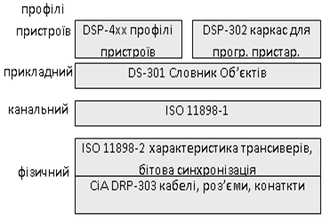

[Промислові мережі та інтеграційні технології в автоматизованих системах](README.md). 9. [CANOpen](9.md)

## 9.1. CANOpen в контексті моделі OSI

CANOpen є продуктом від організації CiA і описується серією стандартів та специфікацій, які розвиваються і доповнюються. Розглянемо що представляє собою дана мережа в контексті моделі OSI (рис.9.1).

Рис.9.1. CANOpen в контексті OSI-моделі

На фізичному та канальному рівні CANOpen базується на CAN контролері та високошвидкісного трансиверу, які визначені ISO 11898 у частинах 1 та 2. Додатково до них вказані вимоги до бітової синхронізації, характеристики кабелів та роз’ємів. Нижні рівні доповнені протоколом прикладного рівня, комунікаційними профілями та Каркасами (Frameworks) для програмованих пристроїв. Для спрощення механізму обміну з різнорідними пристроями в CANOpen використовується сімейство різнорідних стандартизованих профілів. Таким чином мережа CANOpen описується системою стандартів:

-  ISO 11898-1 та ISO 11898-2 фізичний та канальний рівень;

-  CiA DRP-303-1 – опис рекомендованих характеристик кабелів і рознімів;

-  CiA DRP-303-2 – визначення одиниць СІ та префіксів;

-  CiA DS-301 – прикладний рівень та комунікаційний профіль;

-  CiA DSP-302 – каркас для Програмованих пристроїв;

-  CiA DS-4XX – множина профілів пристроїв.

<-- 9. [CANOpen](9.md)

--> 9.2. [Особливості реалізації фізичного рівня](9_2.md) 