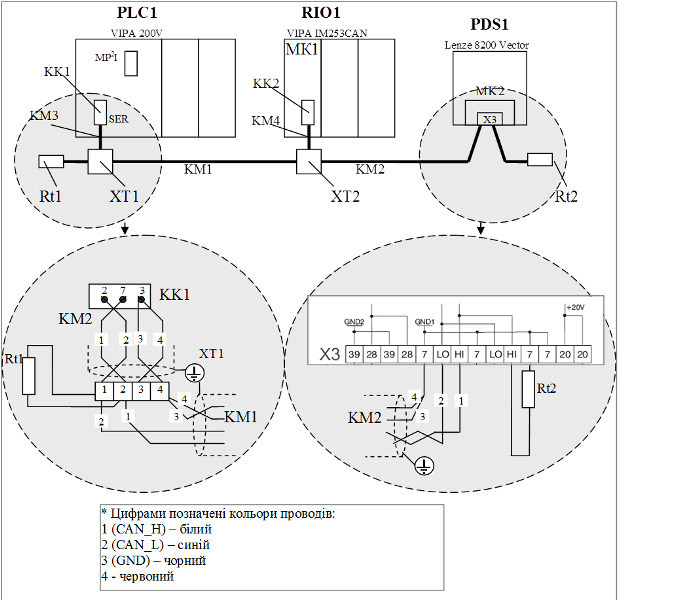

[Промислові мережі та інтеграційні технології в автоматизованих системах](README.md). 9. [CANOpen](9.md)

## 9.2. Особливості реалізації фізичного рівня

Фізичний рівень, як видно з рис.9.1, базується на ISO 11898-2 з додатковими вимогами, які стосуються формування біту, а також рекомендацій до використання кабелів, роз’ємів та їх контактів. 

Згідно ISO 11898-2 у мережі використовується диференційна передача напруги по двом проводам CAN_H та CAN_L відносно загальної землі CAN_GND (див. розділ 8). Для надійної роботи на шині з довжиною більш ніж 200 метрів рекомендується використання опторозв’язок, а більш ніж 1 км – мостів та повторювачів. 

Крім правил формування бітів в CANOpen додатково визначені рекомендовані кабелі, роз’єми та їх контакти. Стандарт CiA DRP-303-1(CiA Draft Recommendation) рекомендує використовувати кабель з хвильовим опором 120 Ом та з характеристиками, наведеними у табл. 9.1, для шини, яка має менш ніж 64 вузлів.

Таблиця 9.1. Характеристики шини

Кабелі відгалуження краще підбирати з поперечним розрізом 0.25 – 0.34 мм2. Крім опору кабелю необхідно враховувати опір роз’ємів, який повинен бути в межах 2,5 – 10 МОм. В даній рекомендації вказуються також випадки, в яких можна не використовувати термінатори лінії. 

В цій же рекомендації визначені декілька типів роз’ємів та їх контактів (рис.9.2 – 9.5). Найбільш популярний з них 9-піновий sub-D конектор (DIN 41652 або відповідний до нього міжнародний стандарт), який сумісний з стандартом CiA DS-102 (CAN physical layer for industrial applications). Контакти CAN_H і CAN_L є основними і використання їх обов’язкове. Хоч контакт CAN_GND не вказаний як опціональний, при повністю гальванічно-розв’язаних мережах CAN його можна не використовувати. На кожному із вузлів контакти GND і CAN_GND повинні бути з’єднані. CAN_V+ використовується для підключення зовнішнього живлення 24В у випадку необхідності живлення трансиверів і опто-розв’язки для гальванічно-розв’язаних вузлів на шині.

Рис.9.2. Призначення контактів 9-пінових SUB- D конекторів

Рис.9.3. Призначення контактів RJ-45 конекторів 

Рис.9.4. Призначення контактів конекторів типу Open Style

 Рис.9.5. Призначення контактів 5-пінових конекторів типу Mini Style 

Приклад.9.1. CANOPen. Побудова схеми мережних з’єднань для CANOpen на базі засобів Schneider Electric. 

Рис.9.6. Структурна схема системи до прикладу 9.1 

Завдання. Необхідно підібрати технічні засоби та розробити схему мережних з’єднань для CANOpen відповідно до наведеної на рис.9.6 структури до якої входять: PLC1 – TSX Premium (модель в даному випадку не має значення); RIO1 – розподілена система вводу виводу Advantys STB з модулями вводу/виводу DDI3610 (6 входів) та DDO3610 (6 виходів);. PDS1 – частотний перетворювач Altivar 71.

Рішення. Для засобів Шнейдер Електрик рішення на базі CANOpen на сьогоднішній день є одним із базових в системах розподіленого управління, аналогічно як Profibus DP для Siemens. Тому всі необхідні аксесуари (кабелі відгалужувачі, коробки підключення) які необхідні для побудови мережі CANOpen є готовими до використання без додаткової зборки. Виключенням хіба що є сам магістральний кабель, який повинен підключатися до коробок відгалуження. 

Рис.9.7. Зовнішній вигляд карти TSX CPP110 з відгалуженням

Для підключення ПЛК TSX Premium та TSX Micro до мережі CANOpen використовується комунікаційна карта TSX CPP110 формату PCMCIA. Ця карта поставляється разом з кабелем відгалуження, який в кінці має коробку підключення з вбудованим 9-піновим SUB-D роз’ємом (рис.9.7). Таке виконання дає можливість уніфікувати кабелі відгалуження.

Для підключення модульного острову вводу/виводу Advantys STB необхідно вибрати базовий комунікаційний модуль. Звісно, що це буде модуль для CANOpen, наприклад STB NCO 2212 (рис.9.8). Підключення до модуля виконується через 9-піновий SUB-D конектор, який знаходиться безпосередньо на модулі.      

Для підключення TSX Premium та Advantys STB на великі відстані можна використати коробки відгалуження, які поєднані магістральним кабелем. В нашому прикладі ми використаємо 4-х портову коробку відгалуження (рис.9.9) з вбудованим термінатором лінії.  

Частотні перетворювачі Altivar 71 мають вбудований порт Modbus/CANOpen з типом роз’єму RJ-45. Підключення до магістральної шини рекомендується проводити з використанням спеціальної коробки відгалуження VW3 CAN TAP 2 (рис.9.10). Ця коробка має 2 порти RJ-45 для підключення частотних перетворювача (ATV1 та ATV2) за допомогою кабелю VW3 CA RR 1 та порт для підключення ПК (PowerSuite). Останній дозволяє в режимі роботи системи по Modbus RTU налаштовувати частотні перетворювачі за допомогою спеціального конфігураційного забезпечення PowerSuite. Крім того, дана коробка має вбудований термінатор лінії. 

Схема мережних з’єднань показана на рис.9.11. Специфікація мережних засобів та вузлів дана в таблиці 9.6.

Рис.9.8. Комунікаційний модуль CANOpen STB NCO 2212

Рис.9.9. Коробка відгалуження TSX CAN TDM4 на 4 порти типу Sub-D 9-pin

 Рис.9.10. Підключення ATV71 до коробки відгалуження VW3 CAN TAP 2

 

Таблиця 9.6.  Специфікація мережних засобів

| №    | Позна-чення | Назва                                                        | Тип           | Кіль-кість | Фірма |
| ---- | ----------- | ------------------------------------------------------------ | ------------- | ---------- | ----- |
| 1    | PLC1        | ПЛК TSX Premium                                              | TSX 57204M    | 1 шт.      | SE    |
| 2    | RIO1 (KK2)  | Острів віддаленого вводу/виводу Advantys STB, з комунікаційним модулем CANOpen AdvabtysSTB | STB NCO 2212  | 1 шт.      | -//-  |
| 3    | PDS1        | Частотний  перетворювач Altivar71 для управління асинхронним двигуном | ATV71H037M3   | 1 шт.      | -//-  |
| 4    | KK1         | Комунікаційна PCMCIA карта CANOpen для TSX Micro/Premium     | TSX CPP110    | 1 шт.      | -//-  |
| 5    | KМ1,KМ2     | Магістральний кабель (подвійна екранована вита пара для  CANOpen) | TSX CAN CA100 | 40 м       | -//-  |
| 6    | KM3,КМ4     | Кабель для підключення пристроїв по CANOpen, з обох боків 9-пінова SUB-D розетка, 1 м. | TSX CAN CADD1 | 1 шт.      | -//-  |
| 7    | KM5         | Кабель для підключення пристроїв по CANOpen, з обох боків RJ-45 вилка, 1м | TSX CAN CARR1 | 1 шт.      | -//-. |
| 8    | KП1, КП2    | Коробка підключення пристроїв до магістральної шини CANOpen з 4-ма портами типу 9-пінова SUB-D вилка | TSX CAN TDM4  | 1 шт.      | -//-  |
| 9    | КП3         | Коробка підключення частотних перетворювачів Altivar до магістраль-ної шини CANOpen, 3 порти RJ-45 розетка (2 –  CAN, 1 – Modbus RTU) | VW3 CAN TAP 2 | 1 шт.      | -//-  |

 Рис.9.11. 

Як видно зі схеми в обох кінцях лінії, на коробках підключення необхідно перемикачем виставити термінатори лінії. 

Слід зауважити, що всі елементи підключення від Шнейдер Електрик зроблені згідно CiA DS-102 (для прикладу порівняйте підключення кабелю КМ2 до клем S4 з рис.9.4). Тобто поз.5-9 специфікації з таблиці 9.6. можна замінити на аксесуари власного виготовлення. 

Приклад 9.2. CANOpen. Побудова схеми мережних з’єднань для CANOpen на базі засобів VIPA та LENZE. 

Завдання. Необхідно підібрати технічні засоби та розробити схему мережних з’єднань для CANOpen відповідно до наведеної структури на рис.9.12, до якої входять:  PLC1 – VIPA 200V з процесором, що має вбудований CANOpen інтерфейс (CPU 214CAN); RIO1 – розподілена система вводу виводу VIPA 200V; PDS1 – частотний перетворювач Lenze 8200 Servo.

Рішення. Для підключення розподіленої системи вводу виводу VIPA 200 до CANOpen використовується інтерфейсний модуль VIPA IM253CAN. Цей модуль, а також процесорний модуль CPU 214CAN мають SUB-D 9-піновий роз’єм типу вилка, який відповідає стандарту CiA DS-102. Всі інші аксесуари для підключення (кабелі, конектори, коробки відгалуження) підбираються відповідно до вимог цього ж стандарту.

Рис.9.12. Структурна схема системи до прикладу 9.2.

У Lenze є декілька спеціальних моду-лів для підключення частотного перетворю-вача 8200 Servo до CANOpen. Серед них – функціональний модуль E82ZAFCC – CAN System Bus. У цього модуля є свої особливості, щодо використання в CANOpen. Основні з них – це можливість роботи частотних перетворювачів без NMT-Ведучого,та відсутність профілю CANOpen для частотного перетворювача. Нижче (в іншому прикладі) ми розглянемо ці особливості більш детально. Слід зазначити, що в Lenze існують модулі, які підтримують CANOpen на всіх рівнях профілів. Враховуючи відсутність готових аксесуарів, схема мережних з’єднань наведена на рис.9.13. Специфікація мережних засобів та вузлів дана у таблиці 9.7.

Таблиця 9.7. Специфікація мережних засобів

| №    | Позна-чення | Назва                                                        | Тип            | Кіль-кість  | Фірма |
| ---- | ----------- | ------------------------------------------------------------ | -------------- | ----------- | ----- |
| 1    | PLC1        | ПЛК VIPA 214 CAN з  вбудованим інтерефейсом CANOpen          | VIPA 214-2CM02 | 1 шт.       | VIPA  |
| 2    | RIO1 (MK1)  | Система віддаленого вводу/виводу VIPA 200V на базі IM253 CAN | VIPA 253-1CA01 | 1 шт.       | VIPA  |
| 3    | PDS1        | Частотний  перетворювач Lenze 8200 Vector для управління асинхронним  двигуном 0,37 кВт | E82EV371K2C    | 1 шт.       | Lenze |
| 4    | MK2         | Функціональний модуль CAN System Bus для Lenze 8200          | E82ZAFCC       | 1 шт.       | Lenze |
| 5    | KK1,KK2     | 9-піновий SUB-D коннектор типу розетка                       |                | 2 шт.       |       |
| 6    | KМ1,KМ2     | Магістральний кабель, подвійна екранована вита пара для  CANOpen | TSX CAN CA100  | 40 м   40 м | SE    |
| 7    | KМ3,KМ4     | Кабель  відгалуження,  подвійна екранована вита пара для CANOpen | TSX CAN CA100  | 1 м   1 м   | SE    |
| 8    | XT1,  XT2   | Клемна колодка  з 4 клем                                     | TSX CAN CADD1  | 2 шт.       |       |
| 9    | Rt1,  Rt2   | Резистор 120 Ом (0.25 Вт)                                    |                | 2 шт.       |       |

На схемі мережних з’єднань показано підключення PLC1 до клемної колодки XT1 кабелем KM3, та розпайку конектору КК1. Аналогічно проводиться підключення КК2 до ХТ2. Для клемних колодок, конекторів та резисторів виробник не вказаний, оскільки це не має принципового значення. В якості кабелів вибраний стандартний кабель, який пропонується від Шнейдер Електрик. Однак можна вибрати кабель іншого виробника, який задовольняє стандартам CiA DRP-303-1.

 Рис.9.13. Схема мережних з’єднань до прикладу 9.2

Приклад 9.3. CANOpen. Побудова схеми мережних з’єднань для CANOpen на базі засобів UNITRONICS та LENZE. 

Рис.9.14. Структурна схема системи до прикладу 9.3.

Завдання. Необхідно підібрати технічні засоби та розробити схему мережних з’єднань для CANOpen відповідно до наведеної на рис.9.14 структури, до якої входят:  PLC1 – Unitronics має вбудований CAN інтерфейс, який можна використати в режимі CAN-bus або CANOpen. 

Рішення. Для підключення до CAN  частотного перетворювача Lenze необхідний відповідний комунікаційний модуль E82ZAFCC001, який сумісний з CANOpen. Схема мережних з’єднань буде мати вигляд, як на рис.9.15.

Рис.9.15. Схема мережних з’єднань до прикладу 9.3.

Таблиця 9.8 Специфікація мережних засобів

| №    | Позна-чення | Назва                                                        | Тип           | Кіль-кість | Фірма      |
| ---- | ----------- | ------------------------------------------------------------ | ------------- | ---------- | ---------- |
| 1    | PLC1        | ПЛК Unitronics Visio570                                      | Visio570      | 1 шт.      | Unitronics |
| 2    | PDS1        | Частотний перетворювач Lenze 8200 Vector для управління асинхронним  двигуном 0,37 кВт | E82EV371K2C   | 1 шт.      | LENZE      |
| 3    | MK1         | комунікаційний модуль для роботи в мережі CAN частотних перетворювачів Lenze 8200. | E82ZAFCC001   | 1 шт.      | LENZE      |
| 4    | KM1         | Кабель екранована вита пара                                  | TSX CAN CA100 | 100 м      |            |
| 5    | Rt1,Rt2     | Резистор 120 Ом (0,25 Вт)                                    |               | 2 шт.      |            |

<-- 9.1. [CANOpen в контексті моделі OSI](9_1.md) 

--> 9.3. [Базові принципи функціонування](9_3.md) 