[Промислові мережі та інтеграційні технології в автоматизованих системах](README.md). 9. [CANOpen](9.md)

## 9.3. Базові принципи функціонування

### 9.3.1. Модель обміну

#### 9.3.1.1. Прикладні Об’єкти та Словник Об’єктів. 

Для обміну даними між прикладними Процесами вузлів використовуються Прикладні Об’єкти (Application Objects), які зберігають ці дані в структурованому вигляді. Базовим поняттям прикладного рівня є Словник Об’єктів (Object Dictionary), який вміщує Прикладні Об’єкти, які доступні для обміну, їх типи та опис. Іншими словами, дві прикладні сутності вузлів обмінюються даними через доступні в Словнику Прикладні Об’єкти.

#### 9.3.1.2. Адресація Об’єктів в Словнику. 

Кожний Прикладний Об’єкт в словнику має унікальну адресу (індекс), яка складається з 16-бітового Індексу (Index) та 8-бітового Під-індексу (Subindex). Саме по ним проводиться доступ до необхідного об’єкту в Словнику (рис.9.16). 

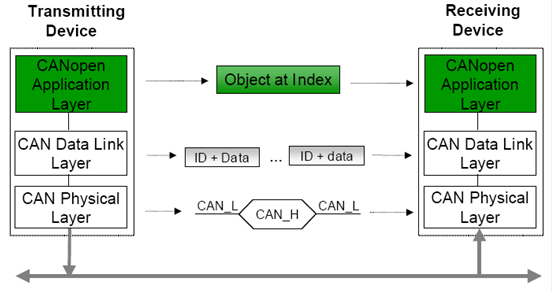

Рис.9.16. Принципи обміну даними між пристроями в CANOpen.

#### 9.3.1.3. Комунікаційні Об’єкти канального рівня. 

На канальному рівні обмін відбувається за допомогою Комунікаційних Об’єктів COB (Communication OBject) різних форматів, які передаються CAN-кадрами. Поле Ідентифікатора CAN-кадру відповідає Ідентифікатору СОВ (COB-ID). На фізичному рівні високошвидкісний трансивер передає задані послідовності бітів відповідно до стандарту ISO 11898-2 (рис.9.16).

Параметри Комунікаційних Об’єктів також зберігаються у Словнику Об’єктів, та мають свій Індекс. Крім того, у Словнику зберігаються типи даних, які використовуються для опису Прикладних та Комунікаційних Об’єктів. Таким чином Словник Об’єктів – це центральна частина моделі вузла CANOpen. 

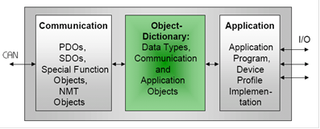

Рис.9.17. Модель пристрою CANOpen

#### 9.3.1.4. Модель пристрою CANOpen. 

З точки зору моделі CANOpen кожний пристрій складається з трьох частин (рис.9.17). В центрі моделі знаходиться Словник Об’єктів – набір типів та структурованих даних, які приймають участь в мережному обміні: дані процесу (внутрішні змінні, входи/виходи), їх типи, інформація про способи їх оновлення, конфігураційні параметри пристрою, комунікаційні параметри каналу і таке інше. Всі об’єкти згруповані в Словнику по їх Індексам. Так наприклад в діапазоні 1 по 9Fh знаходяться типи даних, з 1000h по 1FFFh дані комунікаційного профілю і т.д. 

Словник являється проміжним буфером між прикладною програмою пристрою та шиною. Тобто прикладна програма не займається безпосереднім інтерфейсом з шиною, а забезпечує опитування та оновлення значень Прикладних Об’єктів в Словнику. Комунікаційний інтерфейс забезпечує обміном об’єктами Словнику з мережею за допомогою спеціальних сервісів. Така структура забезпечує максимальну швидкодію та гнучкість.   

### 9.3.2. Комунікаційні сервіси

Канальний рівень CANOpen повинен забезпечити передачу даних між вузлами. Він представляє собою реалізацію CAN (ISO 11898), яка оперує стандартними кадрами з 11-бітним ідентифікатором або розширеними 29-бітними, в залежності від реалізації CAN-контролеру. Контролер CAN не зможе безпосередньо реалізувати обмін Прикладними Об’єктами між пристроями на шині. Очевидно, що додатково повинен існувати механізм за допомогою якого всі операції з Прикладними Об’єктами переводяться всього в два типи CAN кадрів: Кадр Даних та Дистанційний Кадр. Крім того, об’єми даних, які ці кадри повинні "переносити", часто перевищують 8 байт, що потребує передачі декількох CAN-кадрів для реалізації транзакції. 

У CANOpen є декілька типів сервісів для реалізації функцій переносу Прикладних Об’єктів. Всі вони використовують спеціальні Комунікаційні Об’єкти. В залежності від того, який сервіс використовується Комунікаційні Об’єкти діляться на 4-ри групи:

-  Process Data Object (PDO) – для ідентифікованого обміну даними процесу в реальному часі; 

-  Service Data Object (SDO) – для читання чи запису об’єктів по їх адресі у Словнику Об’єктів (обмін параметричними даними);

-  Special Function Objects (SFO) – реалізовують додаткові функції: Синхронізаційний Об’єкт (SYNC) – для синхронізації повідомлень; Аварійний Об’єкт (EMCY) – для аварійних повідомлень; Об’єкт Часовий Відбиток (Time Stamp Object) – для чіткого визначення часу події; 

-  Network Management (NMT) Objects – для управління станом мережі та пристроїв (ініціалізація, слідкування за помилками, управління станом пристрою): NMT повідомлення; Об’єкт Завантаження (Boot-Up Object); Об’єкт Контролю Помилок (Error Control Object).

Відповідно до цих Комунікаційних Об’єктів формується CAN-кадр з певним Ідентифікатором та заповненим полем даних. Серед наведених типів комунікаційних об’єктів тільки PDO та SDO займаються переносом значень Прикладних Об’єктів, а інші два сервіси являються службовими. 

Об’єкти PDO використовуються для реал-тайм обміну ідентифікованими даними процесу (до 8 байт на PDO) в синхронному або асинхронному, циклічному/періодичному чи ациклічному режимах. Обмін PDO налаштовується при конфігурації мережі.

Об’єкти SDO призначені для обміну параметричними даними та даними процесу великого обсягу, шляхом доступу з мережі до Об’єктів Словника по їх індексу (Індекс+Під-індекс). Це аперіодичний клієнт-серверний тип обміну повідомленнями. Обсяг даних, які можна передати за рахунок SDO теоретично не обмежений.    

### 9.3.3. Основи функціонування сервісу PDO

#### 9.3.3.1. Призначення та типи об’єктів PDO. 

Сервіс PDO (Process Data Object) забезпечує функціонування ідентифікованого обміну Комунікаційними Об’єктами PDO. Під сервісом PDO розуміється весь набір функцій, які забезпечують таке функціонування. Комунікаційний Об’єкт PDO – це по суті структура, яка відображає дані процесу (Прикладні Об’єкти). Кожен PDO Об’єкт є унікальним у мережі і має свій унікальний COB-ID ідентифікатор, який співпадає з Ідентифікатором кадру, яким він передається. Параметри Об’єктів PDO розміщуються в Словнику Об’єктів вузлів. 

Об’єкти PDO вміщують дані, які повинні передаватися/прийматися в реальному часі. PDO, який містить дані для відправки по мережі, називають Transmit-PDO (T-PDO), а для приймання даних - Receive-PDO (R-PDO). CANOpen забезпечує відправку даних від T-PDO до R-PDO, які мають однакові COB-ID. 

Для відправки одного об’єкту T-PDO використовується один Кадр Даних CAN, який як відомо може вміщувати не більше 8 байт (див. розділ 8). З цього витікає, що один PDO об’єкт вміщує не більше 8 байт даних. Передача PDO відбувається за моделлю Виробник-Споживач. Сервіс не потребує підтвердження, що значно зменшує мережний трафік, і робить можливим передачу даних процесу в реальному часі. Додатково про модель Виробник-Споживач можна ознайомитися у розділі 2.

#### 9.3.3.2. Реалізація зв’язку  T-PDO з R-PDO. 

Функціонування сервісу PDO проілюстровано на рис.9.18. PDO Producer вміщує T-PDO з певним COB-ID (позначений ID). Він відправляє Кадр Даних з ідентифікатором ID, в області даних якого розміщується наповнення T-PDO. Вузли, в яких існують R-PDO з COB-ID рівним ID (позначені як PDO Consumer), перепишуть значення даних в наповнення R-PDO. 

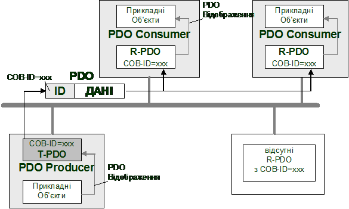

Рис.9.18. Обмін даними за допомогою PDO

Ідентифікатори PDO, тобто їх COB-ID, зв’язують T-PDO та R-PDO логічним каналом, який так і називається Link (Зв’язок). Інформація про ідентифікатори COB-ID, налаштування обміну та наповнення PDO так само знаходяться в Словнику Об’єктів, як і сам PDO. Таким чином процес зв’язку та наповнення об’єктів PDO проводиться шляхом зміни інших Об’єктів із Словника. Це робиться за допомогою службових сервісів та спеціальних конфігураторів, які розглянуті нижче. 

#### 9.3.3.3. Зв’язок даних PDO з Об’єктами Словнику. 

Джерелом даних для T-PDO є значення певних Об’єктів Словнику. Так само отримувачами даних R-PDO теж є Об’єкти Словнику. Зв’язок Об’єктів Словнику з наповненням PDO називається PDO-Відображенням (PDO-Mapping). На рис.9.19 показано яким чином відбувається Відображення. В настройках PDO послідовно вказуються індекси Об’єктів (Індекс + Під-індекс), які необхідно відобразити на цей PDO. У вказаному на рисунку прикладі це об’єкти A (тип Unsigned16), В (тип Unsigned8) та С (тип Unsigned8) з відповідними умовним індексами xxxx.xx, yyyy.yy та zzzz.zz. При передачі Т-PDO з таким відображенням, на канальному рівні сформується CAN Кадр Даних, в полі даних якого послідовно передадуться значення об’єкту В (1 байт), А (2 байти), С (1 байт).   

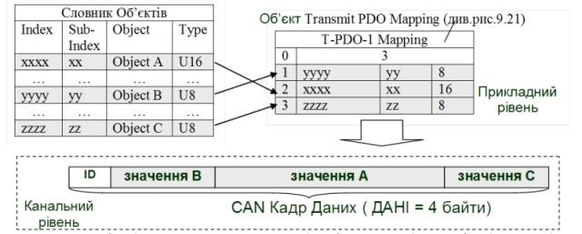

 Рис.9.19. Відображення Прикладних Об’єктів на PDO (PDO-Відображення) 

Враховуючи обмеження на об’єм даних в PDO розміром 8 байт, максимальна кількість Прикладних Об’єктів, які можуть відобразитися у ньому дорівнює 64-м (64 дискретних значень = 8х8 біт). 

Конфігураційні параметри Відображення T-PDO та R-PDO знаходяться у Словнику з наступними Індексами (рис.9.20):

-  Transmit PDO Mapping Parameter (1A00-1BFFh)

-  Receive PDO Mapping Parameter (1600-17FFh);

Конфігураційні параметри відображення представляють собою Об’єкти типу PDO Mapping Parameter. Сам тип теж знаходиться в Словнику Об’єктів під індексом 21h(рис.9.20). Тип визначає масив структурних даних, в якому нульовий запис вказує на кількість елементів в масиві, а наступні - являються безпосередньо елементами, 32-бітне значення яких вказують на розміщення та розмір відображених Об’єктів. Зокрема перші 8-біт вказують на розмір відображеного Об’єкту, наступні 8 на Під-індекс, та останні 16 – на Індекс.   

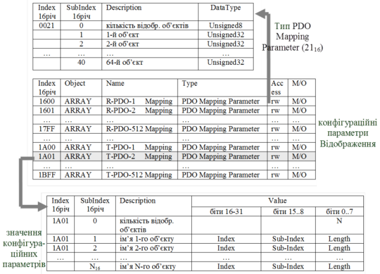

Рис.9.20. Параметри відображення PDO 

#### 9.3.3.4. Комунікаційні параметри обміну PDO. 

Крім PDO-Відображення, необхідно також налаштувати такі комунікаційні параметри обміну PDO, як порядок ініціації передачі T-PDO, часові затримки, тощо. Для цього в Словнику Об’єктів є спеціальні записи з типом Communication Parameter (20h) (рис.9.21):

-  Receive PDO Communication Parameter (1400-15FFh);

-  Transmit PDO Communication Parameter (1800-19FFh);

 Призначення полів структури Communication Parameter ми розглянемо в 9.4.3.

 Рис.9.21. Комунікаційні параметри PDO: Об’єкти Communication Parameter (знизу); структура типу Communication Parameter (зверху)  

#### 9.3.3.5. Основні властивості сервісу PDO. 

Підводячи підсумки, виділимо основні властивості сервісу PDO:

-  сервіс PDO забезпечує обмін даними процесу в реальному часі;

-  Комунікаційний Об’єкт PDO – це структурні дані, які відображають значення Прикладних Об’єктів зі Словника Об’єктів; цей процес відображення називається PDO-Відображення;

-  в кожному вузлі розміщується два типи PDO: T-PDO, які призначені для передачі та R-PDO – які призначені для отримання даних;

-  T-PDO передається одним CAN Кадром Даних в широкомовному режимі з Ідентифікатором рівним COB-ID цього T-PDO; R-PDO вузлів з таким саме COB-ID приймають ці дані (модель Виробник-Споживач);

-  T-PDO та R-PDO з однаковими COB-ID називаються зв’язаними, а процес присвоєння їм рівних ідентифікаторів – Зв’язуванням;

-  параметри настройки обміну об’єктами PDO, їх типи та об’єкти відображення зберігаються в спеціальних Об’єктах Словника; 

-  максимальна кількість PDO об’єктів в мережі обмежена і дорівнює 512;

Зміна Об’єктів Словника, які відповідають за настройку PDO-обміну може проводитись шляхом використання сервісів SDO та NMT, які розглянуті нижче. 

### 9.3.4. Базові концепції конфігурування та адміністрування мережі (NMT-Сервіси)

#### 9.3.4.1. Загальні принципи функціонування NMT. 

Враховуючи, що область застосування CANOpen це системи розподілених польових засобів управління рівня датчиків, які необхідно конфігурувати та діагностувати, - в протоколі визначений механізм адміністрування мережі. Сервіси, які призначені для адміністрування CANOpen називаються NMT-Сервісами (Network Management), і забезпечують управління та діагностування роботи пристроїв на мережі. Функції адміністрування мережі виконує один із вузлів, який зветься NMT-Ведучий (NMT-Master), всі інші вузли називаються NMT-Ведені (NMT-Slave). Кожний вузол в CANOpen має свою унікальну адресу NODE-ID (від 1 до 127). 

Не слід плутати поняття "NMT-Ведучий" з "Ведучим шини" або "NMT-Ведені" з "Веденими шини". NMT-Ведучий – аналог адміністратору мережі. Він конфігурує всі інші вузли, керує їх операційним станом, діагностує їх роботу, однак не регламентує порядок їх доступу до шини, оскільки в CANOpen (так як і в CAN) використовується випадковий метод доступу з арбітражем (див. розділ 8). А в мережах з централізованим методом доступу типу Ведучий-Ведений – Ведучий шини регламентує доступ до шини для передачі.

NMT-Ведучий бере на себе наступні функції:          

-  ініціалізація вузлів NMT-Ведених;

-  спостереження за станом мережі та її вузлів;

-  завантаження/вивантаження конфігураційних даних вузлів. 

#### 9.3.4.2. Конфігурування NMT-Ведених. 

Однією з функцій NMT-Ведучого є конфігурування NMT-Ведених вузлів. Процес конфігурування – це зміна значень потрібних об’єктів в Словнику NMT-Веденого вузла. Запис та читання цих значень проводиться за допомогою SDO-об’єктів по їх Індексу та Під-індексу.

З точки зору розробника мережі, налаштування NMT-Ведучого для конфігурування NMT-Ведених може проводитись різними шляхами:

1) за допомогою явної організації в прикладній програмі обміну Об’єктами SDO;

2) за допомогою спеціалізованої програми (конфігуратора мережі) та файлів EDS; 

Перший спосіб використовується в основному в тих випадках, коли недоступний другий спосіб, наприклад для контролерів з підтримкою безпосереднього обміну кадрами CAN, що надають прямий інтерфейс до канального рівня (наприклад ОПЛК Unitronics). Однак для інших систем, при наявності доступу з прикладної програми до сервісів SDO, можна також організувати перенесення конфігураційних Об’єктів Словнику.  

Другий спосіб автоматизує процес конфігурації NMT-Ведених. Він базується на використанні вбудованих або зовнішніх конфігураторів мереж. Процес конфігурування проходить з використанням файлів EDS (Electronic Data Sheet), в яких у визначеному стандартом форматі зберігається інформація про пристрої. Більша частина цієї інформації представляє собою опис Об’єктів Словника. Таким чином, використовуючи конфігуратор з підключенням EDS-файлів для необхідних типів пристроїв, процес створення конфігурації зводиться до зміни конфігураційних параметрів вузлів системи. Завантаживши конфігураційні дані в вузол NMT-Ведучого, той сам організовує передачу необхідних конфігураційних SDO в NMT-Ведений а також його ініціалізацію та запуск. Продемонструємо це на прикладах.

Приклад 9.4. CANOpen. Створення базової конфігурації CANOpen для ПЛК Premium. 

Завдання. Створити конфігурацію мережі CANOpen для NMT-Ведучого типу ПЛК Premium та налаштувати всі вузли для роботи системи, показаної в задачі 9.1, якщо:

- PLC1 - є NMT-Ведучим з адресою NODE-ID=127;
- RIO1 - NMT-Ведений з адресою NODE-ID=1;
- PDS1- NMT-Ведений з адресою NODE-ID=2;

Бітова швидкість для мережі дорівнює 1 Мбіт/с.

Рішення. Налаштування швидкості та адреси для RIO1 (Advantys STB модуль NCO 2212) проводиться за допомогою вбудованих перемикачів (рис.9.22). Для налаштування швидкості передачі даних, перед увімкненням живлення засобу, нижній перемикач необхідно переключити в позицію BAUD RATE а верхній (вибір бітової швидкості) - в позицію 7 (1 Мбіт/с). Після включення живлення, Advantys запам’ятає вказану швидкість. Адреса пристрою задається комбінацією позицій обох перемикачів: верхній – десятки, нижній – одиниці. Для нашої задачі виставляємо: верхній=0, нижній =1.

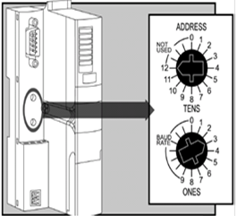

Рис.9.22. Налаштування адреси та БІТОВА ШВИДКІСТЬ для Advantys 

  Налаштування частотного перетворювача PDS1 проводиться за допомогою зовнішньої панелі настройки (можливий варіант – використання спеціалізованого ПЗ - PowerSuite). Виставляємо наступні настройки: CANOpen address=2, CANOpen bit rate = 1 Mbps. 

Для частотного перетворювача необхідно виставити наступні додаткові настройки:

|                                           |             |                                              |
| ----------------------------------------- | ----------- | -------------------------------------------- |
| Drive Menu-> Command->Ref.1.Channel       | CANOpen     | 1 Канал заданої частоти двигуна   - CANOpen  |
| Drive Menu->  Command->Ref.2.Channel      | HMI         | 2 Канал заданої частоти  двигуна - панель    |
| Drive Menu->  Command->Cmd. channel 1     | CANOpen     | 1 Канал управління двигуном - CANOpen        |
| Drive Menu-> Command->Cmd. channel 2      | HMI         | 2 Канал управління двигуном-  панель         |
| Drive Menu->  Command->Profile            | I/O Profile | вибраний профіль                             |
| Drive Menu->  Command->Cmd Switching      | Ch1 Active  | активний канал для управління -  1           |
| Drive Menu-> Command->Copy  Channel 1<->2 | Cmd+ref     | копіювання між каналами:  команди та частота |
| Drive Menu-> Command->F1  key assignment  | T/K         | Призначення кнопки F1– переключення каналів  |
| Drive Menu-> Command->HMI  Cmd            | STOP        | дозволити зупинку двигуна з  панелі          |

Для створення конфігурації мережі для NMT-Ведучого, тобто ПЛК TSX Premium, окрім програм PL7 PRO або Unity PRO, необхідне додаткове спеціалізоване ПЗ – SyCon. Порядок створення конфігурції наступний:

1. Створюється проект конфігурації мережі на SyCon та записується на диск (рис.9.23);

2. Створюється конфігурація ПЛК NMT-Ведучого, тобто TSX Premium, в якій замовляється комунікаційна карта TSX CPP110;

3. Для комунікаційної карти вказується файл проекту мережі, створений за допомогою SyCon (рис. 9.24). 

Для роботи в SyCon необхідні EDS файли для STB NCO 2212, ATV71H037M3 та TSX CPP110. 

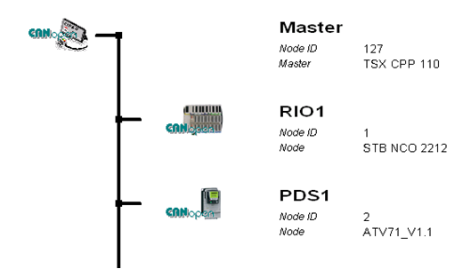

 Рис.9.23. Вигляд конфігурація мережі в SyCon. 

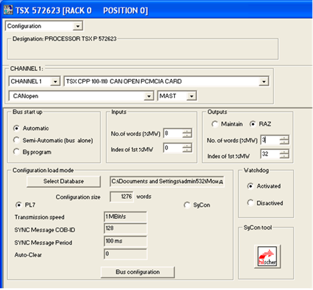

Рис.9.24. Вигляд конфігурація мережі в SyCon. 

Приклад 9.5. CANOpen. Створення базової конфігурації CANOpen для ПЛК VIPA. 

Завдання. Створити конфігурацію мережі CANOpen для NMT-Ведучого типу ПЛК VIPA та налаштувати всі вузли для роботи системи, показаної в прикладі 9.2, якщо:

- PLC1 - являється NMT-Ведучим з адресою NODE-ID=127;
- RIO1 - NMT-Ведений з адресою NODE-ID=1;
- PDS1- NMT-Ведений з адресою NODE-ID=2;
- Бітова швидкість для мережі дорівнює 1 Мбіт/с.

Рішення. Швидкість передачі та адреса модулю IM253CAN налаштовуються за допомогою селектора ADR (рис.9.25). Перед його включенням, селектор встановлюють в позицію 00. Включивши пристрій, протягом 5 с, за допомогою селектора вибирається потрібна швидкість (00 – 1 Мбіт/с), після чого вибрана швидкість запам’ятовується в енергонезалежну пам’ять. Далі вводять потрібну адресу (01 – NODE-ID=1).

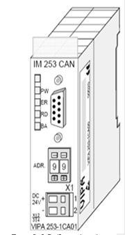

Рис.9.25. Зовнішній вигляд модуля VIPA IM253CAN

  Частотний перетворювач Lenze налаштовується з пульта або за допомогою спеціалізованого ПЗ PowerDrive. Виставляються наступні параметри: C0350 = 2 (номер NODE-ID), C0351 = 4 (1 Мбіт/с), C0352 = 0 (Lenze являється NMT Slave). Настройки активуються після перезапуску частотного перетворювача. 

 Для створення конфігурації мережі для NMT-Ведучого, тобто ПЛК VIPA, окрім програм WIN PLC7  або STEP 7, необхідне додаткове спеціалізоване ПЗ WinCoCT. Порядок створення конфігурції наступний:

1. Створюється проект конфігурації мережі на WinCoCT та експортується в файл з розширенням wld. (рис.9.26);

2. Створюється конфігурація ПЛК NMT-Ведучого, тобто VIPA200 за допомогою програм WIN PLC7  або STEP 7;

3. Імпортується wld файл в проект ПЛК, як DB2000(9.27). 

Для роботи в WinCoCT необхідні EDS файли для всіх вузлів. 

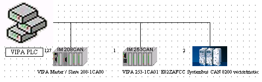

Рис.9.26. Вигляд конфігурація мережі в WinCoCT

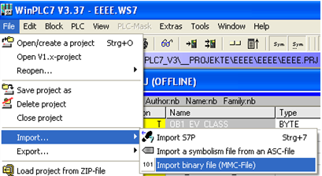

Рис.9.27. Імпорт конфігурації в проект WinPLC7. 

#### 9.3.4.3. Діаграма станів NMT-Веденого. 

Процес функціонування NMT-Сервісів для управління вузлами прокоментуємо по діаграмі станів NMT-Веденого (рис.9.28). Після включення живлення пристрою, він проходить стадію внутрішньої ініціалізації (Initialization), в якій проводить тестування та налаштовує параметри комунікаційного зв’язку (виставляє бітову швидкість, призначає адресу вузла, назначає COB-ID по змавоченню і т.д.). Після цього, при відсутності внутрішніх помилок, NMT-Ведений переходить в Передопераційний режим (Pre-Operational). У цьому режимі NMT-Ведучий може обмінюватися даними з NMT-Веденим, використовуючи тільки сервіси SDO, обмін об’єктами PDO в цьому режимі недоступний. В Передопераційному режимі NMT-Ведучий використовуючи сервіси SDO може конфігурувати NMT-Ведені вузли, зокрема налаштувати параметри обміну PDO. 

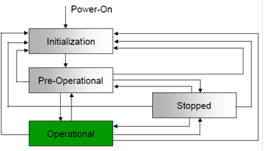

Рис.9.28. Діаграма станів NMT-Веденого

Після зміни необхідних конфігураційних даних в Словнику Об’єктів NMT-Веденого, NMT-Ведучий переводить його в Операційний режим (Operational), в якому обмін даними з NMT-Веденим може проводитись як через SDO так через PDO Об’єкти. NMT-Ведучий може переводити NMT-Веденого в будь який із режимів, показаних на рис. 9.28, зокрема в режим Стоп (Stopped), при якому недоступний обмін ні PDO, ні SDO.

#### 9.3.4.4. Команди NMT.  

Переведення вузла з режиму в режим відбувається за рахунок спеціального NMT-Об’єкта (рис.9.29). Цей об’єкт передається від NMT-Ведучого до NMT-Ведених одним CAN Кадром Даних з Ідентифікатором рівним 0 (призначений всім вузлам). Значення перших двох байт даних в кадрі визначають тип команди (CS) і адресу вузла призначення (NODE-ID). Адреса вузла надається йому перед переходом в Передопераційний режим за допомогою вбудованих в нього засобів (наприклад DIP-перемикачами). Якщо в NMT-об’єкті NODE-ID=0, то команда призначається всім вузлам мережі. Тип команди може приймати значення:

-  старт Операційного режиму (CS=1);

-  стоп  (CS=2);

-  переведення у Передопераційний режим(CS=80h, );

-  перезапустити вузол (CS=81h);

-  перезапустити комунікацію (CS=82h).

Таким чином використовуючи NMT-Об’єкт, NMT-Ведучий переводить NMT-Ведених в потрібний режим, а використовуючи SDO-Об’єкти – виконує їх конфігурацію. Нагадаємо, що в CANOpen всі Комунікаційні Об’єкти мають унікальний COB-ID, який передається в Ідентифікаторі CAN Кадру Даних. Це значить, що для прийому Об’єктів з відповідним COB-ID, NMT-Ведений повинен налаштувати на них вхідний фільтр (див. розділ 8). NMT-Об’єкт має 0-вий Ідентифікатор і приймається усіма вузлами, а його зміст визначає кому призначена команда. Для можливості обміну з NMT-Веденим іншими Комунікаційими Об’єктами, в CANOpen визначена примусова схема розподілення ідентифікаторів COB-ID по замовченню (див.9.3.5).

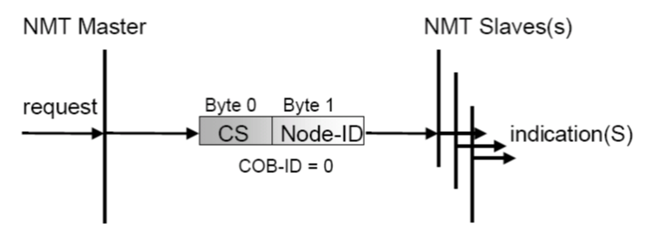

Рис.9.29. Структура NMT-Об’єкту

Приклад 9.6. CANOpen. Конфігурування мережі CANOpen з використанням ПЛК Unitronics та частотних перетворювачів Lenze. 

Завдання. Налаштувати всі вузли для роботи системи, показаної в прикладі 9.3 та написати програму в ПЛК для управління станом LENZE, якщо:

- PLC1 – являється NMT-Ведучим з адресою NODE-ID=1;
- PDS1 – NMT-Ведений з адресою NODE-ID=2;
- БІТОВА ШВИДКІСТЬ для мережі дорівнює 125 Кбіт/с.

Рішення. Частотний перетворювач Lenze налаштовується з пульта або за допомогою спеціалізованого ПЗ PowerDrive. Виставляються наступні параметри: C0350 = 2 (номер NODE-ID), C0351 = 2 (125 Кбіт/с), C0352 = 0 (Lenze являється NMT Slave). Настройки активуються після перезапуску частотного перетворювача

Зі сторони контролера фрагмент програми, що відповідає за обмін в мережі CAN та CANOpen має вигляд наведений на рис. 9.30. В блоці CAN_Layer_2, при першому старті контролера налаштовується тип протоколу та бітова швидкість на комунікаційному порті. 

<a href="media9/9_30.png" target="_blank">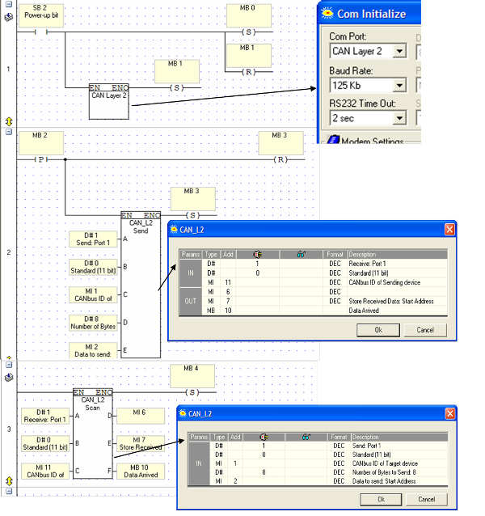</a> 

 Рис. 9.30. Програма для ПЛК UNITRONICS до прикладу 9.6

Для відправлення кадру використовується блок CAN_L2_Send, де настроюється:

-  номер порту, А = 1 (порт 1);

-  кількість біт в ідентифікаторі, В = 0 (11 бітний);

-  в якій змінній будуть знаходитися дані ідентифікатора COB-ID, С= МІ1 (внутрішнє слово);

-  кількість байт даних для відправки, D=8 (8 байт, CAN поле Кадру Даних);

-  номер першої змінної буфера даних для відправки, Е=МІ2.

Таким чином необхідний COB-ID вказується в змінній МІ1, а 8 байт даних знаходяться в змінних MI2- MI5.  

Для переводу частотного перетворювача LENZE в різні режими функціонування, необхідно з ПЛК відіслати широкомовний NMT-Об’єкт (COB-ID=0), з відповідною командою CS, для NODE-ID=2. Тобто телеграми відправки будуть мати вигляд, як на рис.9.31. Тобто MI1=0 (COB-ID), CS знаходиться в молодшому байті змінної MI2, а NODE-ID – у старшому.

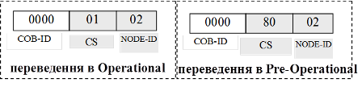

Рис.9.31. Телеграми NMT-Об’єктів для переводу в різні режими вузла з NODE-ID=2

Для отримання відповіді використовується блок CAN_L2_Scan, де встановлюються такі настройки: вхідні – номер порту (А); кількість біт в ідентифікаторі (В), в якій змінній будуть знаходитися дані ідентифікатора (С); вихідні – змінна, в якій знаходиться значення кількості отриманий байт; номер першої змінної, в якій знаходяться отримані дані “user data“ (Е); біт активності отриманого кадру (Е).

### 9.3.5. Схема розподілення Ідентифікаторів по замовченню

#### 9.3.5.1. Загальна схема розподілу COB-ID. 

NMT-Ведучий використовує NMT-Об’єкт для переводу вузлів в різні стани. Оскільки COB-ID (Ідентифікатор CAN-кадру) NMT-Об’єкта дорівнює 0, вузли всіх фільтрів пропустять цей кадр. Для обміну іншими Комунікаційними Об’єктами (SDO, PDO, SFO), необхідно щоб вони мали Ідентифікатори відмінні від нуля. Призначення COB-ID можна проводити через сервіс SDO, записавши їх в конкретні записи Словнику. Однак для цього необхідно, щоб хоча б один серверний SDO на кожному вузлі вже мав унікальний COB-ID.

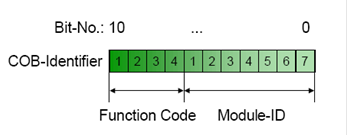

Рис.9.32. Схема присвоєння Ідентифікаторів. 

Тому в CANOpen визначена обов’язкова схема розподілення ідентифікаторів COB-ID по замовченню. Розподіл наперед визначених COB-ID проходить в момент ініціалізації NMT-Веденого і базується на використанні ідентифікаторів модулів вузла (Module-ID), які в свою чергу поєднані з NODE-ID. Module-ID може виставлятись апаратно (перемикачами) або через інший інтерфейс пристрою. Схема розподілення Ідентифікаторів по замовченню складається з функціональної частини (Function Code), яка визначає призначення об’єкту та Module-ID (рис.9.32).

Схема розподілу визначає COB-ID для одного Об’єкту Emergency, одного SDO, 4-рьох T-PDO та 4-рьох R-PDO, одного NodeGuard. 

Більшість ідентифікаторів COB-ID можна змінити за допомогою SDO, однак частина з них доступна в Словнику тільки для читання. Це ідентифікатори для (див. табл.9.9): 

-  NMT-Об’єкту (0); 

-  SDO-Об’єкту по замовченню (1409-1535 і 1537-1663);

-  NMT Error Control (1793-1919);

-  NMT, LMT та DBT сервісів (2015-2031);

-  Safety-relevant Data Objects (SRDO) (257-384) 

#### 9.3.5.2. Схема Ідентифікації SDO. 

Функціонування сервісу SDO описане в 9.4.2. Обмін між Клієнтським та Серверним SDO проводиться через два Комунікаційні Об’єкти з кожного боку: Transmit-SDO (T-SDO) та Receive-SDO(R-SDO). Механізм розподілу COB-ID T-SDO/R-SDO по замовченню для Серверних SDO дає можливість в Передопераційному режимі обмінюватися даними NMT-Ведучому з потрібними NMT-Веденими. 

Кожний NMT-Ведений містить принаймні один Серверний SDO. Для цього Об’єкту функціональна частина T-SDO в двійковому вигляді має по замовченню значення FunctionCode=1011b а R-SDO – FunctionCode=1100b. Наприклад для 1-го вузла, ідентифікатори Серверних SDO-об’єктів будуть рівними:

T-SDO-1 = 10110000001b=581h

R-SDO-1 = 11000000001b=601h

#### 9.3.5.3. Схема Ідентифікації PDO.

Крім Серверних SDO при ініціалізації NMT-Веденого, надаються Ідентифікатори чотирьом його R-PDO та чотирьом T-PDO. Схема розподілу Function Code для наперед визначених по замовченню Ідентифікаторів дана в таблиці 9.9. 

Таблиця 9.9. Схема розподілу функціональних кодів для  Ідентифікаторів NMT-Ведених

| Об’єкт            | Function Code  (2-кова) | результуючий  COB-ID      | Комунікаційні Параметри по Індексу |
| ----------------- | ----------------------- | ------------------------- | ---------------------------------- |
| NMT               | 0000b                   | 0                         | -                                  |
| SYNC              | 0001b                   | 128 (80h)                 | 1005h, 1006h, 1007h                |
| TIME STAMP        | 0010b                   | 256 (100h)                | 1012h, 1013h                       |
| EMEGRENCY         | 0001b                   | 129 (81h) – 255 (FFh)     | 1014h, 1015h                       |
| T-PDO-1           | 0011b                   | 385 (181h) – 511 (1FFh)   | 1800                               |
| R-PDO-1           | 0100b                   | 513 (201h) – 639 (27Fh)   | 1400                               |
| T-PDO-2           | 0101b                   | 641 (281h) – 767 (2FFh)   | 1801                               |
| R-PDO-2           | 0110b                   | 769 (301h) – 895 (37Fh)   | 1401                               |
| T-PDO-3           | 0111b                   | 897 (381h) – 1023 (3FFh)  | 1802                               |
| R-PDO-3           | 1000b                   | 1025 (401h) – 1151 (47Fh) | 1402                               |
| T-PDO-4           | 1001b                   | 1153 (481h) – 1279 (4FFh) | 1803                               |
| R-PDO-4           | 1010b                   | 1281 (501h) – 1407 (57Fh) | 1403                               |
| Server T-SDO-1    | 1011b                   | 1409 (581h) – 1535 (5FFh) | 1200                               |
| Server R-SDO-1    | 1100b                   | 1537 (601h) – 1663 (67Fh) | 1200                               |
| NMT Error Control | 1110b                   | 1793 (701h) – 1919 (77Fh) | 1016h, 1017h                       |

#### 9.3.5.4. Статичне та динамічне зв’язування. 

Розподіл Ідентифікаторів для PDO по замовченню дає жорстку схему Зв’язування, яка однозначно визначається Module-ID (NODE-ID). Це наперед визначене статичне PDO-Зв’язування NMT-Ведучого - з NMT-Веденими, яке передбачає Зв’язок всіх PDO в NMT-Ведених з відповідними PDO NMT-Ведучого по схемі, показаній на рис. 9.33(а). Такий тип Зв’язування повинні підтримувати всі вузли CANOpen.

Деякі вузли можуть підтримувати динамічне Зв’язування PDO (PDO-Linking), яке показано на рис. 9.33(б). Якщо підключені пристрої підтримують PDO-Linking і змінну схему ідентифікації, розробник може реалізувати зв’язки між Комунікаційними Об’єктами, назначивши їм довільний COB-ID. 

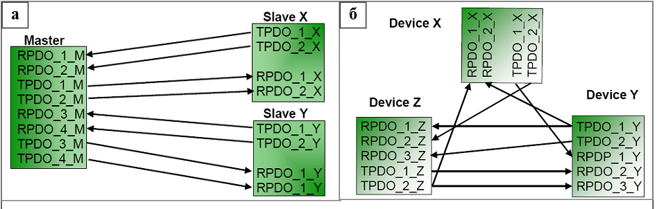

 Рис.9.33. Типи PDO Зв’язування: а – наперед визначене статичне; б – динамічне.

Приклад 9.7. CANOpen. Зв’язування та Відображення PDO для системи CANOpen з TSX Premium. 

Завдання. Забезпечити Зв’язування та Відображення PDO вузлів CANOpen для вирішення задачі, представленої на рис.9.34. Дане завдання стосується декількох задач даного розділу, тому на рис.9.34 слід звертати увагу тільки на змінні вузлів та напрямок їх передачі.

Рішення. Реалізація схеми мережних з’єднань для даної задачі подане в прикладі 9.1. Конфігурація вузлів проводиться згідно прикладу 9.4. Задача передбачає що дані повинні передаватися в реальному часі, тобто необхідно використати сервіс PDO. Всі змінні в частотному перетворювачі PDS1 – 16-бітні аналогові цілі, в RIO1 – дискретні.  

Рис.9.34. Постановка задачі до прикладу 9.7

При створенні конфігурації в CANOpen в SyCon, по замовченню для вузлів виділяється наступна конфігурація:

- RIO1: 4 об’єкти RPDO + 4 об’єкти TPDO
- PDS1: 1 об’єкти RPDO + 1 об’єкти TPDO.

PDO Відображення по замовченню визначається профілем пристрою і не співпадає з поставленим в умові прикладу завданням. 

В конфігураторі SyCon для RIO1 залишаємо тільки 1 PDO та 1 SDO, що цілком достатньо для передачі 8 біт в одному та іншому напрямку.

Від PDS1 необхідно передати сім 16-бітних слів, що займає 16 байт, і передати 2 слова, відповідно 4 байти. Враховуючи обмеження PDO 8-ма байтами, необхідно в PDS1 виділити 2 TPDO та 1 RPDO. 

Замовлення необхідних PDO та PDO-Відображення в SyCon проводиться доволі просто, без необхідності в налаштуванні параметрів Об’єктів Словника, які відповідають за PDO-Сервіси. Кінцева картина наявних PDO для RIO1 та PDS1 показана на рис.9.35. Стрілками показані Об’єкти доступні через PDO, які сконфігуровані в процесі PDO-Відображення (кнопка PDO Contents Mapping). 

Після створення (зміни) конфігурації в SyCon, в проекті PL7 для комунікаційної карти необхідно виділити 8 вхідних слів (1 байт RIO1 + 7 слів PDS1 ) та 3 вихідних (1 байт RIO1 + 2 слова PDS1), так як показано на рис.9.24.

<a href="media9/9_35.png" target="_blank">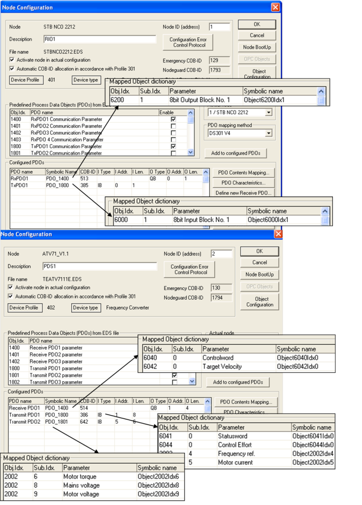</a> 

Рис.9.35. Конфігурування PDO до прикладу 9.7 

Приклад 9.8.  CANOpen. Зв’язування та Відображення PDO для системи CANOpen з VIPA.

Завдання. Забезпечити Зв’язування та Відображення PDO вузлів CANOpen для вирішення задачі, представленої на рис.9.36. Дане завдання стосується декількох задач даного розділу, тому на рис.9.36 слід звертати увагу тільки на змінні вузлів, та напрямок їх передачі.

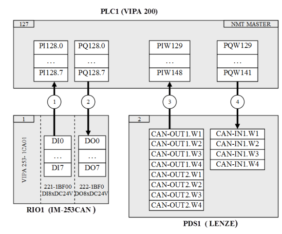

Рис.9.36. Постановка задачі до прикладу 9.7 

Рішення. Реалізація схеми мережних з’єднань для даної задачі подане в прикладі 9.2. Конфігурація вузлів проводиться згідно задачі 9.5. Задача передбачає що дані повинні передаватися в реальному часі, тобто необхідно використати сервіс PDO. Всі змінні в частотному перетворювачі PDS1 – 16-бітні аналогові цілі, в RIO1 – дискретні.  

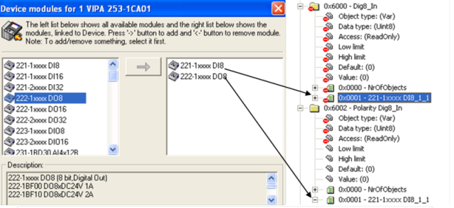

Рис.9.37. Замовлення дискретних модулів (зліва) та відповідні Об’єкти в Словнику (зправа) для RIO1

Першопочатково в конфігураторі мережі WinCoCT для RIO1 замовляються дискретні модулі (див. рис.9.37). Ця процедура автоматично добавляє необхідні Об’єкти в Словник Об’єктів. 

PDO-Зв’язування та PDO-Відображення в WinCoCT проводиться в одному вікні (рис.9.39). Спочатку вибирається два PDO, які необхідно зв’язати (поз.3 на рис.9.39), а потім для кожного PDO вказуються Об’єкти Словника. Так, наприклад, TPDO1 з Індексом 1800h в RIO1 (поз.1 на рис. 9.39) зв’язується з RPDO1 з Індексом 1400h в PLC1 (поз.2). В свою чергу на TPDO1 в RIO1 відображається Обє’кт з Індексом 6000h (поз.4.) і Під-індексом 1, які відповідають за дискретні входи на модулі 221-1BF00 (див. рис.9.36), що з’явився у Словнику після добавлення модулів (рис.9.37). Так саме на RPDO1 в PLC1 відображається Об’єкт з Індексом A4C0h та Під-індексом 1, який відповідає за внутрішній буфер обміну, 8-бітного розміру.   

Загальний список Зв’язаних в мережі PDO згрупований по їх COB-ID, наведений на рис.9.38. 

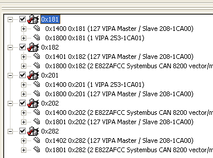

Рис.9.38. Список Зв’язаних PDO та їх COB-ID. 

Змінні, які відповідають в ПЛК1 за вхідні та вихідні дані вказуються в самому конфігураторі WinCoCT. Кількість байт, які передаються в ПЛК= 17, з ПЛК = 9. 

При конфігурації ПЛК1 в WinCoCT пам’ять виділяється блоками по 4 байти. Таким чином для області входів необхідно виділити 5 блоків, а для області виходів - 3 блоки (див. рис.9.40).   

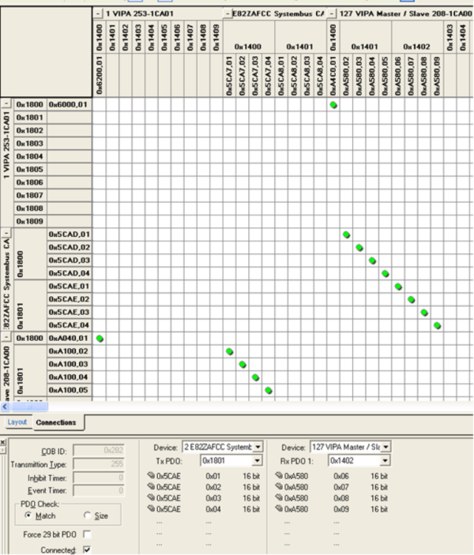

 Рис.9.39. PDO-Зв’язування та PDO-Відображення. 

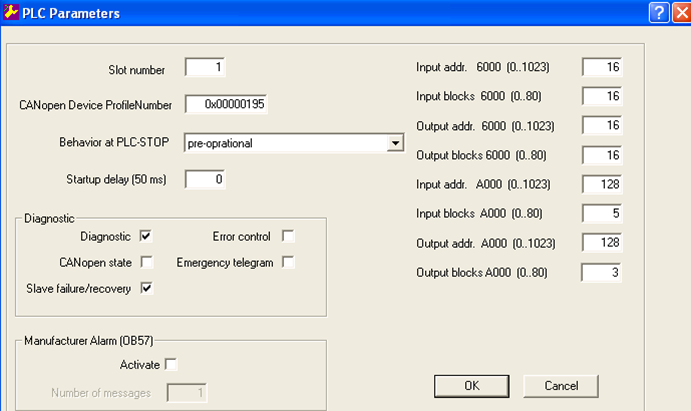

 Рис.9.40. Налаштування параметрів ПЛК. 

<-- 9.2. [Особливості реалізації фізичного рівня](9_2.md) 

--> 9.4. [Робота зі Словником Об’єктів](9_4.md) 