[Промислові мережі та інтеграційні технології в автоматизованих системах](README.md). 9. [CANOpen](9.md)

## 9.4. Робота зі Словником Об’єктів

### 9.4.1. Структура словника об’єктів

Загальна структура Словника Об’єктів всіх пристроїв однакова, оскільки Об’єкти в Словнику розміщуються згідно їх функціонального призначення. Наявність певних Об’єктів є обов’язковою, а їх розміщення визначено стандартом. Інші Об’єкти можуть знаходитися тільки в спеціально виділених областях Індексів. Наявність і властивості Об’єктів Словника доступні розробнику мережі через EDS файли, структура яких стандартизована, що дозволяє переглядати їх за допомогою різних конфігураторів (наприклад SyCon та WinCoCT). 

Загальний розподіл Об’єктів в Словнику показаний в таблиці 9.10. Область з Індексами 1-9Fh виділяється під типи даних. Об’єкти з області комунікаційного профілю відповідають за комунікаційний обмін між пристроями. Частина з цих об’єктів, які відповідають за обмін PDO, розглянута вище, частина наведена в таблиці 9.11. Специфічні для пристрою дані, які визначені його Профілем,  розміщуються в Об’єктах з Індексами 2000-5FFFh. Для CANOpen визначено ряд профілів пристроїв, Прикладні Об’єкти яких завжди розміщуються в області 6000-9FFFh. 

Таблиця 9.10. Загальний розподіл Об’єктів у Словнику

| Index  (16-кова) | Об’єкти (англ)                              | Об’єкти (укр)                                                |
| ---------------- | ------------------------------------------- | ------------------------------------------------------------ |
| 0000             | Reserved                                    | зарезервовані                                                |
| 0001-001F        | Static Data Types                           | Статичні Типи Даних                                          |
| 0020-003F        | Complex Data Types                          | Структурні Типи Даних                                        |
| 0040-005F        | Manufactured Specific Data  Types           | Типи Даних визначені виробником                              |
| 0060-007F        | Device Profile Specific  Static Data Types  | Статичні Типи Даних визначені Профілем пристрою              |
| 0080-009F        | Device Profile Specific  Complex Data Types | Структурні Типи Даних визначені Профілем пристрою            |
| 00A0-0FFF        | Reserved for further use                    | зарезервовані на майбутнє використання                       |
| 1000-1FFF        | Communication Profile Area                  | Область Об’єктів визначених Комунікаційним Профілем          |
| 2000-5FFF        | Manufactured Specific  Profile Area         | Область Об’єктів визначених виробником                       |
| 6000-9FFF        | Standardized Device Profile  Area           | Область Об’єктів визначених Стандартними Профілями  Пристроїв |
| A000-FFFF        | Reserved for further use                    | зарезервовані на майбутнє використання                       |

Таблиця 9.11. Об’єкти області комунікаційного профілю

| Index (16-кова) | Object                                       | Name                          | Type       | Access | M/O  |
| --------------- | -------------------------------------------- | ----------------------------- | ---------- | ------ | ---- |
| 1000            | VAR                                          | device type                   | Unsigned32 | ro     | M    |
| 1001            | VAR                                          | error register                | Unsigned8  | ro     | M    |
| 1002            | VAR                                          | manufacturer status register  | Unsigned32 | ro     | O    |
| 1003            | ARRAY                                        | pre-defined error field       | Unsigned32 | ro     | O    |
| 1004            | зарезервований для майбутнього  використання |                               |            |        |      |
| 1005            | VAR                                          | COB-ID SYNC-message           | Unsigned32 | rw     | O    |
| 1006            | VAR                                          | communication cycle period    | Unsigned32 | rw     | O    |
| 1007            | VAR                                          | synchronous window length     | Unsigned32 | rw     | O    |
| 1008            | VAR                                          | manufacturer device name      | VIS-String | c      | O    |
| 1009            | VAR                                          | manufacturer hardware version | VIS-String | c      | O    |
| 100A            | VAR                                          | manufacturer software version | VIS-String | c      | O    |
| 100B            | зарезервований для майбутнього  використання |                               |            |        |      |
| 100C            | VAR                                          | guard time                    | Unsigned32 | rw     | O    |
| 100D            | VAR                                          | life time factor              | Unsigned32 | rw     | O    |
| 100E            | зарезервований для майбутнього використання  |                               |            |        |      |
| 100F            | зарезервований для майбутнього  використання |                               |            |        |      |
| 1010            | VAR                                          | store parameters              | Unsigned32 | rw     | O    |
| 1011            | VAR                                          | restore default parameters    | Unsigned32 | rw     | O    |
| 1012            | VAR                                          | COB-ID time stamp             | Unsigned32 | rw     | O    |
| 1013            | VAR                                          | high resolution time stamp    | Unsigned32 | rw     | O    |
| 1014            | VAR                                          | COB-ID Emergency              | Unsigned32 | rw     | O    |
| 1015            | VAR                                          | Inhibit Time Emergency        | Unsigned16 | rw     | O    |
| 1016            | ARRAY                                        | Consumer Heartbeat Time       | Unsigned32 | rw     | O    |
| 1017            | VAR                                          | Producer Heartbeat Time       | Unsigned16 | ro     | O    |
| 1018            | RECORD                                       | identity object               | Identity   |        | M    |

## 9.4.2. Основи функціонування сервісу SDO

SDO (Service Data Object) – це Об’єкти Сервісних Даних, які призначені для доступу до даних Словника Об’єктів по Індексу та Під-Індексу. Використовується Клієнт-Серверна модель обміну між прикладними Процесами. Словник Об’єктів кожного вузла включає мінімум один Серверний Об’єкт SDO, через який можна проводити обмін конфігураційними даними. Клієнтський процес повинен включати Клієнтський SDO, за допомогою якого він формує запит на читання чи запис Об’єкту Словнику, вказуючи його Індекс та Під-Індекс (рис.9.41).

<a href="media9/9_41.png" target="_blank">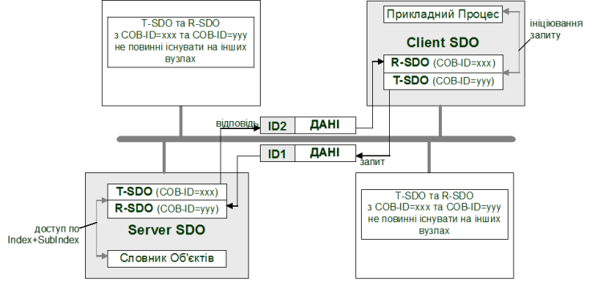</a> 

Рис.9.41. Клієнт-серверна архітектура SDO 

Клієнтські та Серверні SDO створюють канал з двома COB-ID з кожного боку для організації двосторонньої передачі: клієнтський Transmit-SDO (T-SDO) "поєднується" Ідентифікатором серверного Receive-SDO (R-SDO), та навпаки. В одній мережі CANOpen можуть функціонувати до 256 каналів SDO.    

За допомогою сервісу SDO можна зчитувати або записувати дані об’ємом більшим ніж 8 байт. Це досягається шляхом сегментування цих даних. Параметри SDO можна настроювати через Словник Об’єктів (рис.9.42).

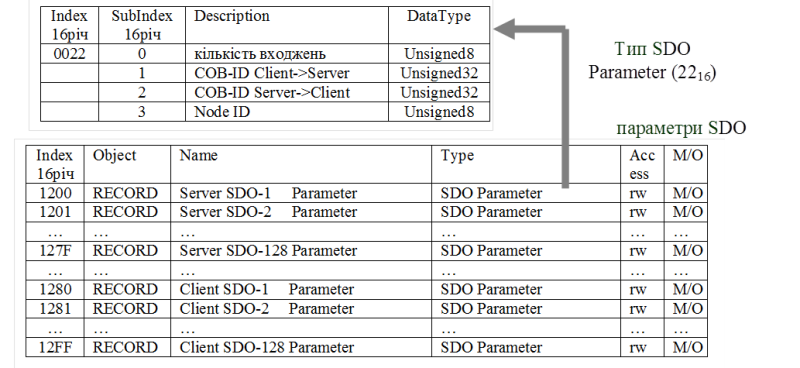

Рис.9.42. SDO в словнику об’єктів

### 9.4.3. Типи передачі PDO та об’єкт SYNC

#### 9.4.3.1. Типи передачі PDO. 

З точки зору ініціації обміну, відправка PDO може проходити в наступних режимах:

-    ациклічний при виникненні специфічної події на пристрої. 

-    ациклічний по запиту. 

-    циклічний з прив’язкою до циклічного об’єкту SYNC. 

З точки зору синхронності в CANOpen виділяють наступні режими передачі:

-  синхронна передача, з прив’язкою до об’єкту SYNC;

-  асинхронна передача, без прив’язки до об’єкту SYNC;

Комбінації цих режимів дають Тип Передачі PDO (Transmission Type), який є одним із полів структури PDO Communication Parameter (див. 9.3.3). Тип Передачі визначає подію, при якій відбувається передача T-PDO. Список всіх доступних значень цих типів в залежності від режимів показаний у вигляді таблиці 9.12.

Таблиця 9.12. Значення поля Transmission Type PDO

| Номер типу | циклічно | ациклічно | синхронно     | асинхронно | тільки по RTR |
| ---------- | -------- | --------- | ------------- | ---------- | ------------- |
| 0          |          | X         | X             |            |               |
| 1-240      | X        |           | X             |            |               |
| 241-251    |          |           | зарезервовано |            |               |
| 252        |          |           | X             |            | X             |
| 253        |          |           |               | X          | X             |
| 254        |          |           |               | X          |               |
| 255        |          |           |               | X          |               |

#### 9.4.3.2. Об’єкт SYNC.  

Функціонування синхронного обміну забезпечується шляхом прив’язки ініціації передачі T-PDO до Комунікаційного Об’єкту SYNC (належить до SFO). Цей Об’єкт періодично передається одним з вузлів (SYNC-Producer), яким як правило є NMT-Ведучий. Прив’язавшись до цього Об’єкту, інші вузли (SYNC-Consumer) можуть організувати циклічну передачу. Враховуючи що публікація Об’єкту SYNC періодична, циклічний тип T-PDO буде передаватись теж періодично. З іншого боку, Об’єкт SYNC може служити і для ациклічних передач в якості синхросигналу. Крім того, з отриманням Синхронного Об’єкту, пристрої можуть зберегти значення своїх входів для ефекту квазіодночасності. В будь якому випадку, якщо передача PDO залежить від появи на шині Об’єкту SYNC, цей PDO являється синхронним, якщо ні – асинхронним (рис.9.43).  

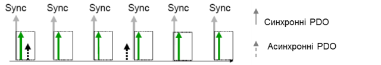

Рис.9.43. Синхронні та асинхронні PDO 

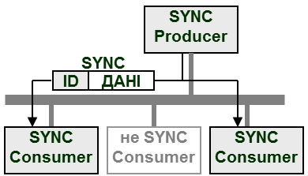

Рис. 9.44. Оновлення Об’єкту SYNC 

Об’єкт SYNC в Словнику Об’єктів знаходиться під Індексом 1005h. Там вказується його Ідентифікатор, який по замовченню дорівнює 128. Повідомлення передається без додаткової передачі даних (рис.9.44). 

Синхронні PDO передаються тільки під час синхронного вікна. Тобто довжина синхронного вікна – це інтервал часу між появою Об’єкту SYNC та дозволеною передачею синхронних PDO (рис.9.45). Ця величина може конфігуруватися окремо для всіх вузлів через Об’єкт Synchronous window length (1007h, величина вказується в мікросекундах). Для оптимальної роботи мережі, кожний SYNC-Consumer в момент конфігурування також отримує значення періоду появи Об’єкту SYNC, який записується в Communication cycle period (1006h, величина вказується в мікросекундах).   

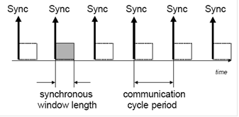

Рис.9.45. Довжина синхронного вікна 

#### 9.4.3.3. Ациклічні синхронні PDO (Тип Передачі 0). 

Цей тип PDO буде передаватись ациклічно при специфічній для пристрою події (наприклад при зміні значення змінної), але тільки в момент отримання Об’єкту SYNC (9.46).

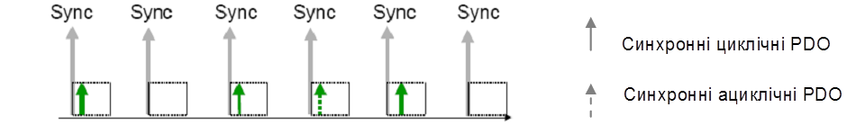

Рис .9.46. Синхронні циклічні та ациклічні PDO

#### 9.4.3.4. Циклічні синхронні PDO (Тип Передачі 1-240). 

Ці PDO передаються синхронно з періодом, який визначається кількістю Об’єктів SYNC між передачами. На цю кількість вказує значення типу PDO (від 1 до 240). Так тип=1 вказує, що PDO буде передаватись з кожною появою Об’єкту SYNC, а тип=2 – з появою кожного другого SYNC.  

#### 9.4.3.5. Синхронні по запиту PDO (Тип Передачі 252). 

Цей тип PDO вказує на те, що дані, які містяться в ньому, повинні бути оновлені в момент отримання Об’єкту SYNC. Для віддаленого вхідного модулю, наприклад, це значить, що в момент отримання Об’єкту SYNC вхідні дані будуть оцифровані і збережені в T-PDO. Однак відправлений T-PDO буде тільки в момент отримання запиту Дистанційного Кадру (RTR). Для статичного зв’язування, запит на зчитування T-PDO генерує NMT-Ведучий, для якого в конфігураторі можна вказати додаткові настройки (наприклад кількість циклів контролеру між опитуваннями).

#### 9.4.3.6. Асинхронні по запиту PDO (Тип Передачі 253). 

Дані для цього типу PDO відновляються відразу при отриманні Дистанційного Кадру, після чого T-PDO відправляється в мережу.

#### 9.4.3.7. Асинхронні ациклічні PDO (Тип Передачі 254 та 255). 

Відправка в мережу цих типів PDO не залежить від появи Об’єкту SYNC. Момент відправки визначається профілем пристрою (Тип Передачі 255) або виробником пристрою (Тип Передачі 254). Для цих типів PDO можна визначити інтервал часу між відправками T-PDO. Цей параметр доступний не для всіх типів пристроїв і настроюється в Комунікаційних Параметрах PDO в полі Event Timer (див. рис.9.21). 

Враховуючи, що Відображені Об’єкти на PDO типів 254 та 255 можуть оновлюватися дуже часто, передача PDO з високим пріоритетом може  витіснити інші PDO. Для запобігання цього ефекту в Комунікаційних Параметрах PDO визначене поле Час Заборони (Inhibit Time), яке вказує на мінімальний час між двома передачами даного PDO (див. рис.9.21). 

### 9.4.4. Об’єкт Time Stamp

Для синхронізації процесів по часу, в CANOpen використовується Об’єкт Time Stamp. Даний Об’єкт є 6-байтною послідовністю, яка показує абсолютний час в мілісекундах після опівночі, та кількість днів після 1-го січня 1984 року.. Для більш критичних по часу синхронізацій (порядку мікросекунд) використовується високоякісний time-stamp який кодується 32-бітною послідовністю, що показує кількість мікросекунд. Лічильник мікросекунд таким чином повинен рестартувати кожні 72 хвилини. Даний сервіс функціонує за моделлю Producer-Consumer. 

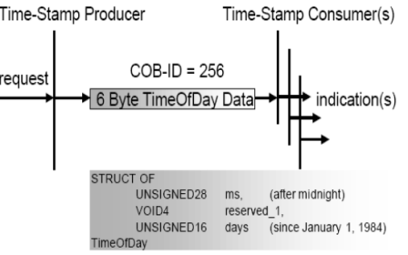

Рис. 9.47. Об’єкт Time Stamp. 

### 9.4.5. Об’єкт Emergency

Повідомлення Emergency передається при виникненні фатальної помилки на пристрої і має високий пріоритет. Воно відправляється кожен раз при виникненні нової помилки. Коди помилок визначаються за допомогою комунікаційного профілю пристрою. Emergency Object є опціональним. Якщо він підтримується, то повинні підтримуватись як мінімум два коди помилок 00xx (помилок немає) і 11xx(генерація помилки). Вміщує 8 байт даних і підтвердження передачі. Даний сервіс функціонує за моделлю Producer-Consumer. 

<a href="media9/9_48.png" target="_blank">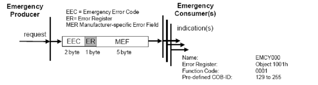</a> 

 Рис. 9.48. Об’єкт Emergency 

### 9.4.6. Діагностичні сервіси NodeGuard та Heartbeat

#### 9.4.6.1. Node Guarding. 

Для слідкування за працездатністю вузлів в мережі, тобто за регулярною передачею ними PDO, NMT Master може вести базу даних стану NMT-Ведених. Цей процес називається Node Guarding (Охорона Вузлів). Для цього NMT-Ведучий регулярно полінгує NMT-Ведених (рис. 9.49). Для виявлення відсутності NMT-Ведучого, NMT-Ведені в свою чергу перевіряють, чи проводився на певному інтервалі полінг (Life Guarding) Node Guarding активний також і в режимі стоп.

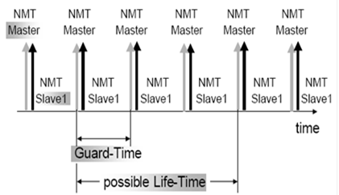

Рис. 9.49. Функціонування Node Guard 

Регулярно NMT Master відправляє Дистанційні Кадри і перевіряє дані в відповіді з записом в базі даних. Якщо вони відрізняються - це відображається в прикладній програмі NMT-Ведучого через Network Event Service. 

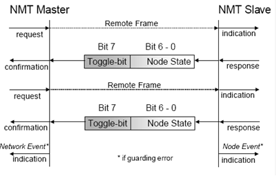

 Рис. 9.50. Виявлення дефектного вузла в Node Guard 

#### 9.4.6.2. Heartbeat. 

Протокол Heartbeat (серцебиття) є опціональним і являється рекомендованою альтернативою Node Guarding. З певною циклічністю Heartbeat Producer відправляє Heartbeat-повідомлення з частотою, визначеною Heartbeat Producer Time Object (рис. 9.51). Один, або більше Heartbeat Consumer можуть його отримати. Якщо Heartbeat Consumer не отримає за певний час цей об’єкт – буде згенероване повідомлення Heartbeat Event. Даний сервіс функціонує за моделлю Producer-Consumer. 

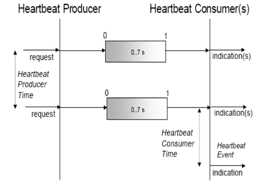

 Рис.9.51. Функціонування протоколу Hertbeat

<-- 9.3. [Базові принципи функціонування](9_3.md) 

--> 9.5. [Специфікації профілів пристроїв CANOpen](9_5.md)