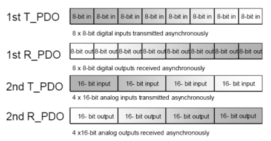
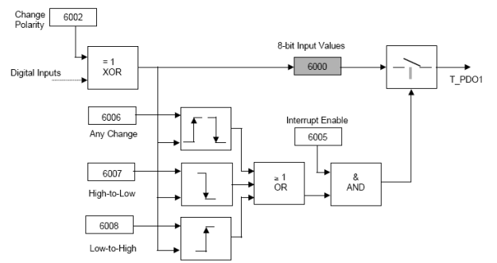
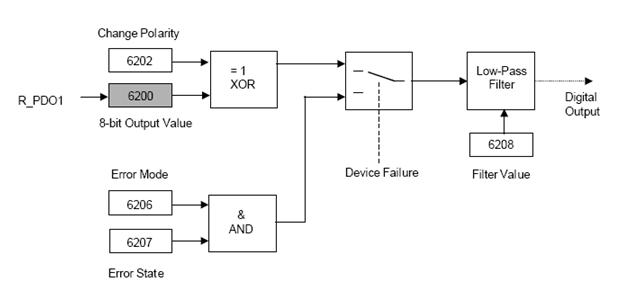
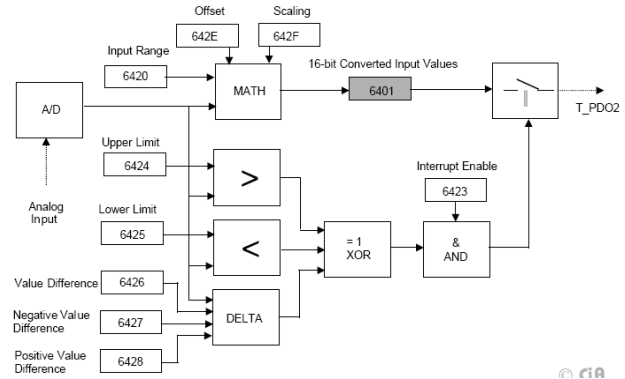
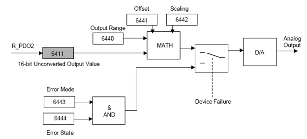

[Промислові мережі та інтеграційні технології в автоматизованих системах](README.md). 9. [CANOpen](9.md)

## 9.5. Специфікації профілів пристроїв CANOpen

### 9.5.1. Профілі пристроїв в CANOpen

CANOpen використовує профілі пристроїв для забезпечення легкої системної інтеграції пристроїв різних виробників (рис. 9.1). Реалізація обов’язкових характеристик приcтрою у відповідності з CANOpen гарантує коректне функціонування базової мережі. В той же час CANOpen допускає визначення опціональних і спеціально визначених виробником функціональних можливостей приладу.  На сьогоднішній день профілі пристроїв CANOpen визначені для широкого спектра різних типів приладів:

-  CiA DSP-401: I/O Modules;

-  CiA DSP-402: Drives and Motion Control;

-  CiA DSP-403: Human Machine Interface;

-  CiA WD-404: Measuring Devices and Closed-Loop Controllers;

-  CiA DSP-406: Encoders;

-  CiA WD-408: Proportional Hydraulic Valves;

-  CiA WD-409: Door Control (Railways);

-  CiA WDP-4XX: Brake Control (Railways);

-  CiA WDP-4XX: Train Bus Gateways.

Слід зазначити, що основна відмінність прикладних профілів від комунікаційних заключається в тому, що комунікаційний профіль визначає порядок доступу прикладної програми одного вузла до об’єктів іншого, а прикладний профіль визначає призначення цих об’єктів та правила їх використання.

Профілі пристроїв в CANOpen визначають:

-  підтримувані Прикладні Об’єкти;

-  значення комунікаційних параметрів PDO;

-  значення PDO-Відображення по замовченню;

-  додаткові коди помилок;

-  додаткові типи даних.

Кожен пристрій має 32-бітний ідентифікатор, який записаний в Об’єкті Device Type - 1000h (таб. 9.11). Молодше слово ідентифікатора вказує на номер профілю пристрою, старше – вміщує додаткову інформацію про пристрій. Для багатомодульних пристроїв, кожний модуль якого підтримує різні профілі, додаткова інформація в Об’єкті Device Type має значення FFFFh, а номер профілю вказує на профіль пристрою першого модуля. Профілі всіх інших модулів пристрою записуються в об’єктах 67FFh + x  800h (де x = внутрішній номер модуля пристрою).

Стандартизовані CiA профілі пристроїв використовують Об’єкти Словнику з адресами від 6000h по 9FFFh. Нижче розглянемо один з найбільш популярних профілів пристроїв CANOpen – профілю вводу/виводу, а в розділі 11 профіль для пристроїв PDS (DSP-402). 

### 9.5.2. Профіль модулів вводу/виводу

Профіль I/O Modules описаний в специфікації CiA DSP-401 і призначений для роботи з віддаленими модулями вводу/виводу по мережі CANOpen. Значення молодшого слова вказує на номер профілю (401), старшого – на тип модуля вводу/виводу:

- 1-й біт -  модуль дискретних входів;
- 2-й біт – модуль дискретних виходів;
- 3-й біт – модуль аналогових входів;
- 4-й біт – модуль аналогових виходів.

По замовченню, для даного типу пристрою сконфігуровані два Об’єкти T-PDO та два R-PDO (рис.9.52) які відповідають за виходи та входи пристрою. В першому об’єкті відображаються 64 дискретні сигнали, в другому 4 аналогових. По замовченню всі PDO передаються асинхронно з нульовою затримкою (Inhibit Time=0).  В залежності від можливості пристрою кількість та конфігурація PDO може змінюватись NMT-Ведучим.

Рис.9.52. PDO-Відображення по замовченню для модулів вводу/виводу 

Окрім визначеного по замовченню профілем доступу до каналів вводу/виводу, CANOpen опціонально підтримує інші методи доступу через Об’єкти Словника.

1. Для дискретних входів:

​     - доступ до конкретного біту (6020h-6027h) ;

​     - 2-байтовий доступ (6100h);

​     - 4-байтовий доступ (6120h);

2. Для дискретних виходів:

​     - доступ до конкретного біту (6220h-6227h) ;

​     - 2-байтовий доступ (6300h);

​     - 4-байтовий доступ (6320h);

3. Для аналогових входів:

​     - 1-байтовий доступ (6400h);

​     - 4-байтовий доступ (6402h);

​     - специфічний (6404h);

4. Для аналогових виходів:

​     - 1-байтовий доступ (6410h);

​     - 4-байтовий доступ (6412h);

​     - специфічний (6414h);

Крім того  опціонально підтримуються додаткові функції перетворення. Для дискретних входів можливі такі додаткові функції (рис. 9.53):

-  зміна полярності логіки (6002h);

-  відправка T-PDO по передньому фронту сигналу входу (6008h);

-  відправка T-PDO по задньому фронту сигналу входу (6007h);

-  відправка T-PDO по будь якій зміні (6006h);

-  відправка T-PDO по будь якій зміні (6006h);

-  активація/деактивація відправки по зміні значення (6005h). 

Рис. 9.53.Схема перетворення для перших 8-ми дискретних входів (6000h) 

Для дискретних виходів визначені такі можливості (рис.9.54):

-  зміна полярності логіки (6202h);

-  настройка фільтру (6208h);

-  визначення режиму стану виходів при аварійній ситуації (6206h);

-  визначення значення виходів при аварійній ситуації (6207h). 

Для аналогових входів визначені такі можливості (рис.9.55):

-  вхідний діапазон для масштабування (6420h);

-  зміщення для масштабування (642Eh);

-  коефіцієнт масштабування (642Fh); 

- настройки події активації передачі PDO:

  - --  верхня межа (6424h);

  - --  нижня межа (6425h);

  - --  зона нечутливості (6426h,6427h,6428h)

  - --  активація/деактивація відправки по зміні значення(6423h)

Рис. 9.54. Схема перетворення для перших 8-ми дискретних виходів (6200h). 

Рис.9.55. Схема перетворення для першого аналогового входу(6401h)

Для аналогових виходів визначені такі можливості (рис. 9.56):

-  вхідний діапазон для масштабування (6440h);

-  зміщення для масштабування (6441h);

-  коефіцієнт масштабування (6442h); 

-  визначення режиму стану виходів при аварійній ситуації (6443h);

-  визначення значення виходів при аварійній ситуації (6444h). 

Рис. 9.56. Схема перетворення для першого аналогового виходу (6411h)

<-- 9.4. [Робота зі Словником Об’єктів](9_4.md) 

--> 10. [ПРОМИЛОВИЙ ETHERNET](10.md)

## Контрольні запитання до розділу 9

1.   Поясніть відмінність між CAN та CANOpen? 

2.   Поясніть функціонування CANOpen в контексті моделі OSI. Які стандарти використовує мережа CANOpen на різних рівнях?

3.   На яких стандартах на фізичному рівні базується CANOpen і які додаткові вимоги ставляться на цьому рівні? Наведіть основні характеристики CANOpen на фізичному рівні: спосіб передачі бітів, топологія, правила термінування, максимальна довжина ліній зв’язку та відгалужень, бітова швидкість, максимальна кількість пристроїв.

4.   Які кабелі, роз’єми та призначення контактів рекомендується для використання в CANOpen? Який стандарт це визначає?

5.   Розкажіть про призначення Словнику Об’єктів. Яким чином визначається місце розміщення Об’єктів в Словнику?

6.   Яким чином Прикладні Об’єкти передаються на канальному рівні? Де знаходяться настройки комунікаційного обміну?

7.   Поясніть модель функціонування пристрою-вузлу CANOpen.

8.   Перерахуйте комунікаційні сервіси, які використовуються в CANOpen. Поясніть їх призначення.

9.   Які Комунікаційні Об’єкти використовуються для реал-тайм обміну невеликими обсягами даних процесу? Які Комунікаційні Об’єкти використовуються для ациклічного обміну великими обсягами даних?

10. Що забезпечують функції сервісу PDO? Які комунікаційні Об’єкти використовуються для функціонування даного сервісу?

11. Поясніть призначення T-PDO та R-PDO. Як забезпечується їх взаємний Зв’язок та зберігається інформація про нього? Як передається T-PDO на канальному рівні?

12. Як забезпечується зв’язок даних T-PDO/R-PDO з Об’єктами Словнику? Як називається цей механізм? Де зберігаються настройки таких зв’язків?

13. Як забезпечується зв’язок даних T-PDO з даними R-PDO? Де зберігаються настройки параметрів комунікаційного обміну?

14. Яке призначення NMT-сервісів? Яке призначення NMT-Ведучого в CANOpen та які функції він виконує? Поясніть різницю між NMT-Ведучим та Ведучим шини.

15. Які способи конфігурування можуть бути доступні розробнику для конфігурування NMT-Ведених?

16. Прокоментуйте роботу діаграми станів NMT-Веденого. Які сервіси доступні в кожному із станів? За допомогою яких Об’єктів налаштовується конфігурація вузла NMT-Веденого перед переводом його в операційний режим? 

17. Яким чином відбувається перехід NMT-Веденого з одного стану в інший? Які об’єкти для цього використовуються? Як ідентифікується конкретний вузол в CANOpen і для чого це потрібно?

18. Яким чином забезпечується зв’язок між Комунікаційними Об’єктами вузлів до їх функціонування в операційному режимі? Поясніть механізм розподілу Ідентифікаторів по замовченню. 

19. Яке правило наперед-визначеного статичного зв’язування PDO в мережі? Що таке динамічне зв’язування PDO?

20. В чому необхідність знання структури Словнику Об’єктів конкретного засобу? Який ресурс необхідно використати для її визначення? Прокоментуйте загальноприйнятий розподіл Індексів різних типів Об’єктів в Словнику.

21. Що забезпечують функції сервісу SDO? Які комунікаційні Об’єкти використовуються для функціонування даного сервісу? На якій моделі прикладного обміну базуються сервіси SDO?

22. Яким чином забезпечується обмін даними за допомогою об’єктів SDO? Як дані SDO-об’єктів зв’язуються з даними Прикладних Об’єктів Словнику? Як забезпечується передача даних великого обсягу?

23. Які режими ініціації обміну об’єктів PDO є в CANOpen? Поясніть їх функціонування? До яких моделей обміну на прикладному рівні їх можна віднести?

24. Як забезпечується синхронізація передачі PDO в чітко визначені моменти часу? Що таке синхронне вікно? Який вузол генерує синхронні об’єкти?  

25. Які комунікаційні режими передачі (Transmission Type) визначені в CANOpen? Прокоментуйте призначення кожного режиму. Де зберігається налаштування режиму для кожного PDO?

26. Яким чином в CANOpen забезпечується синхронізація годинників реального часу для різних вузлів? 

27. Яким чином в CANOpen вузол повідомляє про наявність помилки? Які сервіси використовуються для визначення станів NMT-Ведених та NMT-Ведучих вузлів на шині?

28. Які переваги дає профілювання пристроїв для використання їх в CANOpen? Які типи профілів пристроїв для CANOpen Ви можете назвати? Яким чином в Об’єкті Словнику вказується його приналежність до конкретного профілю?  

29. Які Ви можете назвати профілі для модулів вводу/виводу CANOpen? Як по замовченню налаштовується для них PDO-Відображення?

30.            Які Прикладні Об’єкти Словнику використовуються по замовченню для налаштування перетворення дискретних входів, дискретних виходів, аналогових входів, аналогових виходів в пристроях відповідних профілів? 