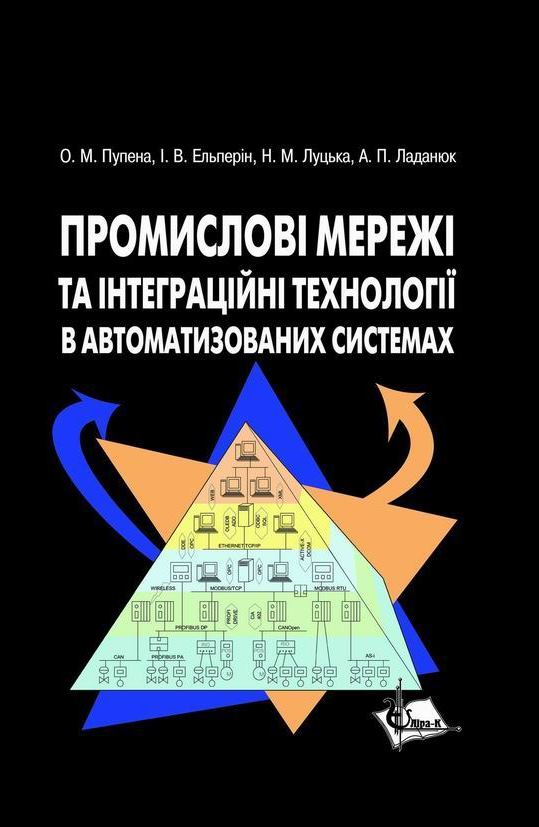

# Промислові мережі та інтеграційні технології в автоматизованих системах

Пупена О.М., Ельперін І.В., Луцька Н.М., Ладанюк А.П. Промислові мережі та інтеграційні технології в автоматизованих системах: Навчальний посібник. – К.: Вид-во "Ліра-К", **2011**. – 552 с.

**Примітки Олександра Пупени щодо даного видання.** Це [електронний варіант](https://pupenasan.github.io/fieldbusbook/2010) **старого** видання посібника 2010/11 року. Багато інформації застаріло, в деяких  місцях я побачив неточності і хибні висловлювання. На мою думку, посібник має бути повністю перероблений як структурно так і змістовно. Тому ця версія залишається як є, за винятком виправлених опечаток та хибних посилань, які були помічені при переносі. Нова версія розроблятиметься в іншій гілці, посилання на яку наведено в [цьому файлі](../README.md)  

Купити паперовий варіант можна у [видавництві (2010р)](https://lira-k.com.ua/books/tehnichni/promyslovi-merezhi-ta-integracijni-tehnologiji-v-avtomatyzovanyh-systemah.html) Пропозиції щодо структури та змісту нової версії можна добавляти [в цю тему на гітхабі](https://github.com/pupenasan/fieldbusbook/issues/1) 

- [ВСТУП](vstup.md)

1) [МІСЦЕ ТА РОЛЬ МЕРЕЖНИХ ТЕХНОЛОГІЙ В ІНТЕГРОВАНИХ АВТОМАТИЗОВАНИХ СИСТЕМАХ УПРАВЛІННЯ](1.md).

- 1.1. Інтегровані автоматизовані системи управління. 1.2. Функціональна інтеграція. 1.3. Інформаційна інтеграція. 1.4. Технічна та програмна інтеграція. 1.5. Обчислювальні мережі в ієрархії ІАСУ

2) [ЗАГАЛЬНА ХАРАКТЕРИСТИКА ПРОМИСЛОВИХ МЕРЕЖ](2.md)

- 2.1. Властивості промислових мереж. 2.2. Історія розвитку та стандартизації промислових мереж 2.3. Промислові мережі в контексті моделі ISO OSI  2.4. Основні робочі характеристики промислових мереж 2.5. Короткий огляд промислових мереж 2.5.1. Мережа MODBUS RTU/ASCII та MODBUS TCP/IP 2.5.2. [Мережа World-FIP](2_5_2.md) 2.5.3. [Мережа Foundation Fieldbus (FF)](2_5_3.md) 2.5.4. CAN та CANOpen 2.5.5. [Мережа LonWorks](2_5_5.md) 2.5.6. Мережі PROFIBUS 2.5.7. [HART-протокол](2_5_7.md) 2.5.8. [Мережа AS-і](2_5_8.md)  2.5.9. [Мережа INTERBUS](2_5_9.md)  2.5.10. [Мережі CIP: DeviceNet, ControlNet, Ethernet/IP та CompoNet](2_5_10.md) 2.5.11. [Мережі CC-Link](2_5_11.md) 2.6. Вибір промислової мережі

3) [РЕАЛІЗАЦІЯ ФІЗИЧНОГО РІВНЯ](3.md).

- 3.1.Організація каналу зв’язку 3.2. Використання металевих кабелів 3.3. Передача напругою та струмом 3.4. Використання оптоволоконного кабелю 3.5. Використання бездротового зв’язку . 3.6. Кодування інформації 3.7. Синхронна та асинхронна передача 3.8. Стандартні послідовні інтерфейси 3.9. Інтерфейс RS-232 3.10. Інтерфейс RS-422A (EIA-422A) 3.11. Інтерфейс RS-485 (EIA/TIA-485). 3.12. Інтерфейс „струмова петля” 20 мА (Current Loop, ИРПС) 3.13. Порівняльна характеристика стандартних послідовних інтерфейсів. 3.14. Використання адаптерів-перетворювачів інтерфейсів

4) [ТЕХНОЛОГІЇ МОДЕМНОГО ТА БЕЗПРОВОДНОГО ЗВ’ЯЗКУ](4.md)

- 4.1. Символьний спосіб обміну. 4.2. Модемний обмін 4.3. Бездротовий спосіб обміну 4.4. Особливості бездротових модемів з використанням стільникового зв’язку

5) [ІНТЕРФЕЙС AS-i](5.md)

- 5.1. Загальні відомості 5.2. Реалізація фізичного рівня 5.3. Принципи функціонування 5.4. Етапи роботи шини AS-i. 5.5. Формат кадру AS-i 5.6. Швидкість відновлення даних. 5.7. Профілювання Ведучих та Ведених  5.8. Автоматична адресація 5.9. AS-i V2.1 та V3.0 5.10. AS-i профілі.

6) [МЕРЕЖІ MODBUS](6.md)

- 6.1. Мережі Modbus в контексті моделі OSI. 6.2. Реалізація Modbus на прикладному рівні 6.3. Modbus Serial 6.4. Modbus TCP/IP. 6.5. Рекомендації до проектування . Modbus RTU/ASCII та Modbus TCP/IP .

7) [МЕРЕЖА PROFIBUS](7.md)

- 7.1. Мережі PROFIBUS в контексті моделі ISO та МЕК. 7.2. Реалізація фізичного рівня PROFIBUS DP. 7.3. Реалізація фізичного рівня PROFIBUS PA (MBP) 7.4. Реалізація канального рівня 7.5. Базові функції обміну даними між вузлами в PROFIBUS DP (DP-V0) 7.6. Розширені функції обміну даними між вузлами в PROFIBUS DP (DP-V1, DP-V2) 7.7. Профілі в PROFIBUS DP.

8) [CAN ПРОТОКОЛ](8.md).

- 8.1. CAN стандарти та їх опис в контексті моделі OSI 8.2. Організація канального рівня.  8.3. Реалізація фізичного рівня 8.4. CAN-сумісні стандарти 8.5. Реалізація CAN.

9) [CANOpen](9.md)

- 9.1. CANOpen в контексті моделі OSI 9.2. Особливості реалізації фізичного рівня. 9.3. Базові принципи функціонування 9.4. Робота зі Словником Об’єктів. 9.5. Специфікації профілів пристроїв CANOpen

10) [ПРОМИСЛОВИЙ ETHERNET](10.md)

- 10.1. Мережі Ethernet 10.2. Протоколи рівня ІР 10.3. Протоколи транспортного рівня . 10.4. Промисловий Ethernet

11) [КОМУНІКАЦІЙНА АРХІТЕКТУРА ДЛЯ ЕЛЕКТРОПРИВОДІВ](11.md)

- 11.1. Способи інтеграції PDS в автоматизовані системи управління . 11.2. Стандарт на універсальний інтерфейс PDS. 11.3. Профіль PROFIDRIVE 11.4. Профіль CiA402

12) [ВІДКРИТІ ТЕХНОЛОГІЇ ПРОГРАМНОЇ ІНТЕГРАЦІЇ В СЕРЕДОВИЩІ WINDOWS](12.md) 

- 12.1. Проблеми програмної інтеграції в інтегрованих автоматизованих системах . 12.2. Функціонування ОС Windows. 12.3. Інтерфейс програми користувача до ОС Windows. 12.4. Технології DDE та NetDDE 12.5. Технології СОМ/DCOM 12.6. Web Технології

13) [Технологія ОРС](13.md)

- 13.1. Загальні концепції 13.2. Принципи функціонування ОРС DA 13.3. Типи ОРС DA інтерфейсів 13.4. Область застосування технології ОРС.

14) [Стандартні технології доступу до баз даних](14.md)

- 14.1 Проблеми доступу до баз даних 14.2. Мова SQL 14.3. ODBC та DAO. 14.4. OLE DB, ADO та ADO.NET

15) [Проектування ІНТЕГРОВАНИХ АВТОМАТИЗОВАНИХ СИСТЕМ](15.md) 

- 15.1. Загальні підходи до проектування автоматизованих систем 15.2. Загальні підходи до проектування інтегрованих автоматизованих систем  15.3. Розробка структурних схем ІАС. 15.4. Розробка документів інформаційного забезпечення ІАС

--> [ВСТУП](vstup.md)

Література

