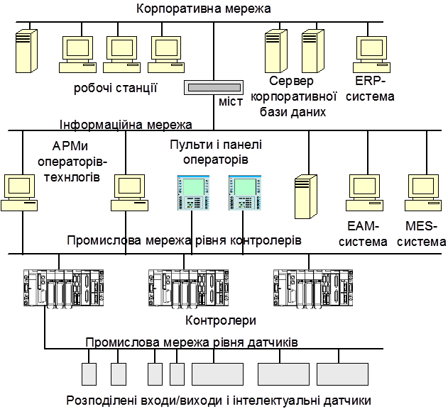

[Промислові мережі та інтеграційні технології в автоматизованих системах](README.md). 

# ВСТУП

​     Одною з ознак початку нового етапу розвитку систем автоматизації промислових підприємств є пошук шляхів інтеграції двох систем автоматизації – “Автоматизованих систем управління підприємством” (АСУП) і “Автоматизованих систем управління технологічними процесами” (АСУТП), які до останнього часу розвивались відокремлено і незалежно одна від одної. Традиційно системи АСУП орієнтовані на вирішення задач автоматизації управлінською і фінансово-господарською діяльністю, а також на планування ресурсів підприємства. Системи АСУТП вирішують задачі автоматизації технологічних і виробничих процесів. Головною метою інтеграції різних підсистем на виробництві є створення єдиного інформаційного простору підприємства для об’єктивної і оперативної оцінки стану підприємства, оперативного прийняття своєчасних і ефективних управлінських рішень, а також ліквідації інформаційних та організаційних бар’єрів між управлінським та технологічним рівнями. 

​     Економічною основою інтеграції є прагнення керівників підприємств шукати реальні додаткові джерела підвищення економічної ефективності діяльності підприємства. На кожному підприємстві такі джерела існують, треба тільки вміти їх знайти, а для цього необхідно забезпечити збір, обробку і аналіз інформації оперативних даних з усіх технологічних і виробничих ділянок виробництва. Саме оперативної, а не в кінці зміни, робочого дня або місяця. Для того, щоб керувати собівартістю продукції треба поряд з інформацією про вартість сировини і робочої сили знати скільки сировини, електроенергії, пари, води і палива пішло на виготовлення кінцевої продукції. Для харчової промисловості це дуже важливо, тому що питома вага вартості сировини в собівартості продукції є досить високою, а основні технологічні процеси вимагають використання великої кількості енергоресурсів. Інтерграція АСУП і АСУТП може дозволити реалізувати поточне та оперативне планування витрат і собівартості, а також забезпечувати їх розрахунок у реальному часі одночасно з змінами темпа виробництва, миттєво реагуючи на відхилення від заданого рівня. На базі поточної інформації із АСУТП можливо реалізувати цільове керування з наступних показників:

-     якості продукції і підтримання необхідних споживчих властивостей продукції;

-     енергозбереженню та економії ресурсів;

-     підтримання заданої продуктивності.

Технічною передумовою інтеграції систем управління є широке впровадження на виробництві комп’ютерної і мікропроцесорної техніки, а також сучасних інформаційних технологій. Треба відзначити, що не завжди виробничі процеси реалізовувалися у межах чітко визначеної стратегії розвитку систем управління. Частіше всього ці задачі вирішувалися локально і тому при пошуку шляхів їх інтеграції можуть виникнути певні труднощі. Тому процес інтеграції систем управління може відбуватися або в умовах коли на підприємстві уже функціонують окремі системи автоматизованого управління і необхідно визначити шляхи їх взаємодії або в умовах коли вирішення цієї задачі тільки планується. І в тому і в іншому випадку при вирішенні питання практичної реалізації інтегрованої системи управління конкретним виробництвом необхідно чітко визначити мету інтеграції, а також проаналізувати сучасний стан організаційного, функціонального, технічного та програмного забезпечення існуючих на виробництві АСУП і АСУТП. Це дозволить визначити чітку стратегію розвитку систем управління виробництвом і уникнути невиправданих матеріальних втрат від прийняття необґрунтованих і неузгоджених рішень.

На рис.1 наведений приклад узагальненої інтегрованої структури системи управління із якої видно, що одним із основних елементів цієї схеми є використання різноманітних обчислювальних мереж на різних рівнях управління. Без них неможливо створити єдиний інформаційний простів. 

Рис. 1. Приклад узагальненої структури інтегрованої системи управління

Є суттєві відмінності у вимогах до інформаційних мереж (структури, технічного і програного забезпечення) які використовуються на різних рівнях управління. Якщо обчислювальні мережі, які використовуються на рівні організаційно-економічного управління описані досить широко у спеціальній літературі, то опис мереж та інтеграційних технологій рівня АСУТП потребують узагальнення і систематизації.

У навчальному посібнику розглянуті матеріали присвячені промисловим мережам та інтеграційним технологіям. Навчальний посібник має умовно чотири частини. У першій частині, розглядаються загальні питання присвячені висвітленню питання та місця мережних технологій в інтегрованих автоматизованих системах (розділ 1), загальних характеристик та короткому огляду промислових мереж (розділ 2), а також характеристикам каналів зв’язку, тобто реалізації фізичного рівня для цього типу мереж (розділ3). 

У другій частині наводяться дані по принципам функціонування та проектуванню деяких, найбільш використовуваних в Україні промислових мереж (розділи 4-10).  При цьому використаний досвід авторів по роботі з цими мережами як у лабораторних так і промислових умовах. Наведені приклади організації мереж з використанням технічної бази різних виробників. В розділі 11 описані стандартні технології управління електроприводами через промислові мережі.  

Третя частина присвячена технологіям програмної інтеграції. Зокрема в розділі 12 наводяться загальні відкриті технології міжпрограмної взаємодії, які використовуються в середовищах Mocrosoft Winodws. Розділ 13 повністю присвячений найбільш популярній в області АСУТП технології ОРС, зокрема специфікації OPC DA 2.0. Відкриті технології доступу до баз даних розглядаються в розділі 14.   

Остання частина (розділ 15) присвячена питанням проектування інтегрованих автоматизованих систем, в яких використовуються промислові мережі та технології міжпрограмної взаємодії.

Навчальний посібник може бути використаний при вивченні курсів циклу професійної і практичної підготовки рівня бакалавра для напряму 6.050202 «Автоматизація та комп’ютерно-інтегровані технології»: «Автоматизація технологічних процесів і виробництв», «Інтегровані системи управління», «Контролери та їх програмне забезпечення», а також при вивченні дисциплін ОКР спеціаліст-магістр з спеціальностей «Автоматизоване управління технологічними процесами» та «Комп’ютерно-інтегровані технологічні процеси і виробництва»: «Проектування комп’ютерно-інтегрованих систем», «Програмно-технічні комплекси та промислові контролери», а також при виконанні курсового і дипломного проектування.

При вивченні дисципліни "Проектування комп’ютерно-інтегрованих систем управління" рекомендується наступна послідовність вивчення курсу. Для початку студент ознайомлюється з першим та другим розділом, які є обов’язковими при вивченні дисципліни. У випадку необхідності детального вивчення особливостей реалізації фізичного рівня та стандартних послідовних інтерфейсів, студенту рекомендується прочитати 3-й розділ. Після ознайомлення з основними концепціями можна приступити до розгляду конкретної промислової мережі на вибір (розділи 4-9), які побудовані як самостійні частини. Детальне вивчення розділу 8 (CAN) є хорошою основою для вивчення функціонування мережі CANOpen (розділ 9), однак це не є обов’язковим. Слід наголосити, що розділи 4-9 є незалежними, що дає змогу зосередитись на вивченні конкретної мережі, в залежності від наявної технічної бази лабораторій. Якщо вивчення ведеться тільки на теоретичній базі, рекомендується вивчення мереж Modbus (розділ 6), як найбільш простих для сприйняття. 

Після вивчення базових концепцій розділів 1-го,2-го, бажано 3-го, одного з розділів від 4-го по 9-й, можна приступати до вивчення розділу 15. Така послідовність дає можливість завершити частину, яка присвячена промисловим мережам. 

Рекомендується ознайомитися з розділами 10 та 11, що можна зробити вже після вивчення перших двох розділів. 

Для ознайомлення з технологіями міжпрограмної інтеграції, необхідно послідовно прочитати розділи з 12 по 14. Розділ 15 є логічним завершенням цієї частини

Отже мінімальна послідовність для вивчення курсу "Проектування комп’ютерно-інтгрованих систем" наступна:

1. Розділ 1. Місце та роль мережних технологій в інтегрованих автоматизованих системах управління. 

2. Розділ 2. Загальна характеристика промислових мереж.

3. Розділ 3. Реалізація фізичного рівня.

4. Один з розділів (4-10). 

5. Розділ 15. Проектування інтегрованих автоматизованих систем управління (в контексті промислових мереж).

6. Розділ 12. Відкриті технології програмної інтеграції в середовищі Windows.

7. Розділ 13. Технологія ОРС.

8. Розділ 14. Стандартні технології доступу до баз даних.

9. Розділ 15. Проектування інтегрованих автоматизованих систем управління. (в контексті міжпрограмної взаємодії).

З іншими розділами студент може ознайомитись в будь який час після вивчення основної послідовності. 

Посібник також може бути корисний спеціалістам в галузі автоматизації виробництва, які спеціалізуються на проектуванні і розробці комп’ютерно-інтегрованих систем управління виробництвом.

-->1. [МІСЦЕ ТА РОЛЬ МЕРЕЖНИХ ТЕХНОЛОГІЙ В ІНТЕГРОВАНИХ АВТОМАТИЗОВАНИХ СИСТЕМАХ УПРАВЛІННЯ](1.md).

