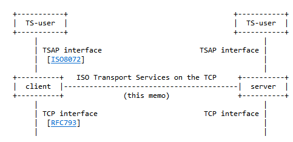
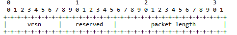
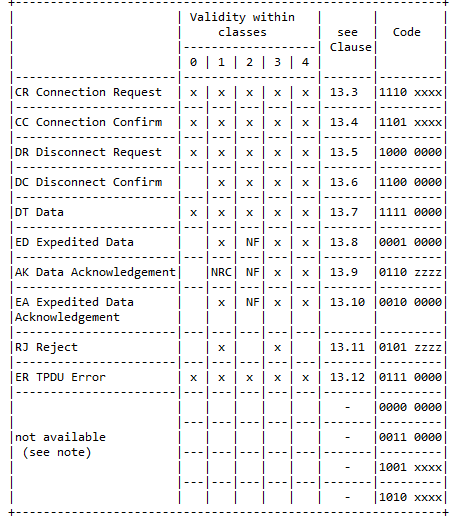
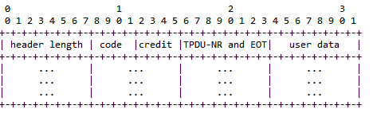
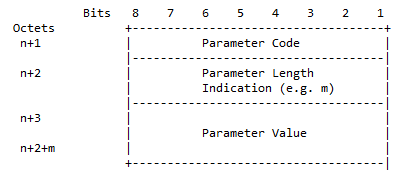
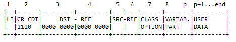
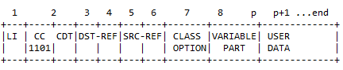
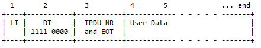

[S7 TCP/IP](../README.md)

# RFC 1006

- [ISO 8073](ISO 8073.md)

- [RFC1006](RFC1006.md)

RFC1006 - це протокол шлюзування ISO8072/ISO8073 на TCP.

Стандарт ISO 8072 описує визначення транспортної послуги ISO, яка надалі називається TP.

-  Transport service [ISO8072]  [X.214]

-  Transport protocol [ISO8073]  [X.224]
-  Session protocol  [ISO8327]  [X.225]



З метою пояснення використовуються наступні скорочення:

- TS-peer - процес, який реалізує протокол, описаний у цьому меморандумі
- TS-user - процес, що спілкується за допомогою послуг TS-peer

- TS-провайдер —сутність чорної скриньки, що реалізує протокол, описаний у цьому меморандумі

Протокол RFC 1006 ідентичний протоколу ISO transport class 0, за такими винятками:

- для цілей тестування initial data (початкові дані) можуть обмінюватися під час встановлення з'єднання
- для цілей тестування підтримується служба прискорених даних (expedited data service)
- з міркувань продуктивності підтримується набагато більший розмір TSDU
- мережева послуга, яка використовується протоколом, забезпечується TCP

Транспортний протокол ISO обмінюється інформацією між одноранговими вузлами в окремих одиницях інформації, які називаються одиницями даних транспортного протоколу (TPDU). Протокол, означений у RFC 1006, інкапсулює ці TPDU в окремі блоки, які називаються **TPKT**. Структура цих TPKT та їхній зв’язок із TPDU обговорюються в наступному розділі.

## Примітиви

У RFC 1006 описано, як використовувати ці служби для емуляції наступних службових примітивів, яких вимагає [ISO8073]:

- Events (Події)

  - `N-CONNECT.INDICATION` - NS-user (відповідач) отримує сповіщення, що встановлення з'єднання триває

  - `N-CONNECT.CONFIRMATION` - NS-user (відповідач) отримує сповіщення, що з'єднання встановлено

  - `N-DATA.INDICATION` - NS-user отримує сповіщення, що дані можуть бути прочитані з підключення

  - `N-DISCONNECT.INDICATION` - NS-user отримує сповіщення про те, що з'єднання закрито

- Actions (Дії)

  - `N-CONNECT.REQUEST` - NS-user  (ініціатор) вказує, що він хоче встановити з'єднання

  - `N-CONNECT.RESPONSE`- NS-user  (відповідач) вказує, що він виконає запит

  - `N-DATA.REQUEST` - NS-user надсилає дані

  - `N-DISCONNECT.REQUEST` - NS-user  вказує, що з'єднання має бути закрито

Протокол пропонує наступні сервісні примітиви, як визначено в [ISO8072], для користувача TS:

- Events (Події)

  - `T-CONNECT.INDICATION` - TS-user (відповідач) отримує сповіщення про встановлення з'єднання

  - `T-CONNECT.CONFIRMATION` - TS-user (ініціатор) отримує сповіщення, що з'єднання встановлено

  - `T-DATA.INDICATION` - TS-user отримує сповіщення, що дані можуть бути прочитані з підключення

  - `T-EXPEDITED DATA.INDICATION` - TS-user отримує сповіщення, що "прискорені" дані можуть бути прочитані з підключення

  - `T-DISCONNECT.INDICATION` - TS-user отримує сповіщення про те, що з'єднання закрито

- Actions (Дії)

  - `T-CONNECT.REQUEST` - TS-user (ініціатор) вказує, що він хоче встановити з'єднання

  - `T-CONNECT.RESPONSE` - TS-user (відповідач) вказує, що він виконає запит

  - `T-DATA.REQUEST` - TS-user надсилає дані

  - `T-EXPEDITED DATA.REQUEST` - TS-user надсилає "прискорені" дані

  - `T-DISCONNECT.REQUEST` - TS-user вказує, що з'єднання має бути закрито

Відображення між примітивами служби TCP і примітивами служби, очікуваними транспортним класом 0, є досить простим:

| network service              | TCP                              |
| ---------------------------- | -------------------------------- |
| **CONNECTION ESTABLISHMENT** |                                  |
| `N-CONNECT.REQUEST`          | open completes                   |
| `N-CONNECT.INDICATION`       | listen (PASSIVE open) finishes   |
| `N-CONNECT.RESPONSE`         | listen completes                 |
| `N-CONNECT.CONFIRMATION`     | open (ACTIVE open) finishes      |
| **DATA TRANSFER**            |                                  |
| `N-DATA.REQUEST`             | send data                        |
| `N-DATA.INDICATION`          | data ready followed by read data |
| **CONNECTION RELEASE**       |                                  |
| `N-DISCONNECT.REQUEST`       | close                            |
| `N-DISCONNECT.INDICATION`    | connection closes or errors      |

Параметри відображення також є простими:

| network service        | TCP                            |
| ---------------------- | ------------------------------ |
| **CONNECTION RELEASE** |                                |
| Called address         | server's IP address (4 octets) |
| Calling address        | client's IP address (4 octets) |
| all others             | ignored                        |
| **DATA TRANSFER**      |                                |
| NS-user data (NSDU)    | data                           |
| **CONNECTION RELEASE** |                                |
| all parameters         | ignored                        |

## Встановлення з'єднання

Елементи процедури, що використовуються під час встановлення з’єднання, ідентичні тим, що представлені в ISO8073, за трьома винятками.

- Щоб полегшити тестування, TPDU запиту на підключення та підтвердження підключення можуть обмінюватися початковими даними користувача, використовуючи поля даних користувача цих TPDU.
- Щоб поекспериментувати зі службами прискореної передачі даних, TPDU запиту на підключення та підтвердження підключення можуть узгодити використання прискореної передачі даних за допомогою механізму узгодження (negotiate), означеного в [ISO8073] (наприклад, встановлення біта «use of transport expedited data transfer service» у змінній частині «Additional Option Selection»). За замовчуванням служба прискореної транспортної передачі даних не використовується.
- Щоб досягти високої продуктивності, стандартний розмір TPDU становить 65531 октет замість 128 октетів. Для узгодження меншого (стандартного) розміру TPDU використовується механізм узгодження (negotiate), означений у [ISO8073] (наприклад, встановлення потрібного біта в змінній частині «Розмір TPDU»).

Щоб виконати дію `N-CONNECT.REQUEST`, вузол TS виконує активне відкриття потрібної IP-адреси за допомогою TCP-порту 102. Коли TCP сигналізує про успіх або помилку, це призводить до дії `N-CONNECT.INDICATION`.

Щоб очікувати події `N-CONNECT.INDICATION`, сервер прослуховує TCP-порт 102. Коли клієнт успішно підключається до цього порту, відбувається подія та виконується неявна дія `N-CONNECT.RESPONSE`.

## Передача даних

Елементи процедури, що використовуються під час передачі даних, ідентичні тим, що представлені в [ISO8073], за одним винятком: можуть підтримуватися пришвидшені дані (expedited data) (якщо це обговорено під час встановлення з’єднання) шляхом надсилання модифікованого ED TPDU (описано нижче).

TPDU надсилається через те саме з’єднання TCP, що й усі інші TPDU.

Щоб виконати дію `N-DATA.REQUEST`, одноранговий TS створює потрібний TPKT і використовує примітив надсилання даних TCP.

Щоб ініціювати дію `N-DATA.INDICATION`, TCP вказує, що дані готові, і TPKT зчитується за допомогою примітиву читання даних TCP.

## Розірвання з'єднання

Щоб виконати дію `N-DISCONNECT.REQUEST`, вузол TS просто закриває з’єднання TCP. Якщо TCP інформує TS-вузла про те, що з’єднання закрито або виникла помилка, це вказує на подію `N-DISCONNECT.INDICATION`.

## Формат пакету

Фундаментальна відмінність між TCP і мережевою службою, яку очікує TP0, полягає в тому, що TCP керує безперервним потоком октетів без явних обмежень. TP0 очікує, що інформація надсилатиметься та доставлятиметься в окремих об’єктах, які називаються блоками даних мережевої служби (NSDU, network service data units). Хоча інші транспортні класи можуть поєднувати більше одного TPDU в одному NSDU, транспортний клас 0 не використовує цю можливість. Отже, NSDU ідентичний TPDU для цілей нашого обговорення.

Протокол, описаний у RFC 1006, використовує просту схему пакетування для розмежування TPDU. Кожен пакет, який називається TPKT, розглядається як об'єкт, що складається з цілого числа октетів змінної довжини. TPKT складається з двох частин: заголовка пакета та TPDU. 

### Заголовок

Формат заголовка постійний незалежно від типу пакета. Формат заголовка пакета такий (октети/біти):



`vrsn` - 8 біт. Це поле завжди дорівнює `3` для версії протоколу, описаного в цій пам’ятці.

`packet length` - 16 біт (min=`7`, max=`65535`). Це поле містить довжину всього пакета в октетах, включаючи заголовок пакета. Це дозволяє максимальний розмір TPDU 65531 октет. Виходячи з розміру TPDU передачі даних (DT), це дозволяє максимальний розмір TSDU 65524 октетів.

### Загальна структура TPDU

Формат TPDU означено в ISO8073. Таблиця 8 означує ті TPDU, які дійсні для кожного класу, і код для кожного TPDU. Зауважте, що обмінюються лише TPDU, відформатовані для транспортного класу 0 (різні транспортні класи можуть використовувати дещо різні формати). 

Позначення:  

- `xxxx` (біти 4-1): використовується для сигналізації CDT (встановлюється на `0000` у класах 0 і 1)

- `zzzz` (біти 4-1): використовується для сигналу CDT у класах 2, 3, 4, встановленому на `1111` у класі 1

- `NF`: недоступно, якщо вибрано параметр неявного керування потоком.
- `NRC`: недоступно, якщо вибрано параметр підтвердження отримання.



Table 8. TPDU code

Для підтримки прискорених даних дозволено нестандартний TPDU для прискорених даних (ED, expedited data). Формат, який використовується для ED TPDU, майже ідентичний формату звичайних даних, DT, TPDU. Єдина відмінність полягає в тому, що для коду TPDU використовується значення `ED`, а не `DT`:



Після поля credit  (яке завжди дорівнює `0` під час виведення та ігнорується під час введення) є одне додаткове поле перед даними користувача:

`TPDU-NR and EOT` - 8 bits

Біт 7 (старший біт, бітова маска `1000 0000`) вказує на кінець TSDU. Усі інші біти повинні мати значення 0 на виході та ігноруватися на вході.

Зауважте, що специфікація TP обмежує розмір блоку даних служби прискореного транспортування (XSDU) до 16 октетів.

Усі блоки даних транспортного протоколу (TPDU) повинні містити цілу кількість октетів. TPDU повинні містити в такому порядку:

   а) `header` - заголовок, що містить:

      1) поле індикатора довжини (`LI`) -  довжина має бути довжиною заголовка в октетах, включаючи параметри, але за винятком поля індикатора довжини та даних користувача, якщо такі є;
    
      2) `fixed part` - фіксована частина, містить поля в залежності від code TPDU, які можуть приймати значення (див таблицю 8):
         - `1110 xxxx` - Connection Request
         - `1101 xxxx` - Connection Confirm
         - `0101 xxxx` - Reject
         - `0110 xxxx` - Data Acknowledgement
    
      3) `variable part` - змінна частина, якщо вона є (див. нижче);

   b) `data field` - поле даних, якщо воно є.


Змінна частина (variable part) використовується для означення менш часто використовуваних параметрів. Якщо присутня змінна частина, вона повинна містити один або більше параметрів. Кожен параметр, що міститься в змінній частині, має таку структуру:



- `parameter code` - код параметру, закодовано в двійковій системі 

- `parameter  length` - довжина значення параметра в октетах. 

- `parameter value` - містить значення параметра

### Connection Request (CR) TPDU




- `CR` :  Connection Request Code:  `1110` (`0x0e`)
- `CDT` :  Initial Credit  Allocation  `0000` 

- `DST-REF`  :  0

- `SRC-REF`  : Посилання, вибране об’єктом транспортування, що ініціює CR TPDU, для ідентифікації запитаного транспортного з’єднання; 

- `CLASS`: `0000000`

User Data - не повинно бути в даному пакеті

Вибіркова частина включає параметри:

| Параметр                                                     | Parameter code | Parameter length | Parameter value                                              |                                      |
| ------------------------------------------------------------ | -------------- | ---------------- | ------------------------------------------------------------ | ------------------------------------ |
| TSAP-ID - Transport Service Access Point Identifier Calling TSAP | `1100 0001`    | -                |                                                              |                                      |
| TSAP-ID - Transport Service Access Point Identifier Called TSAP | `1100 0010`    | -                |                                                              |                                      |
| TPDU size                                                    | `1100 0000`    | 1                | 0000 1101  8192 octets (not allowed in Class 0)<br/> 0000 1100  4096 octets (not allowed in Class 0)<br/> 0000 1011  2048 octets<br/> 0000 1010  1024 octets<br/> 0000 1001   512 octets<br/> 0000 1000   256 octets<br/> 0000 0111   128 octets | уточнити, бо вказано що можна великі |

#### Приклад JS

```js
connectReq = Buffer.from([
     // RFC 1006 header
     0x03, //0 - vrsn = 3
     0x00, //1 - reserved
     0x00, //2 - packet length HI
     0x16, //3 - packet length LO 22
     // TPDU header
     0x11, //4 - LI - len header 17 octet 
     0xe0, //5 - CR CDT -  
     0x00, //6 - DST-REF -  
     0x00, //7 - DST-REF - 
     0x00, //8 - SRC-REF -
     0x02, //9 - SRC-REF - 
     0x00, //10 - CLASS - 
     0xc0, //11 - para 1: code - TPDU size
     0x01, //12 - para 1: len - 1 
     0x0a, //13 - para 1: val - 1024 octets
     0xc1, //14 - para 2: code - Calling TSAP-ID
     0x02, //15 - para 2: len - 2
     0x01, //16 - para 2: val - 01 - 0001 - localTSAP
     0x00, //17 - para 2: val - 00
     0xc2, //18 - para 3: code - Called TSAP-ID
     0x02, //19 - para 2: len - 2 
     0x01, //20 - para 2: val - 01 - remoteTSAP //CPU S7-1200/1500
     0x02 //21 -  para 2: val - 02 //OP
    // TPDU User Data
    ]);
```


### Connection Confirm (CC) TPDU



-  `CC`: Код підтвердження підключення: `1101`. Біти 8-5 октету 2;

-  `CDT`: `0000` 

-  `DST-REF`: Посилання, що ідентифікує запитане транспортне з’єднання у віддаленому транспортному об’єкті;

- `SRC-REF`: Посилання, що ідентифікує запитане транспортне з’єднання у віддаленому транспортному об’єкті.

- Class and Option: визначає вибраний клас транспортного протоколу та опцію, яка буде працювати через прийняте транспортне з’єднання відповідно до правил узгодження, визначених у 6.5;
- User Data - не повинно бути в даному пакеті

### Disonnect Request (DR) TPDU


### Data (DT) TPDU



Стаціонарна частина повинна містити:

- `DT`: Код передачі даних: `1111 0000`;

- `EOT` (8-й біт): якщо встановлено значення `1`, вказує, що поточний DT TPDU є останнім блоком даних повного DT TPDU послідовності (`End of TSDU`).

- `TPDU-NR`: 0 
- `User Data` - TSDU

#### Приклад JS negotiatePDU

```js
negotiatePDU = Buffer.from([
    // RFC 1006 header
    0x03, //0 - vrsn = 3
    0x00, //1 - reserved
    0x00, //2 - packet length HI
    0x19, //3 - packet length LO 25
    // TPDU header
    0x02, //4 - LI - len header 17 octet
    0xf0, //5 - 1111 0000 - DT
    0x80, //6 - EOT=1 - End of TSDU
    // ------------ TPDU User Data
    // S7 Header (libnodave)
    0x32, //7(0) - allways 0x32 
    0x01, //8(1) - type - 1,2,3 or 7
    0x00, //9(2) - unknown
    0x00, //10(3) - unknown
    0x00, //11(4) - sequence number
    0x00, //12(5) - sequence number
    0x00, //13(6) - length of parameters
    0x08, //14(7) - length of parameters
    0x00, //15(8) - length of data
    0x00, //16(9) - length of data
    // S7 param
    0xf0, //17(10) - PDU length negotiation 
    0x00, //18(11) - 
    0x00, //19(12) - //requestMaxParallel ?
    0x08, //20(13) - //у libnodave=1? 
    0x00, //21(14) - //requestMaxParallel ?
    0x08, //22(15) - //у libnodave=1?
    0x03, //23(16) maxPDUlength - завжди 3 //requestMaxPDU?
    0xc0  //24(17) maxPDUlength - завжди c0 //requestMaxPDU? 
]);
```

#### Приклад JS readReqHeader

```js
readReqHeader = Buffer.from([
    // RFC 1006 header
    0x03, //0 - vrsn = 3 
    0x00, //1 - reserved 
    0x00, //2 - packet length HI 
    0x1f, //3 - packet length LO 31 
    // TPDU header
    0x02, //4 - LI - len header 17 octet 
    0xf0, //5 - 1111 0000 - DT 
    0x80, //6 - EOT=1 - End of TSDU
	// TPDU User Data    
    0x32, //7(0) - allways 0x32  
    0x01, //8(1) - type - 1,2,3 or 7 
    0x00, //9(2) - unknown 
    0x00, //10(3) - unknown 
    0x08, //11(4) - sequence number 
    0x00, //12(5) - sequence number 
    0x00, //13(6) - length of parameters 
    0x0e, //14(7) - length of parameters 
    0x00, //15(8) - length of data
    0x00, //16(9) - length of data 
    0x04, //17(10) - FuncRead
    0x01 //18(11) - 01 чи 00 не зрозуміло
]);
```


### Expedited Data (ED) TPDU


### TPDU Error (ER) TPDU