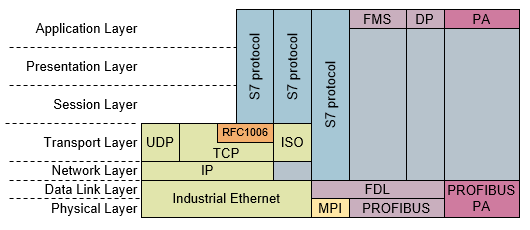

[На головну](../../README.md)

# Протокол S7 TCP/IP

Протоколи S7 TCP/IP повсякмісно використовуються в системах керування, впроваджених в Україні. Це зумовлено великою кількістю впроваджених ПЛК Simatic фірми Siemens. У той же час протокол є пропрієтарним і як мені відомо не описаний у відкритих джерелах. Тому для обміну даними з ПЛК Simatic з інших систем, де не впроваджено протокол, потрібно піти одним з кількох шляхів:

- використовувати відкриті комунікації, наприклад Modbus TCP/IP або обмін поверх TCP або UDP
- писати інтерфейсний драйвер, використовуючи існуючі відкриті бібліотеки, такі як Libnodave, nodeS7,  або подібні
- розібратися з протоколом S7 та реалізувати драйвер самостійно 

Перший варіант є найбільш прийнятним, але потребує реалізації зі сторони ПЛК Simatic. Приводом для створення даного розділу та ініціації робіт по вивченню протоколу стала ідея впровадження бібліотеки імітаційних моделей в імітаторі контролеру PLCNext, який я озвучив в [пості у Фейсбуці](https://www.facebook.com/groups/plcnextua/posts/1508154979612036/). У цьому випадку потребується зв'язок з імітатором ПЛК Simatic Step7, який не підтримує більшість комунікаційних функцій, окрім S7 серверних. Отже перший варіант не підходить. 

Другий варіант потребує реалізації підсистеми, що потребує драйвер. Бібліотека Libnodave розроблена для ПК або пристроїв з відкритим інтерфейсом до ОС Linux, Windows. Для пристроїв з Node.js є бібліотека nodeS7, є також адаптації її для Node-RED.  Хоч PLCNext має такі можливості, для мене цей шлях складніший і не є таким універсальним.

Я вибрав третій варіант, розібратися з протоколом S7 для того щоб реалізовувати драйвер самостійно. Це дасть можливість написати комунікаційну функцію на будь якому пристрої, що підтримує Open TCP комунікації. У якості джерела інформації я використовував відкриті джерела в Інтернеті, на які даю посилання.  

Слід зауважити що підключення до імітатора  ПЛК Simatic Step7 зі сторонніх програм можливе за використання безкоштовної утиліти [nettoplcsim](https://nettoplcsim.sourceforge.net/).

Усі правки та зауваження давайте в [даному issue](https://github.com/pupenasan/fieldbusbook/issues/2). Якщо у Вас немає обліковки GitHub, можете створити, як  описано [тут](https://pupenasan.github.io/Git4All/events/workshop1.html#реєстрація-на-github ) . Інші контакти та репозиторії можете знайти на моїй сторінці <https://github.com/pupenasan>

## Загальний опис

[Джерело](https://support.industry.siemens.com/cs/document/26483647/what-properties-advantages-and-special-features-does-the-s7-protocol-offer-?dti=0&lc=en-WW)

Усі процесори SIMATIC S7 і процесори C7 мають інтегровані служби зв’язку S7, за допомогою яких програма користувача може читати та записувати дані.

Наступні функції доступні для процесорів S7 і C7 незалежно від використовуваної системи мережі, щоб ви могли використовувати зв’язок S7 через Industrial Ethernet, PROFIBUS або MPI:

- Системні функціональні блоки (SFB): у STEP 7 V5.x для ЦП S7-400
- Функціональні блоки (FB): у STEP 7 V5.x для процесорів S7-300 і C7-CPU
- Інструкції: на TIA Portal для ЦП S7-300, ЦП S7-400, ЦП S7-1200 і ЦП S7-1500

Позиція протоколу S7 в еталонній моделі ISO-OSI показана на рис.1.
Рис. 1.  Позиція протоколу S7 в еталонній моделі ISO-OSI.

### Сервіси протоколу S7

Таблиця 1. Огляд сервісів протоколу S7. 

| Service      | Description                                                  |
| :----------- | :----------------------------------------------------------- |
| PUT / GET    | Цей сервіс для читання/запису невеликих обсягів даних на станцію та зі станції по запиту. |
| BSEND / BRCV | Цей сервіс є двонаправленим та блоково-орієнтованим для передачі великих обсягів даних між двома станціями |
| USEND / URCV | Цей сервіс є двонаправленим та некоординованою послугою для передачі невеликих обсягів даних між двома станціями. |

### Об'єм користувацьких даних

Протокол S7 дозволяє передавати дані від 1 байту до 64 Кбайт. Максимальний розмір даних залежить від використовуваного сервісу та процесора S7.

Таблиця 2

| Service      | S7-300 CPU                | S7-400 CPU  | S7-1200 CPU | S7-1500 CPU                                                  |
| :----------- | :------------------------ | :---------- | :---------- | :----------------------------------------------------------- |
| PUT / GET    | 160 bytes                 | 400 bytes   | 160 bytes   | 880 bytes                                                    |
| BSEND / BRCV | 32768 bytes / 65534 bytes | 65534 bytes | -           | 65534 bytes with standard access <br />65535 bytes with optimized access |
| USEND / URCV | 160 bytes                 | 440 bytes   | -           | 920 bytes                                                    |

### Властивості протоколу S7

У наступній таблиці показано властивості протоколу S7.

Table 3

| Властивості                      | PUT / GET                                                    | BSEND / BRCV                                                 | USEND / URCV                                                 |
| :------------------------------- | :----------------------------------------------------------- | :----------------------------------------------------------- | :----------------------------------------------------------- |
| Області пам'яті                  | M, D, E, A, T, Z                                             | M, D, E, A, T, Z                                             | M, D, E, A, T, Z                                             |
| Консистентність даних            | Від 8 до 32 байтів, 32 байти загальної довжини (залежить від ЦПУ, У програмі користувача ви повинні переконатися, що блок даних не змінюється під час передачі даних.) | Загальна довжина на одне завдання (У програмі користувача ви повинні переконатися, що блок даних не змінюється під час передачі даних) | Загальна довжина на одне завдання (У програмі користувача ви повинні переконатися, що блок даних не змінюється під час передачі даних) |
| Комунікаційний принцип           | Client / Server                                              | Client / Client                                              | Client / Client                                              |
| Максимальна кількість підключень | Див специфікацію CPU                                         | Див специфікацію CPU                                         | Див специфікацію CPU                                         |
| Функції                          | FB15 / SFB15 "PUT"<br />FB14 / SFB14 "GET"                   | FB12 / SFB12 "BSEND"<br />FB13 / SFB13 "BRCV"                | FB8 / SFB8 "USEND<br />"FB9 / SFB9 "URCV"                    |

### Переваги протоколу S7

- Незалежність від середовища передачі (PROFIBUS, Industrial Ethernet, MPI).
- Можна використовувати для всіх областей даних S7.
- Передача до 64 Кбайт за одне завдання.
- Протокол S7 забезпечує автоматичне підтвердження записів даних.
- Низьке навантаження на процесор і шину при передачі великих обсягів даних.

Протокол S7 підтримується всіма доступними CPU і комунікаційними процесорами S7. Крім того, комп'ютерні системи з відповідним апаратним і програмним забезпеченням підтримують зв'язок через протокол S7.

## ISO RFC1006

RFC1006 - це протокол шлюзування транспортного протоколу ISO8072/ISO8073 на TCP. Саме його використовують для передачі S7 поверх TCP/IP (див.рис.1). Опис RFC знаходиться у [розділі ISO RFC1006](ISO_RFC1006/README.md). 

## S7 протокол

Опис S7 протоколу наведений у [цьому файді](s7.md). За джерело для цього опису взяті матеріали з відкритиої бібліотеки [libnodave](libnodave) та парсингу бібліотеки [nodeS7](nodeS7/README.md).

##  nodeS7 в node.js

NodeS7 — це бібліотека для Node.js, яка дозволяє зв’язуватися з ПЛК S7-300/400/1200/1500 за допомогою протоколу Siemens S7 Ethernet RFC1006. 

Опис та розбір бібліотеки знаходиться у [розділі nodeS7 ](nodeS7/README.md).

## WireShark S7 Communication (S7comm)

[Джерело](https://wiki.wireshark.org/S7comm)

S7comm (S7 Communication) — це власний протокол Siemens, який працює між програмованими логічними контролерами (PLC) сімейства Siemens S7-300/400. Він використовується для програмування ПЛК, обміну даними між ПЛК, доступу до даних ПЛК із систем SCADA (диспетчерського керування та збору даних) і діагностичних цілей.

Дані S7comm надходять як корисне навантаження пакетів даних COTP. Перший байт завжди `0x32` як ідентифікатор протоколу. Спеціальні комунікаційні процесори для серії S7-400 (CP 443) можуть використовувати цей протокол без рівнів TCP/IP.

|      | OSI layer          | Protocol              |
| ---- | ------------------ | --------------------- |
| 7    | Application Layer  | S7 communication      |
| 6    | Presentation Layer | S7 communication      |
| 5    | Session Layer      | S7 communication      |
| 4    | Transport Layer    | ISO-on-TCP (RFC 1006) |
| 3    | Network Layer      | IP                    |
| 2    | Data Link Layer    | Ethernet              |
| 1    | Physical Layer     | Ethernet              |

Для встановлення з’єднання з ПЛК S7 потрібно виконати 3 кроки:

1. Підключіться до ПЛК через TCP-порт 102
2. Підключення на рівні ISO (запит на підключення COTP)
3. Підключіться до рівня S7comm (`s7comm.param.func = 0xf0`, налаштування зв’язку)

Крок 1) використовує IP-адресу PLC/CP.

Крок 2) використовує як пункт призначення TSAP довжиною два байти. Перший байт TSAP призначення кодує тип зв’язку (`1=PG`, `2=OP`). Другий байт цільового TSAP кодує стійку та номер слота: це позиція центрального процесора PLC. Номер слота кодується в бітах `0-4`, номер стійки - в бітах `5-7`.

Крок 3) призначений для узгодження конкретних деталей S7comm (наприклад, розмір PDU).

### Історія

Цей протокол використовується Siemens з моменту запуску серії продуктів Simatic S7 у 1994 році. Протокол також використовується поверх інших фізичних/мережевих рівнів, таких як RS-485 з MPI (Multi-Point-Interface) або Profibus.

### Залежності протоколу

S7-комунікації складається (принаймні) з таких протоколів:

- [COTP](https://wiki.wireshark.org/COTP): ISO 8073 COTP Connection-Oriented Transport Protocol (spec. available as [RFC905](http://www.ietf.org/rfc/rfc0905.txt))
- [TPKT](https://wiki.wireshark.org/TPKT): [RFC1006](http://www.ietf.org/rfc/rfc1006.txt) "ISO transport services on top of the TCP: Version 3", оновлено як RFC2126
- [TCP](https://wiki.wireshark.org/TCP): Зазвичай TPKT використовує TCP як транспортний протокол. Добре відомий порт TCP для трафіку TPKT – 102. 

### Приклад трафіку


### Wireshark

Диссектор S7comm частково справний.

### Налаштування параметрів

(XXX додає посилання на налаштування параметрів, які впливають на те, як розбирається PROTO).

### Приклади файлів дампів

- [SampleCaptures/s7comm_downloading_block_db1.pcap](https://wiki.wireshark.org/uploads/__moin_import__/attachments/SampleCaptures/s7comm_downloading_block_db1.pcap) s7comm: connecting and downloading program block DB1 into PLC
- [SampleCaptures/s7comm_program_blocklist_onlineview.pcap](https://wiki.wireshark.org/uploads/__moin_import__/attachments/SampleCaptures/s7comm_program_blocklist_onlineview.pcap) s7comm: connecting and getting a list of all available block in the PLC
- [SampleCaptures/s7comm_reading_plc_status.pcap](https://wiki.wireshark.org/uploads/__moin_import__/attachments/SampleCaptures/s7comm_reading_plc_status.pcap) s7comm: connecting and viewing the PLC status
- [SampleCaptures/s7comm_reading_setting_plc_time.pcap](https://wiki.wireshark.org/uploads/__moin_import__/attachments/SampleCaptures/s7comm_reading_setting_plc_time.pcap) s7comm: connecting, reading and setting the time of the PLC
- [SampleCaptures/s7comm_varservice_libnodavedemo.pcap](https://wiki.wireshark.org/uploads/__moin_import__/attachments/SampleCaptures/s7comm_varservice_libnodavedemo.pcap) s7comm: running libnodave demo with S7-300 PLC, using variable-services with several areas
- [SampleCaptures/s7comm_varservice_libnodavedemo_bench.pcap](https://wiki.wireshark.org/uploads/__moin_import__/attachments/SampleCaptures/s7comm_varservice_libnodavedemo_bench.pcap) s7comm: running libnodave demo benchmark with S7-300 PLC using variable-services to check the communication capabilities

### Display Filter

Повний перелік полів фільтра відображення PROTO можна знайти в [довідці про фільтр відображення](https://www.wireshark.org/docs/dfref/s/s7comm.html)

Показати лише трафік на основі S7comm:

```
 s7comm 
```

### Capture Filter

Ви не можете безпосередньо фільтрувати протоколи S7comm під час захоплення.

S7comm використовує порт 102, тому можна отримувати дані S7comm за допомогою фільтра захоплення

```
tcp port 102 
```

### External links

- [RFC1006](http://www.ietf.org/rfc/rfc1006.txt) *ISO Transport Service on top of the TCP Version: 3*, based on ISO 8073
- [RFC905](http://www.ietf.org/rfc/rfc0905.txt) *ISO Transport Protocol Specification ISO DP 8073*
- [Siemens - Information about the properties of the S7 protocol](https://support.industry.siemens.com/cs/ww/en/view/26483647) *What properties, advantages and special features does the S7 protocol offer* - Siemens Industry Online Support

